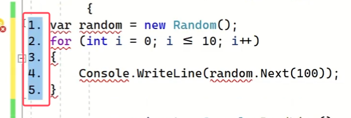
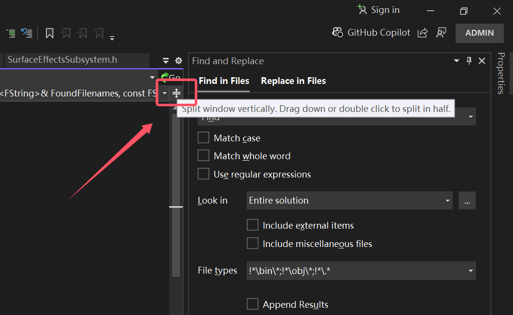
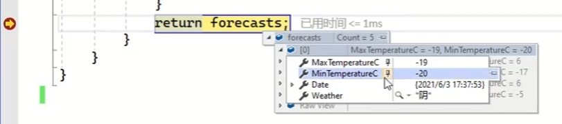
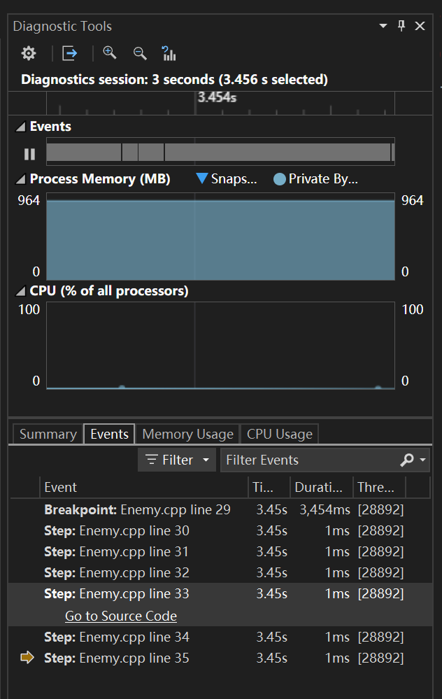

- [课程地址](https://www.bilibili.com/video/BV1gg411g7au)

## 1.代码编辑器
- 区域选中：按住Alt健不松 + 拖动鼠标左键。（按列删除部分内容很好用）

- 多行缩进：略
- 速览定义：略

- 同时查看同一文档两部分：代码编辑器右上角可以将当前文档分成两份，在同时查看一个文档的两个部分时很方便。关闭：下面的页面拖到最上面自动还原

- CS反编译：工具 -> 选项 -> C# -> 高级 -> 支持导航到反编译语言

- 让VS智能提示显示为中文：点击这个[帖子](https://blog.csdn.net/TimChen44/article/details/116018815)就行了。要下个`dotnet`相关东西。

- 代码中的`>=` 变成 `≥`：使用`Cascadia Code`字体就可以了。

## 2.调试时修改代码

- 直接在代码中修改变量，然后拖动断点的箭头到上面的代码，数值可以更新。（仅限支持热编重载Hot Reload的语言，如C#。U++暂不支持。作者基于CS讲解的）

- 快速查看特定的变量（进行数据量比较小时）：

- C#在调试时的即时窗口可以直接运行代码

## 3.检查代码质量
- 分析 -> 分析代码克隆的解决方案：可以找到项目中重复代码。C#可以用，U++似乎用不了
- 分析 -> 分析代码度量值：代码可维护程度。U++也不能用

## 4.历史调试
- 查看历史调试步骤。C++用处不大，C#能直接看当时的变量值。

## 5.实时单元测试
- C++用处不大。菜单栏：Test -> 实时单元测试。

## 6.数据库架构同步

## 7.条件断点

8.项目模板的使用
03:02
9.性能探查器
04:59
10.远程调试
02:31
11.文件嵌套
05:58
12.类设计器
02:57
13.代码图
07:31
14.内联参数
02:28
15.AI代码提示
01:54
16.快速操作和重构
02:41
17.文档选项卡着色
01:28
18.调试断点
02:34
19.添加为引用
02:24
20.预编译指令
03:14
21.项目排除文件
01:27
22.cascadia-code
01:12
23.扩展开发1
10:49
23.扩展开发2
09:17
24.代码片段
02:43
25.扩展开发打包DLL
01:53
26.内存使用率分析
04:40
27.新UI
00:39
28.调式并继续
01:23
29.AI优化代码
02:51
30.AI编写commit

