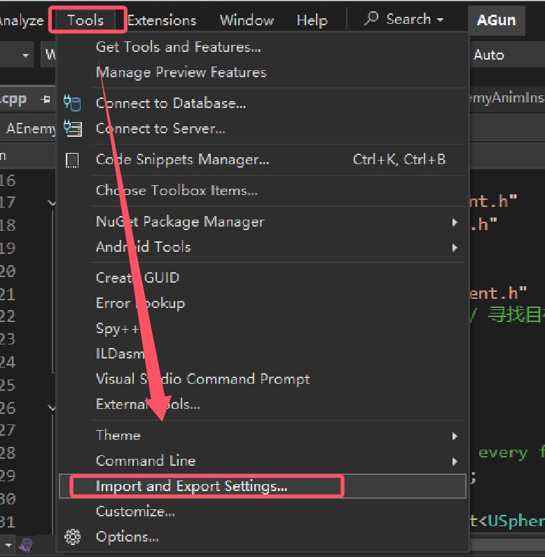

- [x] Coplilot 编写UE代码（已经用Fitten Code代替）
- [ ] 附加包含目录的作用
- [ ] DLL

## 补充内容：
- [VS快捷键](https://learn.microsoft.com/zh-cn/visualstudio/ide/default-keyboard-shortcuts-in-visual-studio?view=vs-2022)

- Ctrl+T: 转到所有

- 重置VS设置：

