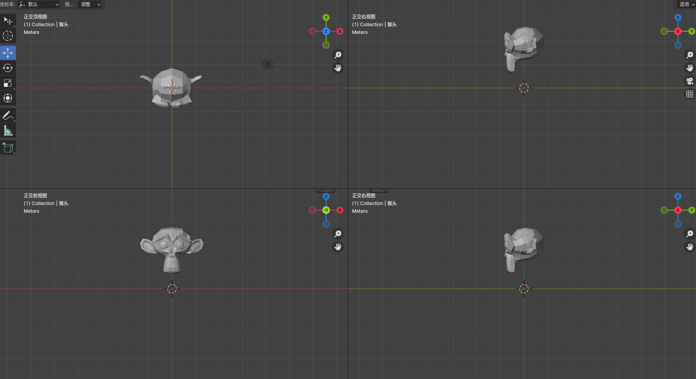

- [课程地址]https://www.bilibili.com/video/BV1vF411Q7p9)

## 1-1 软件安装和界面布局

## 1-2 功能区与基本操作
- `Shift+鼠标中键`:视角平移

## 1-3 N面板和移动操作
- `N`:打开属性面板

- 拖动鼠标左键多选，多个轴同时移动：
    - 
- `ALT+G`:位置坐标归零

- `G`:自由移动模式
    - `G+X`:X轴自由移动模式
    - `G+Y`:Y轴自由移动模式
    - `G+Z`:Z轴自由移动模式

- `Shift+空格键`:打开快速功能菜单
- `Ctrl+Z`:恢复上一步操作

## 2-1 三视图
- `DELETE`:删除所选内容

- 三视图：前视图、顶视图、侧视图（主视图，俯视图、侧视图）

- 切换视图快捷键：
    - `1`：前视图
    - `3`：侧视图
    - `7`：顶视图

- 也可以通过点击罗盘切换视图
    - 

- `CTRL+ ALT + Q`：切换到四视图窗口模式
    - 

## 2-2 旋转和缩放操作

## 2-3 复制和粘贴

## 3-1 游标使用

3-2 案例练习：水杯

4-1 编辑模式

4-2 框选工具使用

5-1 面细分和删除

5-2 面填充与切割

5-3 切分功能

6-1 挤出和内插

6-2 面的尖分

6-3 边的细分，滑移和倒角

7-1 法向问题，环切工具

7-2 法向缩放，桥接

7-3 实例练习：齿轮

8-1 点的基本操作

8-2 实例练习：保温杯

9-1 插件系统，合并与分离

9-2 衰减编辑

9-3 布尔运算

10-1 曲线功能

10-2 曲线倒角，横截面自定义

11-1 参考图使用

11-2 实例练习：无绳跳绳

12-1 工作区修改，倒角修改器

12-2 阵列修改器

13-1 镜像修改器

13-2 布尔修改器

13-3 案例练习：迷你主机（1）

13-4 案例练习：迷你主机（2）

14-1 线框修改器，细分修改器

14-2 实例练习 水杯

15-1 实例位置操控

15-2 实例旋转缩放操控

16-1 着色器使用，材质贴图入门

16-2 UV基础入门讲解·

17-1 UV展开基础

17-2 实例练习：埃及罐

18-1 硬表面插件HardOps使用（1）平滑着色

18-2 硬表面插件HardOps使用（2）倒角和阵列

18-3 硬表面插件HardOps使用（3）镜像功能

18-4 硬表面插件HardOps使用（4）其他常用功能

18-5 硬表面插件BoxCutter快速布尔切割

18-6 DecalMachine贴花使用和平面贴花制作

19-1 怀旧掌机制作1_建立基础模型

19-2 怀旧掌机制作2_完善模型和布线调整

19-3 怀旧掌机制作3_完善细节和贴花

19-4 怀旧掌机制作4_图像马赛克和扫描线纹理

19-5 怀旧掌机制作5_布光和渲染

19-6 怀旧掌机制作6_PowerSave与项目保存
