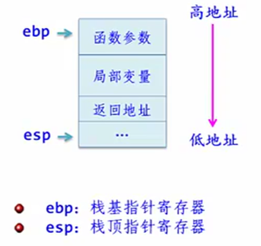

## 5.1 什么是递归
- 在算法设计中经常需要用到递归方法求解，后面的树和二叉树、图、查找即排序等章节大量用到了递归算法

### 5.1.1 递归的定义
- 在定义一个过程或者函数时，出现直接或间接调用自己的成分称之为**递归**(recursion)。
	- 若直接调用自身，称为**直接递归**(direct recursion)。
	- 若间接调用自己，称为**间接递归**(indirect recursion). 
- **尾递归**：一个递归过程或者递归函数中的递归调用语句是最后一条执行语句，则称这种递归调用为尾递归。

递归算法转化：
- 尾递归算法：可以用循环语句转换为等价的非递归算法。（简单）
	- 理论上，递归都可以化为迭代处理。
- 其他递归算法：可以通过栈来转换为非递归算法。（复杂）
	
用递归解决问题应满足三个条件：
- （1）需要解决的问题可以转化为一个或多个子问题来求解，而这些子问题的求解方法与原问题完全相同，只是在数量规模上不同
- （2）递归的次数必须是有限的
- （3）必须有结束递归的条件来终止递归

递归算法优缺点：
- 优点：结构简单、清晰，易于阅读，方便其正确性
- 缺点：算法执行中占用的内存空间较多，执行效率低，不容易优化

### 5.1.2 何时使用递归
#### 1.定义是递归的
- 许多数学公式、数列等定义是递归的。例如，求n！和Fibonacci
```C++
int Fib1(int n)
{
	if (n == 1 || n == 2)
		return 1;
	else
		return Fib1(n-1) + Fib1(n+2);
}
```
- 显然，上述递归算法属于尾递归

#### 2.数据结构是递归的
- 单链表也是递归的，指向下一个元素。所以单链表也可以采用递归算法。大单链表包含小单链表。
```C++
typedef struct LNode
{
	ElemType data;
	struct LNode* next;
}
```
- 结构体的声明用到了自身，next指针域是一种指向自身节点的指针，所以它是一种递归数据结构。
- 对于递归数据结构，采用递归的方法编写算法既方便又高效。
```C++
// 求一个不带头结点的单链表L的所有data域（假设为int）之和的递归算法如下：
int Sum(LinkNode* L)
{
	if (L == NULL)
		return 0;
	else
		return L->data + Sum(L->next);
}
```

#### 3.问题的求解方法是递归的
题目描述：
- 有三根柱子（A、B、C），在柱子A上从下到上按照从大到小的顺序放置着 n 个圆盘，每个圆盘的大小都不一样。要求将这些圆盘从柱子A移到柱子C，且每次只能移动一个圆盘，且在移动过程中不能将较大的圆盘放在较小的圆盘上。请编写一个程序输出圆盘移动的步骤。

```C++
// Hanoi求解
void Hanoi(int n,char x,char y, char z)
{
	if(n==1)
		printf("将第%d个圆盘从%c移动到%c\n",n,x,z);
	else
	{
		Hanoi(n-1,x,z,y);
		printf("将第%d个圆盘从%c移动到%c\n",n,x,z);
		Hanoi(n-1,y,x,z);
	}
}

int main(void){
	int n;
	char a='X',b='Y',c='Z';
	printf("输入求解的层数："); 
	scanf("%d",&n);
	Hanoi(n,a,b,c);
	return 0;
}
```

### 5.1.3 递归模型
- 递归模型是递归算法的抽象，它反映一个递归问题的递归结构。
```C++
// n!的递归模型
f(n) = 1				n = 1
f(n) = n * f(n-1)		n > 1
```
- 一般递归模型由下面两部分组成
	- 第一个式子给出终止条件，称为**递归出口**。意味着问题都可以直接解决。
	- 第二个式子确定求解时的递推关系，称为**递归体**


- 分解过程 -> 求值过程

### 5.1.4 递归与数学归纳法
- 数学归纳法是一种论证方法，而递归是算法和程序设计的一种实现技术，数学归纳法是递归问题求解的理论基础。可以说递归的思想来自数学归纳法。


## 5.2 栈和递归
- 主要讲了递归的栈模型，而不是用栈数据结构去解决递归问题。

### 5.2.1 函数调用栈

函数执行过程
- 函数执行是通过系统栈来实现的。系统栈分为脱岗额**栈帧**。
- 一次函数调用相关的数据保存在栈帧中。体现**先进后出**的特点。

栈帧结构
- **栈帧**就是函数运行的环境。每个函数在被调用时都会在系统栈区形成一个叫做栈帧的结构，这个结构中保存了**函数参数**、**函数局部变量**、**函数执行完后返回到哪里**等等一些数据



### 5.2.1 递归调用的实现
- 递归是函数调用的一种特殊情况，即它是调用自身代码。
- 可以把每一次递归调用理解成调用自身代码的一个复制件。由于每次调用时，它的参数和局部变量可能不相同，因此也就保证了各个复制件执行时的独立性


### 5.2.3 递归到非递归的转换
#### 1.尾递归算法的转换
- 通常尾递归算法可以通过**循环或者迭代**的等方式转换为等价的非递归算法

```C++
// 斐波那契数列递归解法
int Fib1(int n)
{
	if (n == 1 || n == 2)
		return 1;
	else
		return Fib1(n-1) + Fib1(n+2);
}
```

```C++
// 斐波那契数列递归解法
int Fib2(int n)
{
	if (n == 1 || n == 2)
	{
		return 1;
	}	
	else
	{
		int a = 1, b = 1, s;
		for(int i = 3; i <= n; i++>)
		{
			s = a + b;
			a = b;
			b = s;
		}
		return s;
	}
}
```
#### 2.非尾递归算法的转换
- 非为递归算法，在理解递归调用实现过程的基础上，可以用**栈模拟**递归执行过程，从而将其转换为等价的非递归算法
```C++
// 汉诺塔递归解法
void Hanoi1(int n,char a,char b,char c)
{
	if (n==1) 
		printf("\t将第%d个盘片从%c移动到%c\n",n,a,c);
    else 
	{
		Hanoi1(n-1,a,c,b);
		printf("\t将第%d个盘片从%c移动到%c\n",n,a,c);
		Hanoi1(n-1,b,a,c);
	}
}
```

- 借助栈来实现转换，具有一定的通用性，其他的算法进行递归到非递归转换时可以参考：
```C++
typedef struct
{	int n;							//盘片个数
	char x,y,z;						//3个塔座
	bool flag;						//可直接移动盘片时为true,否则为false
} ElemType;							//顺序栈中元素类型

typedef struct
{	ElemType data[MaxSize];			//存放元素
	int top;						//栈顶指针
} StackType;						//顺序栈类型

// 汉诺塔迭代解法
void Hanoi2(int n, char x, char y, char z)
{	StackType *st;							//定义顺序栈指针
	ElemType e,e1,e2,e3;
	if (n<=0) return;						//参数错误时直接返回
	InitStack(st);							//初始化栈
	e.n=n; e.x=x; e.y=y; e.z=z; e.flag=false;
	Push(st,e);								//元素e进栈
	while (!StackEmpty(st))					//栈不空循环
	{	
		Pop(st,e);							//出栈元素e

		if (e.flag==false)					//当不能直接移动盘片时
		{
			e1.n=e.n-1; e1.x=e.y; e1.y=e.x; e1.z=e.z;
			if (e1.n==1)					//只有一个盘片时可直接移动
				e1.flag=true;
			else							//有一个以上盘片时不能直接移动
				e1.flag=false;
			Push(st,e1);					//处理Hanoi(n-1,y,x,z)步骤

			e2.n=e.n; e2.x=e.x; e2.y=e.y; e2.z=e.z; e2.flag=true;
			Push(st,e2);					//处理move(n,x,z)步骤

			e3.n=e.n-1; e3.x=e.x; e3.y=e.z; e3.z=e.y;
			if (e3.n==1)					//只有一个盘片时可直接移动
				e3.flag=true;
			else
				e3.flag=false;				//有一个以上盘片时不能直接移动
			Push(st,e3);					//处理Hanoi(n-1,x,z,y)步骤
		}
		else								//当可以直接移动时
			printf("\t将第%d个盘片从%c移动到%c\n",e.n,e.x,e.z);
	}
	DestroyStack(st);						//销毁栈
}
// 不用flag也可以，但是flag让状态更加明确。不用的话，依然可以用e.n==1来判断，但是第二步需要把n改成1
```

```C++
int main()
{
	int n=3;
	printf("递归算法：%d个盘片移动过程:\n",n);
	Hanoi1(n,'X','Y','Z');
	printf("非递归算法：%d个盘片移动过程:\n",n);
	Hanoi2(n,'X','Y','Z');
	return 1;
}
```

## 5.3 递归算法的设计

### 5.3.1 递归算法设计的步骤
- 设计求解问题的**递归模型**，转换成对应的递归算法：递归模型 -> 递归算法

简化递归模型步骤如下：
- （1）对原问题进行分析，假设出合理的小问题（难）
- （2）假设小问题是可解的，在此基础上确定大问题的解，即给出小问题和大问题之间的关系，也就是确定递归体。（这一步与数学归纳法假设n=k-1成立，在再求证n=k成立的过程相似）
- （3）确定一个特殊情况（如f(1)或f(0)）的解，由此作为递归出口（与数学归纳法中求k=1或k=0时等式成立相似）。

例题：
- 【例 5.2】见`Alogorithm.md`  
- 【例 5.3】见`Alogorithm.md`（很不错的两种解法）

### 5.3.2 基于递归数据的递归算法设计
- 因为需要大小问题统一，所以使用不带头结点的单链表。
```C++
// 求单链表中节点个数的递归算法：
int count(LinkNode* L)
{
	if (L == NULL)
		return 0;
	else
		return count(L->next) + 1;
}
```

```C++
// 正向显示单链表所有节点值：(递归和迭代都很容易)
void traverse(LinkNode* L)
{
	if (L == NULL)
	{
		return;
	}

	printf("%d", L->data);
	traverse(L->next);
}

// 反向显示单链表所有节点值：（用迭代很难，用递归很容易）
void traverseR(LinkNode* L)
{
	if (L == NULL)
	{
		return;
	}

	traverse(L->next);
	printf("%d", L->data);
}
```

- 【例 5.4】见`Alogorithm.md`  


### 5.3.3 基于递归求解方法的递归算法设计

- 【例 5.5 】求解迷宫路径  (前面用栈和队列求解过，当时是只求一条简单路径，这里求解所有路径)
```C++
// 采用递归算法求解迷宫问题，并输出从入口到出口的所有迷宫路径
#include <stdio.h>
#define MaxSize 100
#define M 4
#define N 4

int mg[M+2][N+2]=
{ {1, 1, 1, 1, 1, 1},
  {1, 0, 0, 0, 1, 1},
  {1, 0, 1, 0, 0, 1},
  {1, 0, 0, 0, 1, 1},
  {1, 1, 0, 0, 0, 1},
  {1, 1, 1, 1, 1, 1}
};

typedef struct
{
	int i;				//当前方块的行号
	int j;				//当前方块的列号
} Box;
typedef struct
{
	Box data[MaxSize];
    int length;			//路径长度
} PathType;				//定义路径类型
int count=0;			//存放迷宫路径的条数

void mgpath(int xi,int yi,int xe,int ye,PathType path)
//求解路径为:(xi,yi)->(xe,ye)
{
	if (xi==xe && yi==ye)		//找到了出口,输出路径
	{
		path.data[path.length].i = xi;
		path.data[path.length].j = yi;
		path.length++;

		printf("迷宫路径%d如下:\n",++count);
		for (int k=0;k<path.length;k++)
			printf("\t(%d,%d)",path.data[k].i, path.data[k].j);
		printf("\n");
	}
	else						//(xi,yi)不是出口
	{
		if (mg[xi][yi]==0)		//(xi,yi)是一个可走方块
		{
			int i,j;

			for (int di = 0; di < 4; di++)		//找(xi,yi)的一个相邻方块(i,j)
			{
				switch(di)
				{
				case 0:i=xi-1; j=yi;   break;
				case 1:i=xi;   j=yi+1; break;
				case 2:i=xi+1; j=yi;   break;
				case 3:i=xi;   j=yi-1; break;
				}

				path.data[path.length].i = xi;
				path.data[path.length].j = yi;
				path.length++;

				mg[xi][yi]=-1;			//避免重复找路径
				mgpath(i,j,xe,ye,path);

				path.length--;			//回退一个方块
				mg[xi][yi]=0;			//恢复(xi,yi)为可走
			}
		}
	}
}

int main()
{
	PathType path;
	path.length=0;				//初始化路径长度
	mgpath(1,1,M,N,path);
	return 1;
}
```
- 这一部分比较有难度，以后对《算法设计与分析》这门课也有很大帮助

## 本章小结
### 1.递归基础
- 1）一个递归模型又那两部分构成？
	- 递归出口——确定递归结束情况
	- 递归体——确定大小问题的求解情况

- 2）递归算法如何转换为非递归算法？
	- 对于尾递归，可以用循环递推方法来转换。
	- 对于其他递归，可以用栈模拟执行过程来转换。（参数保存 + Flag表示当前问题是否可以直接求解）

- 3）Hanoi问题递归算法中，当移动6个盘片是递归次数是多少？(63次，指数极算法)
	- `t(n) = 1, (n = 1)`
	- `t(n) = 2t(n-1) + 1, (n > 1)`

### 2.递归算法设计
- 1）基于递归数据结构的递归算法设计
	- 利用递归数据结构的递归特性建立递归模型
	- 编写对应的递归算法

- 2）基于递归方法的递归算法设计（难）—— 如何将递归特性不明显的问题转化为递归问题求解
	- 确定问题的形式化描述
	- 确定哪些是大问题，哪些是小问题
	- 确定大、小问题的关系
	- 确定特殊（递归结束）情况
	```
	题目描述：假设a数组含有1,2, ..., n, 求其全部的排列组合。
	```

	```C++
	// 采用交换作为解题思路
	void Perm(int a[], int n, int k)
	{
		if (k == 0)
		{
			for (int j = 0; j < n; j++)
				printf("%d", a[j]);
			printf("\n");
		}
		else
		{
			for(int i = 0; i < k; i++)
			{
				swap(a[k]. a[i]);
				Perm(a, n, k-1);
				swap(a[k], a[i]);
			}
		}
	}

	void main()
	{
		int n = 3, k = 2;
		int a[] = { 1, 2, 3 };
		Perm(a, 3, 2);
	}
	```

### 3.递归函数设计中几个问题
- 1）递归函数中的引用参数可以用全局变量替换
```C++
// 例如，求1 + 2 + ... + n
void add(int n, int&s )
{
	if (n == 1)
		return s = 1;
	else
	{
		int s1;
		add(n - 1, s1);
		s = s1 + n;
	}

}
```
```C++
// 用全局变量替换
int s = 0;

void add(int n)
{
	if (n == 1)
		return s = 1;
	else
	{
		add(n - 1);
		s += n;
	}

}
```

- 2）递归函数中的非引用形参作为状态变量，可以自动回溯
	- **非引用参数**表示递归状态，由系统栈保存，可以自动回退
	- **引用参数**不能表示递归状态，不能自动回退 
```C++
int f(int n)
{
	if (n == 1 || n == 2)
		return 1;
	else
		return f(n-1) + f(n-2);
}
```

- 3）递归调用后面的语句表示：子问题执行完毕后还要完成的功能
	- 掌握递归函数的执行过程有助于递归算法设计
```C++
void func(int n)
{
	if (n >= 1)
	{
		printf("n1 = %d\n", n);  // (1)
		func(n-1);
		printf("n2 = %d\n", n);  // (2)
	}
}
```
