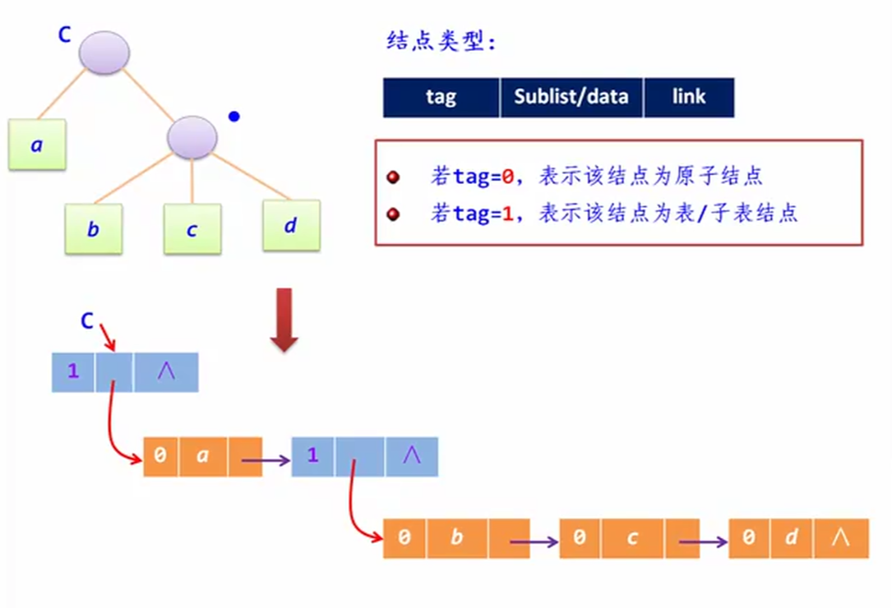
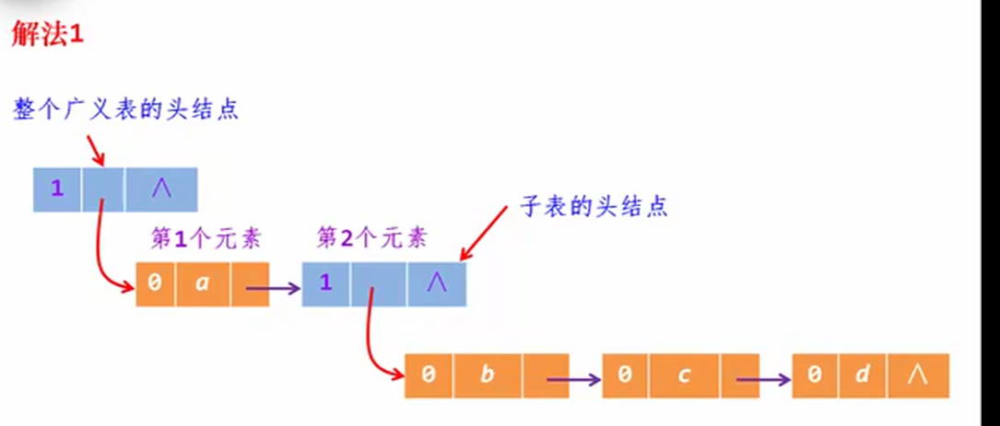
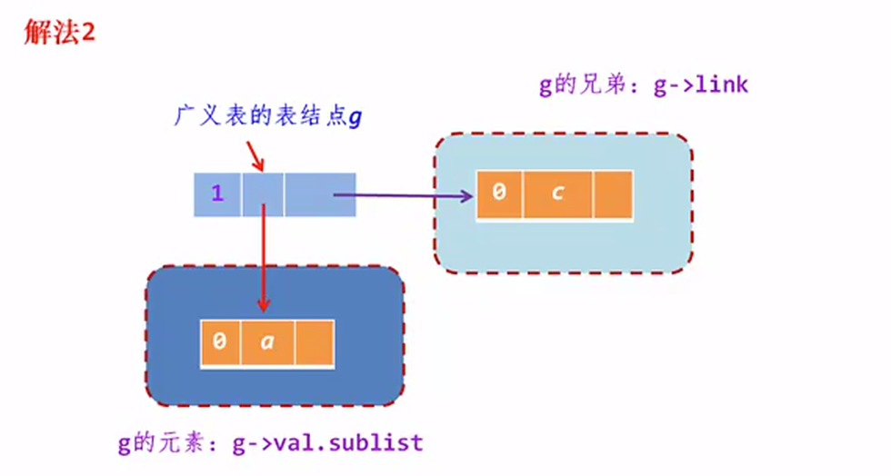

# 第6章 数组和广义表
- **数组**（array）是具有相同类型的数据元素的有序序列，可以将它看作线性表的推广，稀疏矩阵是一种特殊的二维数组。广义表也可以成是线性表的推广，稀疏矩阵是一种特殊的二维矩阵。广义表也可以看成是线性表的推广，它是采用递归方法定义的。


## 6.1 数组
- 我们是一门数据结构课程，所以把数组作为一种数据结构来讨论的。也就是从逻辑结构、存储结构和基本运算等方面来讨论数组。

### 6.1.1 数组的基本概念
- 从**逻辑结构**上看，一维数组A是n (n > 1) 个相同类型数据元素 a1, a2, a3, ..., an 构成的有限序列，其逻辑表现为：A = (a1, a2, a3, ..., an)。其中ai( 1 <= i <= n)表示数组A的第i个元素。

- 二维数组：可以看作是每个数据元素相同的一维数组

- 数组通常有两种操作：
    - 读操作：给定一定的下标，读取相应的数组元素。
    - 写操作：给定一组下标，存储或者修改相应的数组元素。

- 数组抽象数据类型 = 逻辑结构 + 基本运算（运算描述）
```C++
// 数组的基本运算：
InitArray(&A); // 初始化数组，即为数组A分配存储空间
DestroyArray(&A);  // 销毁数组，释放A的存储空间
Value(A,index1,index2....);  // A是一个已存在的d维数组，index是下标，下标的运算结果是返回A对应元素的值
Assign(A,e,index,index2./);  // 将e的值赋给指定下标
```
- 几乎所有的高级编程语言都实现了数组数据结构，并称之为**数组类型**，可以直接使用它。我们主要从数据结构的角度来讨论数组，而不是从高级语言的数据类型角度。线性表就是通过数组来实现的，所以具有**随机存储特性**。

注意:
- 本章的数组是作为一种数据结构讨论的。而C/C++中的数组是一种数据类型
- 前者可以借助后者来存储，像线性表的顺序存储结构即顺序表就是借助一维数组这种数据类型来存储的。但两者不能混淆。

`【例 6.1】约瑟夫问题，见 Alogorithm.md`  

### 6.1.2 数组的存储结构

#### 1.一维数组
- 通过第一个元素的地址，进行计算可以找到第 i 号元素的地址。

#### 2.二维数组
- 二维数组有按行优先存放和按列优先存放两种存储方式。地址计算也比较简单。
- 二维数组也采用顺序存储结果，所以也具有**随机存储特性**，即给定逻辑序号就可以在O(1)的时间内找到对应的元素值。

#### 3.三维维以及多维
- ChatGTP：三维数组可以看作一个由二维数组组成的数组。假设我们有一个三维数组 arr[x][y][z]，其中 x 是深度，y 是行数，z 是列数。若要访问 `arr[i][j][k]`，其内存地址的计算公式为：
```scss

地址 = Base + ((i * y * z) + (j * z) + k) * sizeof(元素类型)
Base 是三维数组的起始地址。
i 是第 i 个二维层。
y 是每个二维层的行数。
z 是每一行的列数。
j 是二维层的行索引。
k 是二维层的列索引。
sizeof(元素类型) 是每个元素的字节大小。
```
- 行列优先不一样时需要稍作调整。

### 6.1.3 特殊矩阵的压缩存储
特殊矩阵的主要形式有：（它们都是方阵，即行列数相同）
- 对称矩阵
- 上、下三角矩阵
- 对角矩阵

#### 1.对称矩阵的压缩存储
- 若一个 \(n\) 阶方阵 \(A[n][n]\) 中的元素满足 \(a_{i,j} = a_{j,i}\) （\(0 \leq i, j \leq n-1\)），则称其为 \(n\) 阶**对称矩阵**。
\[
\begin{bmatrix}
a_{0,0} & a_{0,1} & \cdots & a_{0,n-1} \\
a_{1,0} & a_{1,1} & \cdots & a_{1,n-1} \\
\vdots & \vdots & \ddots & \vdots \\
a_{n-1,0} & a_{n-1,1} & \cdots & a_{n-1,n-1}
\end{bmatrix}
\]

- 这里以行序为主序存储其下三角+主对角线的元素, 即 \(i \geq j \)。数组的地址转换公式如下：
$$B=\left(a_{0,0}, a_{1,0}, a_{1,1},\ldots, a_{i-1,0},\ldots, a_{i-1, i-1}, a_{i, 0},\ldots, a_{i, j-1}, a_{i, j},\ldots, a_{n-1, n-1}\right)$$

- 第一种情况 \(i \geq j \) （下三角 + 主对角线）
- 第二种情况 \(i < j \) （下三角位置对应的元素）

$$ k=\left\{\begin{array}{l}
\frac{i(i+1)}{2}+j \\ 
\frac{j(j+1)}{2}+i
\end{array}\right.$$

- 这么下来，几乎减少了一半的元素。只要稍微包装一下，用户的操作就是不变的，用户感受不到变化也就是对用户是透明的。


#### 2.上、下三角矩阵的压缩存储
- 思路和对称矩阵的压缩类似。需要注意：按行序还是按列序，下标从0开始还是从1开始。

#### 3.对角矩阵的压缩存储
对角矩阵 \(D\) 的定义如下：
\[
D =
\begin{pmatrix}
d_1 & 0   & 0   & \dots  & 0   \\
0   & d_2 & 0   & \dots  & 0   \\
0   & 0   & d_3 & \dots  & 0   \\
\vdots & \vdots & \vdots & \ddots & \vdots \\
0   & 0   & 0   & \dots  & d_n \\
\end{pmatrix}
\]
- 其中 \(d_1, d_2, \dots, d_n\) 为主对角线上的元素。


多对角矩阵（Multidiagonal Matrix）：
- **定义**：多对角矩阵是一个方阵，其非零元素可以存在于主对角线及其上下任意数量的对角线（包括次对角线、超对角线及更高或更低的对角线），其他元素均为零。
- **形式**（以 \(k\) 表示上下的对角线数量）：
\[
M =
\begin{pmatrix}
a_{0,0} & a_{0,1} & a_{0,2} & \cdots & 0 & 0 \\
a_{1,-1} & a_{1,0} & a_{1,1} & \cdots & 0 & 0 \\
a_{2,-2} & a_{2,-1} & a_{2,0} & \cdots & 0 & 0 \\
\vdots & \vdots & \vdots & \ddots & \vdots & \vdots \\
0 & 0 & a_{n-1,-k} & a_{n-1,-k+1} & \cdots & a_{n-1,n-1} \\
\end{pmatrix}
\]


本书定义了对角矩阵的半带宽为b，b = 1是三对角矩阵。压缩后的地址计算公式：`k = 2i + j`，只有第一行和最后一行有2个元素，其他行都是3个元素。


## 6.2 稀疏矩阵
- **稀疏矩阵的定义**：一个阶数较大的矩阵中的非零元素个数s相对于矩阵元素的总个数t十分小时，即s<<t时，称该矩阵为稀疏矩阵。

- 特殊矩阵中的特殊元素的分布具有某种规律，而稀疏矩阵中特殊元素（非零元素）的分布没有规律，具有随机性。
### 6.2.1 稀疏矩阵的三元组表示
- 稀疏矩阵的压缩存储方法是：只存储非零元素。每一个非零元素由一个三元组`(i, j, ai,j)`唯一确定，稀疏矩阵中的所有非零元素构成三元组线性表。

- 把稀疏矩阵的三元组线性表按顺序存储结构存储，则称为稀疏矩阵的三元组顺序表。

```C++
//稀疏矩阵的三元组表示-算法
#include <stdio.h>
#define M 6
#define N 7
#define MaxSize  100         //矩阵中非零元素最多个数
typedef int ElemType;

typedef struct
{
	int r;					//行号
	int c;					//列号
	ElemType d;				//元素值
} TupNode;					//三元组定义

typedef struct 
{	
	int rows;				//行数
	int cols;				//列数
	int nums;				//非零元素个数
	TupNode data[MaxSize];
} TSMatrix;					//三元组顺序表
```
- 约定：data域中表示的非零元素通常以行序为主序顺序排列，它是一种下标按行有序的存储结构。这种有序存储结构可简化大多数矩阵运算算法。

```C++
// 1.从一个二维稀疏矩阵创建其三元组表示
void CreatMat(TSMatrix &t,ElemType A[M][N])
{
	int i,j;
	t.rows=M;t.cols=N;t.nums=0;
	for (i=0;i<M;i++)
	{
		for (j=0;j<N;j++)
        {
			if (A[i][j]!=0) 	//只存储非零元素
			{
				t.data[t.nums].r = i;
                t.data[t.nums].c = j;
                t.data[t.nums].d = A[i][j];
                t.nums++;
			}
        }
	}
}

// 2.三元组元素赋值
bool Value(TSMatrix &t,ElemType x,int i,int j)  
{
	int k=0,k1;
	if (i>=t.rows || j>=t.cols)
		return false;				//失败时返回false

	while (k<t.nums && i>t.data[k].r) k++;					//查找行
	while (k<t.nums && i==t.data[k].r && j>t.data[k].c) k++;//查找列

	if (t.data[k].r==i && t.data[k].c==j)	//存在这样的元素
		t.data[k].d=x;
	else									//不存在这样的元素时插入一个元素
	{	
		for (k1=t.nums-1;k1>=k;k1--)
		{
			t.data[k1+1].r=t.data[k1].r;
			t.data[k1+1].c=t.data[k1].c;
			t.data[k1+1].d=t.data[k1].d;
		}
		t.data[k].r=i;t.data[k].c=j;t.data[k].d=x;
		t.nums++;
	}

	return true;						//成功时返回true
}

// 3.将指定位置的元素值赋给变量
bool Assign(TSMatrix t,ElemType &x,int i,int j)  
{
	int k=0;
	if (i>=t.rows || j>=t.cols)
		return false;			//失败时返回false

	while (k<t.nums && i>t.data[k].r) k++;					//查找行
	while (k<t.nums && i==t.data[k].r && j>t.data[k].c) k++;//查找列

	if (t.data[k].r==i && t.data[k].c==j)
		x=t.data[k].d;
	else
		x=0;				//在三元组中没有找到表示是零元素

	return true;			//成功时返回true
}

// 输出三元组
void DispMat(TSMatrix t)		
{
	int i;
	if (t.nums<=0)			//没有非零元素时返回
		return;
	printf("\t%d\t%d\t%d\n",t.rows,t.cols,t.nums);
	printf("\t------------------\n");

	for (i=0;i<t.nums;i++)
		printf("\t%d\t%d\t%d\n",t.data[i].r,t.data[i].c,t.data[i].d);
}

// 矩阵转置
void TranTat(TSMatrix t,TSMatrix &tb)		
{
	int p,q=0,v;					//q为tb.data的下标
	tb.rows=t.cols;tb.cols=t.rows;tb.nums=t.nums;
	if (t.nums!=0)					//当存在非零元素时执行转置
	{
		for (v=0;v<t.cols;v++)		//tb.data[q]中的记录以c域的次序排列
			for (p=0;p<t.nums;p++)	//p为t.data的下标
				if (t.data[p].c==v)
				{
					tb.data[q].r=t.data[p].c;
					tb.data[q].c=t.data[p].r;
					tb.data[q].d=t.data[p].d;
					q++;
				}
	}
}
```
```C++
int main()
{
	TSMatrix t,tb;
	int x,y=10;
	int A[6][7]={
		{0,0,1,0,0,0,0},
		{0,2,0,0,0,0,0},
		{3,0,0,0,0,0,0},
		{0,0,0,5,0,0,0},
		{0,0,0,0,6,0,0},
		{0,0,0,0,0,7,4}};
	CreatMat(t,A);
	printf("b:\n"); DispMat(t);
	if (Assign(t,x,2,5)==true)  //调用时返回true
		printf("Assign(t,x,2,5)=>x=%d\n",x);
	else  //调用时返回false
		printf("Assign(t,x,2,5)=>参数错误\n");
	Value(t,y,2,5);
	printf("执行Value(t,10,2,5)\n");
	if (Assign(t,x,2,5)==true)  //调用时返回true
		printf("Assign(t,x,2,5)=>x=%d\n",x);
	else  //调用时返回false
		printf("Assign(t,x,2,5)=>参数错误\n");
	printf("b:\n"); DispMat(t);
	TranTat(t,tb);
	printf("tb:\n"); DispMat(tb);
	return 1;
}
```

### 6.2.2 稀疏矩阵的十字链表表示
```C++
//稀疏矩阵的十字链表表示
#include <stdio.h>
#include <malloc.h>
#define M 3         			//矩阵行
#define N 4           			//矩阵列
#define Max ((M)>(N)?(M):(N))   //矩阵行列较大者

typedef int ElemType;

typedef struct mtxn 
{ 
	int row;					//行号
	int col;					//列号
   	struct mtxn *right,*down;	//向右和向下的指针
	union 
	{
		ElemType value;
		struct mtxn *link;
	} tag;

} MatNode;			//十字链表类型

void CreatMat(MatNode *&mh,ElemType a[][N])	//创建a的十字链表
{
	int i,j;
	MatNode *h[Max],*p,*q,*r;
	mh=(MatNode *)malloc(sizeof(MatNode));//创建十字链表的头结点
	mh->row=M;mh->col=N;
	r=mh;					//r指向尾结点
	for (i=0;i<Max;i++)		//采用尾插法创建头结点h1,h2,…循环链表
	{
		h[i]=(MatNode *)malloc(sizeof(MatNode));
		h[i]->down=h[i]->right=h[i];		//将down和right方向置为循环的
		r->tag.link=h[i];					//将h[i]加到链表中
		r=h[i];
	}
	r->tag.link=mh;							//置为循环链表
	for (i=0;i<M;i++)						//处理每一行
	{
		for (j=0;j<N;j++)					//处理每一列
		{
			if (a[i][j]!=0)					//处理非零元素
			{
				p=(MatNode *)malloc(sizeof(MatNode));	//创建一个新结点
				p->row=i;p->col=j;p->tag.value=a[i][j];
				q=h[i];      					//查找在行表中的插入位置
                while (q->right!=h[i] && q->right->col<j) 
                  	q=q->right;
				p->right=q->right;q->right=p;	//完成行表的插入
				q=h[j];      					//查找在列表中的插入位置
				while (q->down!=h[j] && q->down->row<i) 
					q=q->down;
				p->down=q->down;q->down=p;  	//完成列表的插入
			}
		}
	}
}

void DestroyMat(MatNode *&mh)		//销毁十字链表
{
	MatNode *pre,*p,*mp;
	mp=mh->tag.link;				//mp指向h[i]
	while (mp!=mh)					//释放所有数据结点
	{
		pre=mp->right;				//pre指向h[i]的行首结点
		if (pre!=mp)				//h[i]不空
		{
			p=pre->right;			//p指向结点pre的后继结点
			while (p!=mp)
			{
				free(pre);
				pre=p; p=p->right;
			}
		}
		mp=mp->tag.link;			//mp指向下一个头结点
	}
	//释放所有的头结点
	pre=mh->tag.link;				//pre指向h[i]
	p=pre->tag.link;				//p指向h[i+1]
	while (p!=mh)
	{
		free(pre);
		pre=p; p=p->tag.link;
	}
	free(mh);
}

void DispMat(MatNode *mh)		//输出十字链表
{
	MatNode *p,*q;
	printf("行=%d  列=%d\n", mh->row,mh->col);
	p=mh->tag.link;
	while (p!=mh) 
	{	
		q=p->right;
		while (p!=q) 		//输出一行非零元素
		{
			printf("%d\t%d\t%d\n", q->row,q->col,q->tag.value);
			q=q->right;
		}
		p=p->tag.link;
	}
}

//本主程序用于调试
int main()
{
	ElemType a[M][N]={{1,0,0,2},{0,0,3,0},{0,0,0,4}};
	MatNode *mx;
	CreatMat(mx,a);
	printf("a的十字链表:\n");DispMat(mx);
	DestroyMat(mx);
	return 1;
}
```

## 6.3 广义表

### 6.3.1 广义表的定义
广义表定义：
- 广义表(generalized table) 是线性表的推广，是有限个元素的序列，其逻辑结构采用括号表示法表：`GL = (a1, a2, ..., ai, ..., an)`
- 若n=0时称为空表。
- ai为广义表的第i个元素。如果a;属于原子类型，称之为广义表GL的原子
- 如果ai又是一个广义表，称之为广义表GL的子表。

广义表重要概念：
- 广义表的长度定义为最外层包含元素个数。
- 广义表的深度定义为所含括弧的重数。其中，原子的深度为0，空表的深度为1。
- 广义表GL的表头为第一个元素a1，其余部分(a2,., an)为GL的表尾。一个广义表的表尾始终是一个广义表。空表无表头表尾。

### 6.3.2 广义表的存储结构
- 广义表是一种递归的数据结构，因此很难为每个广义表分配固定大小的存储空间，所以其存储只好采用链式存储结构。



```C++
typedef char ElemType;
typedef struct lnode
{
	int tag;					//结点类型标识

	union 
	{
		ElemType data;			//原子值
		struct lnode *sublist;	//指向子表的指针
	} val;

	struct lnode *link;			//指向下一个元素
} GLNode;						//广义表结点类型
```


### 6.3.3 广义表的运算

#### 1.广义表算法设计方法
解法1：  


- 子表的处理和整个广义表的处理是相似的。从这个角度出发设计求解广义表递归算法的一般格式如下:
```C++
void fun1(GLNode *g)  //g为广义表头结点指针
{
	GLNode *g1=g->val.sublist;  //g1指向第一个元素

	while(g1!=NULL)  //元素未处理完循环
	{
		if(g1->tag==1)  //为子表时
			fun1(g1);  //递归处理子表
		else  //为原子时
			原子处理语句;  //实现原子操作
	}

	g1=g1->link;  //处理兄弟
}
```
解法2：  


- 兄弟的处理与整个广义表的处理是相似的；对于子表结点，其元素的处理与整个广义表的处理是相似的。从这个角度出发设计求解广义表递归算法的一般格式如下:
```C++
void fun2(GLNode *g)  //g为广义表结点指针
{ 
	if(g!=NULL) 
	{
		if(g->tag==1)  //为子表时
			fun2(g->val.sublist);  //递归处理其元素
		else  //为原子时
			原子处理语句;  //实现原子操作
		
		fun2(g->link);  //递归处理其兄弟
	}
}
```
#### 2.求广义表长度
- 在广义表中，同一层次的每个结点是通过link域链接起来的，所以可把它看做是由link域链接起来的单链表。这样，求广义表的长度就是求单链表的长度，
```C++
//求广义表g的长度
int GLLength(GLNode *g)			
{
	int n=0;
	GLNode *g1;
	g1=g->val.sublist;			//g指向广义表的第一个元素
	while (g1!=NULL)
	{	
		n++;					//累加元素个数
		g1=g1->link;
	}
	return n;
}
```

#### 3.求广义表深度
- 对于带头结点的广义表g，广义表深度的递归定义是它等于所有子表中表的最大深度加1。若g为原子，其深度为0。
```C++
//求广义表g的深度
int GLDepth(GLNode *g)			
{
	GLNode *g1;
	int maxd=0,dep;
	if (g->tag==0)				//为原子时返回0
		return 0;
	g1=g->val.sublist;			//g1指向第一个元素
	if (g1==NULL)				//为空表时返回1
		return 1;
	while (g1!=NULL)			//遍历表中的每一个元素
	{	
		if (g1->tag==1)			//元素为子表的情况
		{
			dep=GLDepth(g1);	//递归调用求出子表的深度
			if (dep>maxd)		//maxd为同一层所求过的子表中深度的最大值
				maxd=dep;
		}
		g1=g1->link;			//使g1指向下一个元素
	}
	return(maxd+1);				//返回表的深度
}
```

#### 4.输出广义表
- 输出广义表g的过程f(g)为:
	- 若g不为NULL，先输出g的孩子元素，当有兄弟时再输出兄弟。
	- 输出g的孩子元素的过程是
	- 如果该元素为原子，则直接输出原子值;
	- 若为子表，输出'(’
	- 如果为空表则输出'#’
	- 如果为非空子表则递归调用`f(g->val.sublist)`以输出子表,再输出')’
```C++
//输出广义表g
void DispGL(GLNode *g)					
{
	if (g!=NULL)                 		//表不为空判断
	{									//先处理g的元素
		if (g->tag==0)               	//g的元素为原子时
			printf("%c", g->val.data);  //输出原子值
		else							//g的元素为子表时
		{
			printf("(");                //输出'('
			if (g->val.sublist==NULL)  	//为空表时
				printf("#");
			else						//为非空子表时
				DispGL(g->val.sublist); //递归输出子表
			printf(")");               	//输出')'
		}

		if (g->link!=NULL) 
		{
			printf(", ");
			DispGL(g->link);            //递归输出后续表的内容
		}
	}
}
```
- 广义表与与树结构类似，这些算法也可以应用到树结构里面

#### 5.建立广义表的链式存储结构
- 广义表括号表示串s -> 链式存储结构
- 正确的逻辑结构表示:
	- 原子为单个字符
	- 元素之间用一个逗号分隔
	- 表或者子表的起止符号分别为左、右圆括号
	- 空表为“(#)
```C++
//创建由括号表示法表示s的广义表链式存储结构（采用解法2的方式）
GLNode *CreateGL(char *&s)				
{
	GLNode *g;
	char ch=*s++;						//取一个字符
	if (ch!='\0')						//串未结束判断
	{
		g=(GLNode *)malloc(sizeof(GLNode));//创建一个新结点
		if (ch=='(')					//当前字符为左括号时
		{
			g->tag=1;					//新结点作为表头结点
			g->val.sublist=CreateGL(s); //递归构造子表并链到表头结点
		}
		else if (ch==')') 
			g=NULL;           			//遇到')'字符,g置为空
		else if (ch=='#')				//遇到'#'字符，表示为空表
			g=NULL;
		else							//为原子字符
		{
			g->tag=0;					//新结点作为原子结点
			g->val.data=ch;
		}
	}
	else								//串结束,g置为空
		g=NULL;

	ch=*s++;                           	//取下一个字符
	if (g!=NULL)                      	//串未结束，继续构造兄递结点
		if (ch==',')                  	//当前字符为','
			g->link=CreateGL(s);   		//递归构造兄递结点
		else                            //没有兄弟了,将兄弟指针置为NULL
			g->link=NULL;
	return g;                     		//返回广义表g
}
```
#### 6.销毁广义表
```C++
//销毁广义表（采用解法1的方式）
void DestroyGL(GLNode *&g)		
{
	GLNode *g1,*g2;
	g1=g->val.sublist;			//g1指向广义表的第一个元素
	while (g1!=NULL)			//遍历所有元素
	{
		if (g1->tag==0)			//若为原子结点
		{	g2=g1->link;		//g2临时保存兄弟结点
			free(g1);			//释放g1所指原子结点
			g1=g2;				//g1指向后继兄弟结点
		}
		else					//若为子表
		{	g2=g1->link;		//g2临时保存兄弟结点
			DestroyGL(g1);		//递归释放g1所指子表的空间
			g1=g2;				//g1指向后继兄弟结点
		}
	}
	free(g);					//释放头结点空间
}
```

`【例 6.3】求链式存储结构广义表g的原子个数，见 Alogorithm.md`  

## 本章小结
### 1 数组
1）数组两个基本操作：
- 按照给定的下标，取(读)、存（写）相应的元素值

2）为什么说数组是线性表的推广或扩展，而不说数组就是一种线性表呢？
- 从逻辑结构的角度看，一维数组是一种线性表。
- 二维数组可以看成数组元素为一维数组的一维数组，所以二维数组是线性结构，可以看成是线性表。
- 但就二维数组的形状而言，它又是非线性结构，因此将二维数组看成是线性表的推广更准确。
- 三维及以上维的数组亦如此。

3）计算数组中给定元素的地址：
- 数组的存储方式(按行或者按列优先存放)
- 计算给定元素的前面的元素个数s
- 每个元素的存储空问k
- 该元素地址=起始元素地址+sxk

### 2 特殊矩阵
1）什么是特殊矩阵的压缩存储?为什么需要压缩存储?
- 特殊矩阵采用压缩存储的目的是节省存储空间，

2）特殊矩阵压缩存储后具有随机存取特性吗?
- 具有

3）在计算对称矩阵的压缩存储时应注意什么问题?
- 对称矩阵是按上三角还是按下三角存放。
- 对称矩阵元素是按行还是按列优先存放。
- B数组的下标从1开始还是从0开始。

### 3.稀疏矩阵
1）稀疏矩阵的三元组存储结构具有随机存储特性吗?
- No

2）用十字链表表示一个有k个非零元素的mxn的稀疏矩阵，则其总的结点数为多少?


### 4.广义表
1）求广义表的表头、表尾


2）广义表递归算法设计