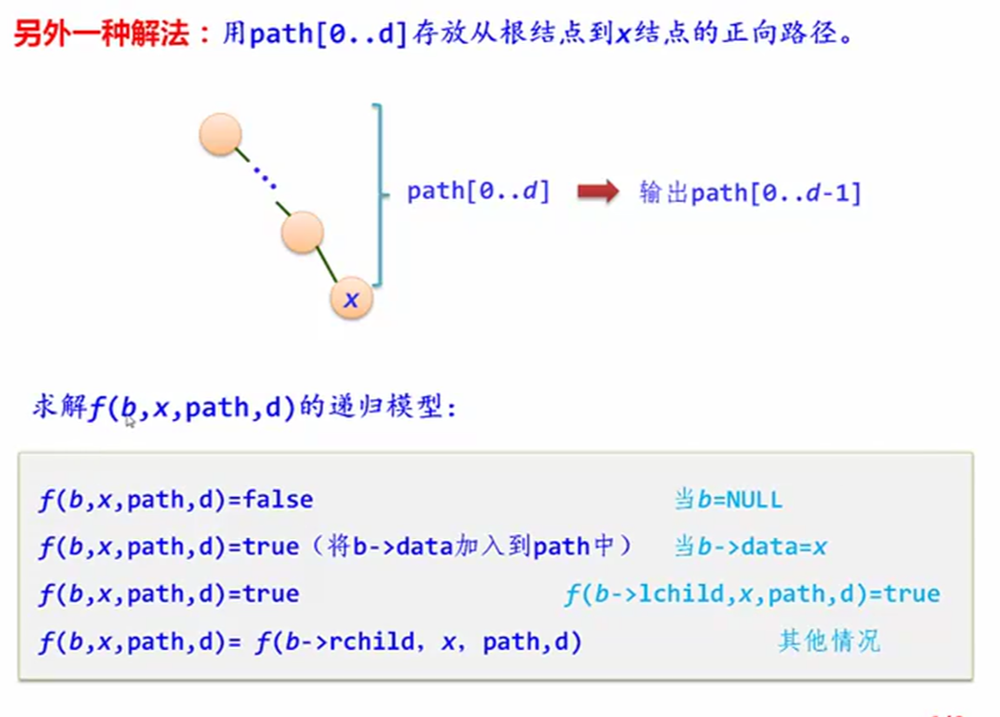
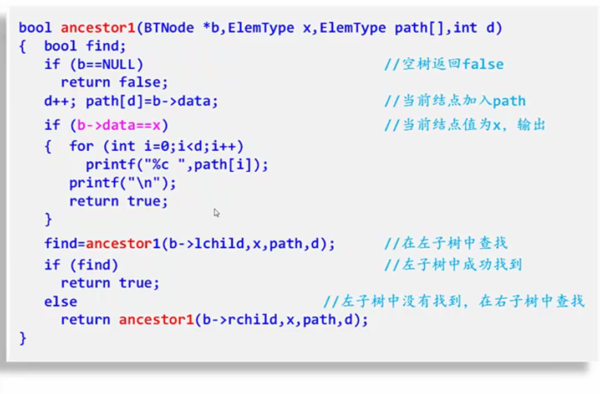
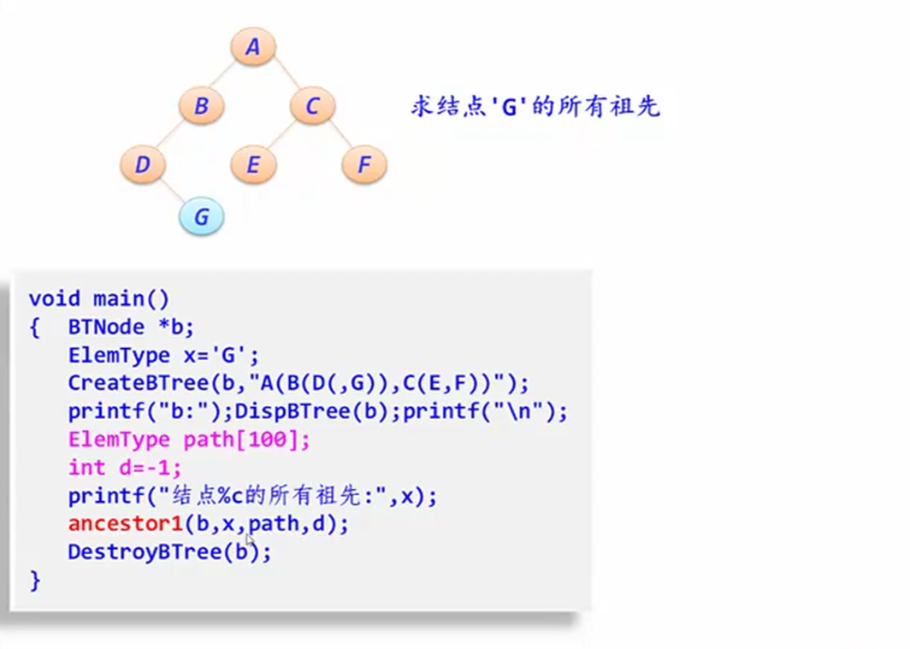

## 课本例题
### 7.3
```C++
/*
题目：以孩子链作为树的存储结构，设计一个求树t高度的递归算法
*/

int TreeHeight1(TSonNode *t)			//求树t高度
{	TSonNode *p;
	int i,h,maxh=0;
	if (t==NULL) return 0;				//空树返回高度0
	else								//处理非空树
	{	for (i=0;i<MaxSons;i++)
		{	p=t->sons[i];				//p指向t的第i-1个孩子节点
			if (p!=NULL)				//若存在第i-1个孩子
			{	h=TreeHeight1(p);		//求出对应子树的高度
				if (maxh<h) maxh=h;		//求所有子树的最大高度
			}
		}
		return(maxh+1);					//返回maxh+1
	}
}
```
```C++
// 完整代码：
//【例7.3】的算法：孩子链存储结构下树的基本运算算法和求树t的高度
#include <stdio.h>
#include <malloc.h>
#define MaxSons 10
#define MaxSize 100
typedef struct node
{	char data;							//节点的值
	struct node *sons[MaxSons];			//指向孩子节点
} TSonNode;								//孩子链存储结构类型

TSonNode *CreateTree(char *str)			//由str建立孩子链存储结构
{	struct
	{	TSonNode *nodep;				//节点指针
		int num;						//孩子个数
	} St[MaxSize];						//定义顺序栈
	int top=-1;							//栈顶指针
	int i=0,j; char ch=str[i];
	TSonNode *t=NULL,*p;
	while (ch!='\0')
	{	switch(ch)
		{
		case '(': top++; St[top].nodep=p;
			St[top].num=0;				//当前节点*p进栈
			break;
		case ')':top--;	break;			//退栈
		case ',':St[top].num++; break;	//栈顶节点增加一个孩子
		default:
			p=(TSonNode *)malloc(sizeof(TSonNode));
			p->data=ch;					//建立一个节点p存放ch
			for (j=0;j<MaxSons;j++)		//所有孩子指针置为NULL
				p->sons[j]=NULL;
			if (t==NULL)				//原为空树
				t=p;
			else						//将其作为栈顶节点的一个孩子
				St[top].nodep->sons[St[top].num]=p;
			break;
		}
		i++;
		ch=str[i];
	}
	return t;
}
void DispTree(TSonNode *t)				//输出孩子链存储结构
{	int i;
	if (t!=NULL)
	{	printf("%c",t->data);
		if (t->sons[0]!=NULL)			//t节点至少有一个孩子
		{	printf("(");				//输出一个左括号
			for (i=0;i<MaxSons;i++)
			{	DispTree(t->sons[i]);
				if (t->sons[i+1]!=NULL)	//如果有下一个孩子
					printf(",");		//输出一个','
				else					//如果没有下一个孩子
					break;				//退出循环
			}
			printf(")");				//输出一个右括号
		}
	}
}
void DestroryTree(TSonNode *&t)			//销毁树t
{	int i;
	if (t!=NULL)
	{	for (i=0;i<MaxSons;i++)
		{	if (t->sons[i]!=NULL)		//有子树
				DestroryTree(t->sons[i]);//销毁该子树
			else						//再没有子树
				break;					//退出循环
		}
		free(t);						//释放根节点
	}
}
int TreeHeight1(TSonNode *t)			//求树t高度
{	TSonNode *p;
	int i,h,maxh=0;
	if (t==NULL) return 0;				//空树返回高度0
	else								//处理非空树
	{	for (i=0;i<MaxSons;i++)
		{	p=t->sons[i];				//p指向t的第i-1个孩子节点
			if (p!=NULL)				//若存在第i-1个孩子
			{	h=TreeHeight1(p);		//求出对应子树的高度
				if (maxh<h) maxh=h;		//求所有子树的最大高度
			}
		}
		return(maxh+1);					//返回maxh+1
	}
}

int main()
{
	TSonNode *t;
	t=CreateTree("A(B,C(E,F,G),D)");
	printf("t:"); DispTree(t);
	printf("\n树t的高度:%d\n",TreeHeight1(t));
	DestroryTree(t);
	return 1;
}
```

### 7.4
```C++
/*
【例7.4】的算法：孩子兄弟链存储结构下树的基本运算算法和求树t的高度
*/
int TreeHeight2(TSBNode *t)
{	TSBNode *p;
	int h,maxh=0;
	if (t==NULL) return 0;		//空树返回0
	else
	{	p=t->vp;				//指向第1个孩子节点
		while (p!=NULL)			//扫描t的所有子树
		{	h=TreeHeight2(p);	//求出p子树的高度
			if (maxh<h) maxh=h;	//求所有子树的最大高度
			p=p->hp;			//继续处理t的其他子树
		}
		return(maxh+1);			//返回maxh+1
	}
}
```
```C++
// 完整代码：
//【例7.4】的算法：孩子兄弟链存储结构下树的基本运算算法和求树t的高度
#include <stdio.h>
#include <malloc.h>
#define MaxSize 100
typedef struct tnode 
{	char data;						//节点的值
	struct tnode *hp;				//指向兄弟
	struct tnode *vp;				//指向孩子节点
} TSBNode;							//孩子兄弟链存储结构类型

TSBNode *CreateTree(char *str)		//由str建立孩子兄弟链存储结构
{	struct
	{	TSBNode *nodep;				//节点指针
		int num;					//孩子个数
	} St[MaxSize];					//顺序栈
	int top=-1;						//栈顶指针
	int i=0,j; char ch=str[i];
	TSBNode *t=NULL,*p,*q;
	while (ch!='\0')
	{	switch(ch)
		{
		case '(': top++; St[top].nodep=p;
			St[top].num=0;				//当前节点p进栈
			break;
		case ')':top--;	break;			//退栈
		case ',':St[top].num++; break;	//栈顶节点增加一个孩子
		default:
			p=(TSBNode *)malloc(sizeof(TSBNode));
			p->data=ch;					//建立一个节点p存放ch
			p->hp=p->vp=NULL;
			if (t==NULL)				//原为空树
				t=p;
			else						//将其作为栈顶节点的一个孩子
			{	if (St[top].num==0)		//第一个孩子用vp指向它
					St[top].nodep->vp=p;
				else					//其他孩子用栈顶节点的孩子节点的hp指向它
				{	q=St[top].nodep->vp;
					for (j=1;j<St[top].num;j++)
						q=q->hp;	
					q->hp=p;
				}
			}
			break;
		}
		i++;
		ch=str[i];
	}
	return t;
}
void DispTree(TSBNode *t)		//输出孩子兄弟链存储结构
{	TSBNode *p;
	if (t!=NULL)
	{	printf("%c",t->data);
		if (t->vp!=NULL)		//有孩子时输出一个'('
		{	printf("(");
			p=t->vp;			//p指向节点t的第一个孩子
			while (p!=NULL)
			{	DispTree(p);
				p=p->hp;
				if (p!=NULL)
					printf(",");
			}
			printf(")");		//输出一个')'
		}
	}
}
void DestroryTree(TSBNode *&t)	//销毁树t
{	if (t!=NULL)
	{	DestroryTree(t->vp);
		DestroryTree(t->hp);
		free(t);				//释放根节点
	}
}
int TreeHeight2(TSBNode *t)
{	TSBNode *p;
	int h,maxh=0;
	if (t==NULL) return 0;		//空树返回0
	else
	{	p=t->vp;				//指向第1个孩子节点
		while (p!=NULL)			//扫描t的所有子树
		{	h=TreeHeight2(p);	//求出p子树的高度
			if (maxh<h) maxh=h;	//求所有子树的最大高度
			p=p->hp;			//继续处理t的其他子树
		}
		return(maxh+1);			//返回maxh+1
	}
}

int main()
{
	TSBNode *t;
	t=CreateTree("A(B,C(E,F,G),D)");
	printf("t:"); DispTree(t);
	printf("\n树t的高度:%d\n",TreeHeight2(t));
	DestroryTree(t);
	return 1;
}
```

### 7.11
```C++
//【例7.11】的算法：计算一棵给定二叉树的所有节点个数
#include "btree.cpp"

int Nodes(BTNode *b)
{	
	int num1,num2;
	if (b==NULL) 
		return 0;
	else
		return Nodes(b->lchild)+Nodes(b->rchild)+1; // 这里采用后序遍历的思路。
} // 本例算法可以基于任何一种遍历算法。

int main()
{
	BTNode *b;
	CreateBTree(b,"A(B(D(,G)),C(E,F))");
	printf("b:");DispBTree(b);printf("\n");
	printf("节点个数:%d\n",Nodes(b));
	DestroyBTree(b);
	return 1;
}

```


### 7.12
```C++
//【例7.12】的算法：输出一棵给定二叉树的所有叶子节点
#include "btree.cpp"
void DispLeaf(BTNode *b)  // 先序遍历思路。任何一种遍历算法都可以。
{
	if (b!=NULL) 
	{
		if (b->lchild==NULL && b->rchild==NULL) 
			printf("%c ",b->data);	//访问叶子节点
		DispLeaf(b->lchild);		//输出左子树中的叶子节点
		DispLeaf(b->rchild);		//输出右子树中的叶子节点
	}
}
void DispLeaf1(BTNode *b) 
{
	if (b!=NULL) 
	{
		if (b->lchild==NULL && b->rchild==NULL) 
			printf("%c ",b->data);	//访问叶子节点
		DispLeaf1(b->rchild);		//输出右子树中的叶子节点
		DispLeaf1(b->lchild);		//输出左子树中的叶子节点
	}
}
int main()
{
	BTNode *b;
	CreateBTree(b,"A(B(D(,G)),C(E,F))");
	printf("b:");DispBTree(b);printf("\n");
	printf("从左到右输出所有叶子节点:");DispLeaf(b);printf("\n");
	printf("从右到左输出所有叶子节点:");DispLeaf1(b);printf("\n");
	DestroyBTree(b);
	return 1;
}

```


### 7.13
```C++
//【例7.13】的算法：求二叉树中指定节点的层次
#include "btree.cpp"

// 基于先序遍历的思路，求指定节点x的层次
int Level(BTNode *b,ElemType x,int h)	//h置初值1
{	int l;
	if (b==NULL)
		return(0);
	else if (b->data==x)
		return(h);
	else
	{	l=Level(b->lchild,x,h+1);	//在左子树中查找
		if (l!=0)
			return(l);
		else						//在左子树中未找到,再在右子树中查找
			return(Level(b->rchild,x,h+1));
	}
}

int main()
{	BTNode *b;
	int h;
	ElemType x;
	CreateBTree(b,"A(B(D(,G)),C(E,F))");
	printf("b:");DispBTree(b);printf("\n");
	printf("节点值:");
	scanf("%c",&x);
	h=Level(b,x,1);
	if (h==0)
		printf("b中不存在%c节点\n",x);
	else
		printf("在b中%c节点的层次为%d\n",x,h);
	DestroyBTree(b);
	return 1;
}

```


### 7.14
```C++
//【例7.14】的算法：求二叉树中指定层次的节点个数
#include "btree.cpp"
void Lnodenum(BTNode *b,int h,int k,int &n)
{	if (b==NULL)			//空树直接返回
		return;
	else					//处理非空树
	{	if (h==k) n++;		//当前访问的节点在第k层时，n增1
		else if (h<k)		//若当前节点层次小于k，递归处理左、右子树
		{	Lnodenum(b->lchild,h+1,k,n);
			Lnodenum(b->rchild,h+1,k,n);
		}
	}
}
int main()
{	BTNode *b;
	int k,n=0;
	CreateBTree(b,"A(B(D(,G)),C(E,F))");
	printf("b:");DispBTree(b);printf("\n");
	printf("层次:");
	scanf("%d",&k);
	Lnodenum(b,1,k,n);  // 引用参数可以用全局变量替换。一般我们希望尽可能少使用全局变量，因为全局变量会使得代码难以维护。
	if (n==0)
		printf("b中不存在第%d层\n",k);
	else
		printf("在b中第%d层有%d个节点\n",k,n);
	DestroyBTree(b);
	return 1;
}

```


### 7.15
```C++
//【例7.15】的算法：判断两棵二叉树是否相似
#include "btree.cpp"

bool Like(BTNode *b1,BTNode *b2)
//b1和b2两棵二叉树相似时返回true，否则返回false
{
    bool like1,like2;
    if (b1==NULL && b2==NULL) 
		return true;
    else if (b1==NULL || b2==NULL) 
		return false;
    else
    {
		like1=Like(b1->lchild,b2->lchild);
		like2=Like(b1->rchild,b2->rchild);
		return (like1 && like2);		//返回like1和like2的与
    }
}

int main()
{
	bool l;
	BTNode *b1,*b2;
	CreateBTree(b1,"A(B(D(,G)),C(E,F))");
	printf("b1:");DispBTree(b1);printf("\n");
	CreateBTree(b2,"a(b(d(,g)),c(e,f))");
	printf("b2:");DispBTree(b2);printf("\n");
	l=Like(b1,b2);
	if (l==true)
		printf("b1和b2相似\n");
	else
		printf("b1和b2不相似\n");
	DestroyBTree(b1);
	DestroyBTree(b2);
	return 1;
}
```
- 感觉还是递归算法更适合二叉树。很少的代码就能实现，非常适合二叉树的结构。栈在某些情况下也很合适。


### 7.16
```C++
//【例7.16】的算法：输出二叉树中值为x的节点的所有祖先。
#include "btree.cpp"

bool ancestor(BTNode *b,ElemType x)
{
	if (b==NULL)
		return false;
	else if (b->lchild!=NULL && b->lchild->data==x || b->rchild!=NULL && b->rchild->data==x)
	{
		printf("%c ",b->data);
		return true;
	}
	else if (ancestor(b->lchild,x) || ancestor(b->rchild,x))
	{
		printf("%c ",b->data);
		return true;
	}
	else
		return false;
}

int main()
{
	BTNode *b;
	ElemType x='G';
	CreateBTree(b,"A(B(D(,G)),C(E,F))");
	printf("b:");DispBTree(b);printf("\n");
	printf("结点%c的所有祖先:",x);
	ancestor(b,x);printf("\n");
	DestroyBTree(b);
	return 1;
}
```



- d初始值为-1。这种解法从根节点开始输出。前面的解发法从指定节点开始输出。


### 7.17
```C++
//【例7.17】的算法：采用后序遍历非递归算法输出从根节点到每个叶子节点的路径逆序列
#include "btree.cpp"

typedef struct 
{	BTNode *data[MaxSize];			//存放栈中的数据元素
	int top;						//存放栈顶指针，即栈顶元素在data数组中的下标
} SqStack;							//顺序栈类型

void InitStack(SqStack *&s)			//初始化栈
{	s=(SqStack *)malloc(sizeof(SqStack));//分配一个是顺序栈空间，首地址存放在s中
	s->top=-1;						//栈顶指针置为-1
}
void DestroyStack(SqStack *&s)		//销毁栈
{
	free(s);
}
bool StackEmpty(SqStack *s)			//判断栈是否为空
{
	return(s->top==-1);
}
bool Push(SqStack *&s,BTNode *e)	//进栈
{	if (s->top==MaxSize-1)			//栈满的情况，即栈上溢出
		return false;
	s->top++;						//栈顶指针增1
	s->data[s->top]=e;				//元素e放在栈顶指针处
	return true;
}
bool Pop(SqStack *&s,BTNode *&e)	//出栈
{	if (s->top==-1)					//栈为空的情况，即栈下溢出
		return false;
	e=s->data[s->top];				//取栈顶指针元素的元素
	s->top--;						//栈顶指针减1
	return true;
}
bool GetTop(SqStack *s,BTNode *&e)	//取栈顶元素
{	if (s->top==-1)					//栈为空的情况，即栈下溢出
		return false;
	e=s->data[s->top];				//取栈顶元素
	return true;
}
void AllPath1(BTNode *b)
{	BTNode *p,*r;
	bool flag;
	SqStack *st;					//定义一个顺序栈指针st
	InitStack(st);					//初始化栈st
	p=b;
	do
	{	while (p!=NULL)				//扫描节点p的所有左下节点并进栈
		{	Push(st,p);				//节点p进栈
			p=p->lchild;			//移动到左孩子
		}
		r=NULL;						//r指向刚刚访问的节点，初始时为空
		flag=true;					//flag为真表示正在处理栈顶节点
		while (!StackEmpty(st) && flag)
		{	GetTop(st,p);			//取出当前的栈顶节点p
			if (p->rchild==r)		//若节点p的右孩子为空或者为刚刚访问过的节点
			{	if (p->lchild==NULL && p->rchild==NULL)	//若为叶子节点
				{					//输出栈中所有节点值
					for (int i=st->top;i>0;i--)
						printf("%c->",st->data[i]->data);
					printf("%c\n",st->data[0]->data);
				}
				Pop(st,p);
				r=p;				//r指向刚访问过的节点
			}
			else
			{	p=p->rchild;		//转向处理其右子树
				flag=false;			//表示当前不是处理栈顶节点
			}
		}
	} while (!StackEmpty(st));		//栈不空循环
}

int main()
{
	BTNode *b;
	CreateBTree(b,"A(B(D(,G)),C(E,F))");
	printf("b:");DispBTree(b);printf("\n");
	printf("输出所有从叶子节点到根节点的序列:\n");
	AllPath1(b);
	DestroyBTree(b);
	return 1;
}

```


### 7.18
```C++
//【例7.18】的算法：采用层次遍历方法输出从根节点到每个叶子节点的路径逆序列
#include "btree.cpp"
#define MaxSize 100

//----------------------------------------------------------
//-非环形队列的基本运算算法---------------------------------
//----------------------------------------------------------
typedef struct snode
{
	BTNode *pt;						//存放当前节点指针
	int parent;						//存放双亲节点在队列中的位置
} NodeType;							//非环形队列元素类型

typedef struct
{
	NodeType data[MaxSize];			//存放队列元素
	int front,rear;					//队头指针和队尾指针
} QuType;							//顺序队类型


void InitQueue(QuType *&q)			//初始化队列
{	q=(QuType *)malloc (sizeof(QuType));
	q->front=q->rear=-1;
}
void DestroyQueue(QuType *&q)		//销毁队列
{
	free(q);
}
bool QueueEmpty(QuType *q)			//判断队列是否为空
{
	return(q->front==q->rear);
}
bool enQueue(QuType *&q,NodeType e)	//进队列
{	if (q->rear==MaxSize-1)			//队满上溢出
		return false;				//返回假
	q->rear++;						//队尾增1
	q->data[q->rear]=e;				//rear位置插入元素e
	return true;					//返回真
}
bool deQueue(QuType *&q,NodeType &e) //出队列
{	if (q->front==q->rear)			//队空下溢出
		return false;
	q->front++;
	e=q->data[q->front];
	return true;
}
//----------------------------------------------------------
void AllPath2(BTNode *b)
{
	int k;
	BTNode *p;
	NodeType qelem;
	QuType *qu;							//定义非非环形队列指针
	InitQueue(qu);						//初始化队列
	qelem.pt=b; qelem.parent=-1;		//创建根节点对应的队列元素
	enQueue(qu,qelem);					//根节点进队
	while (!QueueEmpty(qu))				//队不空循环
	{
		deQueue(qu,qelem);				//出队元素qelem,它在队中下标为qu->front
		p=qelem.pt;						//取元素qelem的节点p
		if (p->lchild==NULL && p->rchild==NULL)	//节点p为叶子节点
		{
			k=qu->front;				//输出节点p到根节点的路径逆序列
			while (qu->data[k].parent!=-1)
			{
				printf("%c->",qu->data[k].pt->data);
				k=qu->data[k].parent;
			}
			printf("%c\n",qu->data[k].pt->data);
		}
		if (p->lchild!=NULL)			//节点p有左孩子
		{
			qelem.pt=p->lchild;			//创建节点p的左孩子对应的队列元素
			qelem.parent=qu->front;		//节点p的左孩子的双亲位置为qu->front
			enQueue(qu,qelem);			//节点p的左孩子进队
		}
		if (p->rchild!=NULL)			//节点p有右孩子
		{
			qelem.pt=p->rchild;			//创建节点p的右孩子对应的队列元素
			qelem.parent=qu->front;		//节点p的右孩子的双亲位置为qu->front
			enQueue(qu,qelem);			//节点p的右孩子进队
		}
	}
}

int main()
{
	BTNode *b;
	CreateBTree(b,"A(B(D(,G)),C(E,F))");
	printf("b:");DispBTree(b);printf("\n");
	printf("从根节点到每个叶子节点的路径逆序列:\n");
	AllPath2(b);
	DestroyBTree(b);
	return 1;
}
```

### 7.19
```C++
//【例7.19】的算法：将二叉树的顺序存储结构转换成二叉链存储结构
#include "btree.cpp"
#define MaxSize 30
typedef char Elemtype;
typedef ElemType SqBTree[MaxSize];
BTNode *trans(SqBTree a,int i)
{
	BTNode *b;
	if (i>MaxSize)
		return(NULL);
	if (a[i]=='#')	return(NULL);			//当节点不存在时返回NULL
	b=(BTNode *)malloc(sizeof(BTNode));	//创建根节点
	b->data=a[i];
	b->lchild=trans(a,2*i);					//递归创建左子树
	b->rchild=trans(a,2*i+1);				//递归创建右子树
	return(b);								//返回根节点
}
int main()
{
	BTNode *b;
	SqBTree a;
	ElemType s[]="0ABCD#EF##G####################";
	b=trans(s,1);
	printf("b:");DispBTree(b);printf("\n");
	DestroyBTree(b);
	return 1;
}

```