# 第7章 树和二叉树
- 前面几章的线性结构表示元素或元素之间的一对一关系，而在树形结构中，一个结点可以与多个结点相对应，因此能够表示层次结构的数据。

## 7.1 树的基本概念
### 7.1.1 树的定义
- 略

### 7.1.2 树的逻辑表示方法
- 树形、文氏图、凹入、括号表示法四种
- Self：凹入表示法就像是我们平时的UI菜单目录结构

### 7.1.3 树的基本术语
- （1）结点的度和树的度
- （2）分支节点和叶子结点
- （3）路径、路径长度（通过的结点数-1）
- （4）孩子结点、双亲结点、兄弟结点、子孙结点、祖先结点
- （5）结点层次和树的高度
- （6）有序树和无序树
- （7）森林：可以变成一棵树

### 7.1.4 树的性质
- 1.树中的结点数 = 所有节点的度数之和 + 1
- 2.度为m的树中第i层上最多有`m^i-`1个结点`（i>=1）`
- 3.高度为h的m次树最多有`m^h-1/m-1`个节点
- 4.具有n个结点的m次树的最小高度为`[logm(n(m-1)+1)]`

`【例 7.1】n个节点的4次数的最小高度和最大高度。略` 
`【例 7.2】结点计算。略`

### 7.1.5 树的基本运算
树的运算主要分为3大类：
- **查找**满足某种特定条件的节点，如寻找当前节点的双亲节点
- **插入或删除**某个节点，如在树的某个节点插入一个孩子节点或删除指定节点的第i个孩子节点等。
- **遍历**（traversal）树中的所有节点，主要有：先根遍历、后根遍历很层次遍历3种。
- 注意：树的先根遍历和后根遍历都是递归的。

#### 1.先根遍历
先根遍历（preoder traversal）:
- （1）访问根节点
- （2）按照从左到右的顺序先根遍历根节点的每一颗子树。

#### 2.后根遍历
后根遍历（postorder traversal）：
- （1）按照从左到右的顺序后根遍历根节点的每一颗子树。
- （2）访问根节点

#### 3.层次遍历
层次遍历（level traversal）的过程是从根节点开始按从上到下、从左到右的次序访问树中的每一个节点。


### 7.1.6 树的存储结构
- 存储树的基本结构既要存储节点的数据元素本身，又要存储节点之间的逻辑关系。

#### 1.双亲存储结构
- 1.双亲存储结构（parent storage structure）是一种顺序存储结构，用一组连续空间存储树的所有节点，
同时在每个双亲节点中附设一个伪指针指示其双亲节点的位置（因为除了根节点以外，每个节点只有唯
一的双亲节点，将根节点的双亲位置设置为特殊值-1
```C++
#include"stdafx.h"
#define MaxSize 100
typedef int ElemType;
typedef struct
{
	ElemType data;  //存放结点的值 
	int parent;  // 存放双亲的位置 
} PTree[MaxSize];  // PTree 为双亲存储结构类型 
```
- 该存储结构利用了每个节点（根节点除外）只有唯一双亲节点的性质。
- 优缺点：在这种存储结构中求某个结点的双亲节点十分容易，但在求某个节点的孩子结点是需要遍历整个存储结构。

#### 2.孩子链存储结构
- 在孩子链存储结构（child chain storage structure）中，每个结点不仅包括结点值，还包括指向所有孩子节点的指针。
- 该算法可按树的度（即树中所有结点度的最大值）设计节点的孩子节点的指针域个数。

- Self：也就是说按照最大的度来设计空间，比如:如果树的度为4，那么每个存储孩子节点的空间都为上4
 
```C++
typedef struct node
{
	ElemType data;  // 结点的值 
	struct node * sons[MaxSize];  // 指向孩子节点 
}TsonNode;  // 孩子链式存储结构中的节点类型。
 ```
 - 优点：查找某结点的孩子节点十分方便
 - 缺点：查找某结点的双亲节点比较费时 or 当树的度较大时存在较多的空指针域。
`【例 7.3】以孩子链作为树的存储结构，设计一个求树t高度的递归算法。见 Alogorithm.md`  

#### 3.孩子兄弟链存储结构
 - 孩子兄弟链存储结构（child brother chain storage structure)为每个节点设计三个域一个数据元素域，一个指向该结点的左边第一个孩子节点（长子）的指针域，一个指向该结点的下一个兄弟节点的指针域
 ```C++
 typedef struct tnode
 {
 	ElemType data;
 	struct tnode * hp;
 	struct tnode * np;
 }TSBNode;
```
- 这个存储结构有两个固定的指针域 and 这两个指针域是有序的，so 这个存储结构实际上是把树转换为了二叉树的存储结构
- 优点：方便树与二叉树的互相转换
- 缺点:从当前节点查找双亲节点比较麻烦，需要从书的根节点开始逐个节点比较查找
`【例 7.4】以孩子兄弟链存储结构下树的基本运算算法和求树t的高度。见 Alogorithm.md`  


## 7.2 二叉树的概念和性质
### 7.2.1 二叉树的定义
#### 二叉树
- **二叉树** (binary tree) 是一个有限的结点集合，这个集合或者为空，或者由一个根节点的两个互不相交的称为左子树(left subtree)和右子树(right subtree)的二叉树组成

- 二叉树的五种形态：
	- 空二叉树
	- 单个结点的二叉树
	- 右子树为空的二叉树
	- 左子树为空的二叉树
	- 左、右子树都不为空的二叉树 

- 二叉树和度为2的数（2次树）的不同：
    - 度为2的树中至少有一个节点的度为2，而二叉树没有这种要求；
    - 度为2的树不区分左、右字数，而二叉树是严格区分左、右子树的；

- 二叉树优点：二叉树结构简单、存储效率高，其运算算法也相对简单，而且任何m次树都可以转化为二叉树结构，因此二叉树具有很重要的地位。

#### 满二叉树
- **满二叉树**(full binary tree): 在一课二叉树中，如果所有分支节点都有左孩子结点和右孩子结点，并且叶子结点都集中在二叉树的最下一层，这样的二叉树称为满二叉树。

- 用户可以对满二叉树进行层序编号(level coding)

- 从结点个数和树高度之间的关系来定义：
	- 一颗高度为h且有2<sup>h</sup>-1个结点的二叉树称为满二叉树

- 非空满二叉树的特点：
    - 叶子结点都在最下一层
    - 只有度为0和度为2的结点

#### 完全二叉树
- **完全二叉树**(complete binary tree)若二叉树中最多只有最下面两层的结点的度数可以小于2，并且最下面一层的叶子结点都依次排列在该层最左边的位置上。则这样的二叉树称为完全二叉树

- **满二叉树是完全二叉树的一种特例**，并且完全二叉树与同高度的满二叉树的对应结点有统一编号。

- 非空完全二叉树的特点：
    - 叶子结点只可能在最下两层出现
    - 对于最大层次的结点，都依次排列在该层最左边的位置上
    - 若有度为1的结点，只可能有一个，且该结点只有左孩子
    - 按层编号是，一旦出现编号为i的结点是叶子结点或只有左孩子，则编号大于i的结点均为叶子结点
    - 当结点总数n为奇数时，n<sub>1</sub>=0，当结点总数为偶数时，n<sub>1</sub>=1


### 7.2.2 二叉树的性质
- 性质1 非空二叉树上叶结点数等于双分支结点数加1。即:n0=n2+1。(公式推导出来的)
	```
	n=n0 + n1 + n2
	度之和 = n-1
	度之和 = n1+2n2
	所以有:
	n=n1 + 2n2 + 1
	```

- 性质2 非空二叉树上第`i`层上至多有 2<sup>i-1</sup> 个结点( i ≥ 1 )
	- 由树的性质2可推出。

- 性质3 高度为h的二叉树至多有2<sup>h</sup>-1个结点(h ≥ 1)
	- 由树的性质3可推出。

- 性质4 
	- 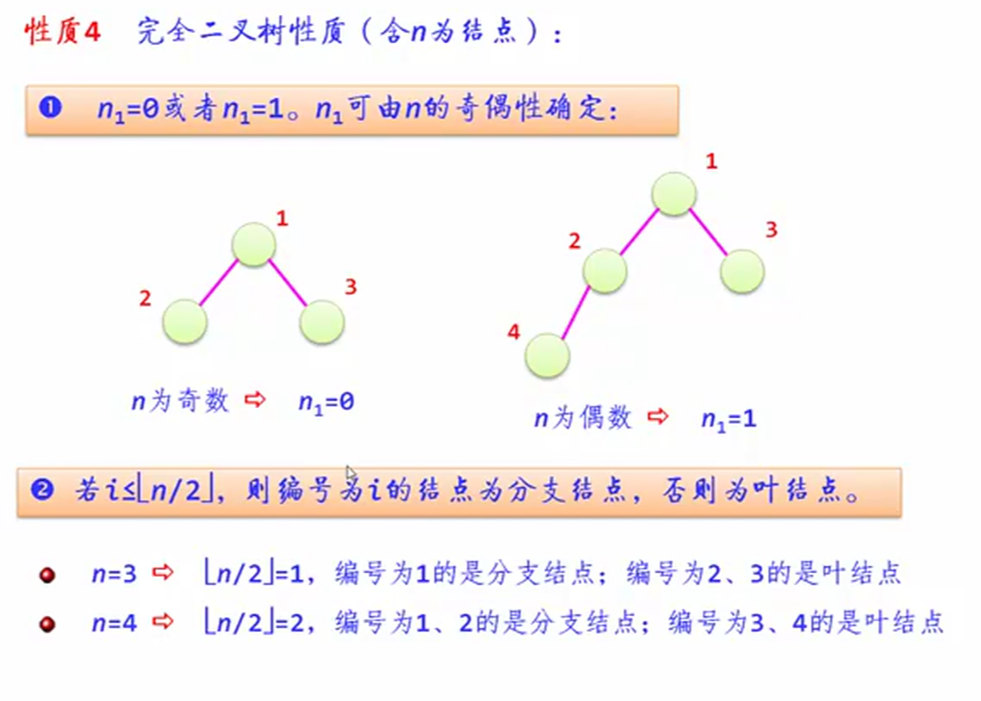
	- 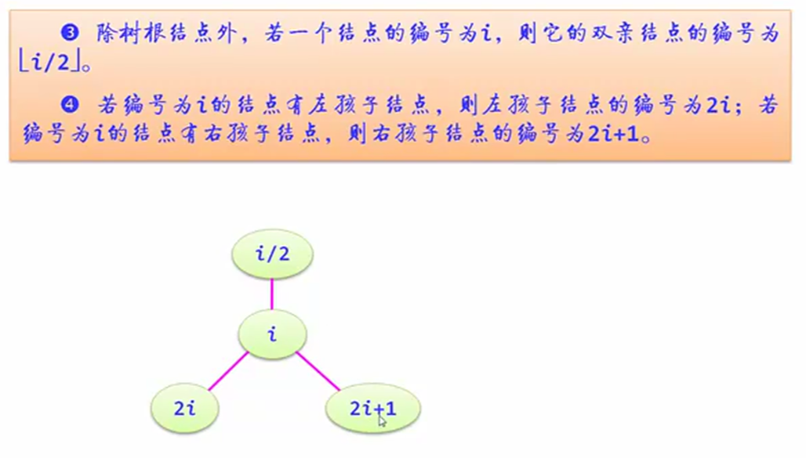

- 性质5
	- 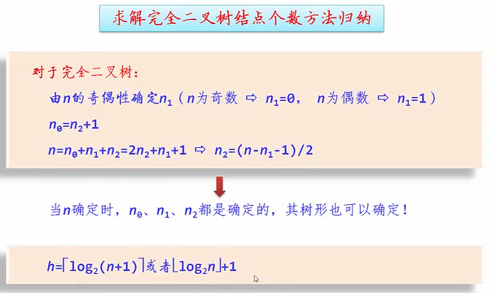


`【例 7.5】`  已知一棵完全二叉树的第6层(设根为第1层)有8个叶子结点，则该完全二叉树的结点个数最多是 `63`


### 7.2.3 二叉树与树、森林之间的转换
#### 1、森林、树转换为二叉树

- 树->二叉树：
	- 左子树为为孩子，右子树为兄弟。顺时针旋转45°
	- 孩子兄弟链存储结构

- 森林->二叉树:
	- 方式1 其他树为第一棵树的右孩子
	- 方式2 设置一棵虚拟根节点，然后按照树转换为二叉树的方式转换

`【例 7.6】` 略

`【例 7.7】` 略

`【例 7.8】` 略


#### 2 二叉树还原为树/森林
- 二叉树还原为一棵树：
	- 左孩子关系恢复为长子关系
	- 右孩子关系恢复为兄弟关系

`【例 7.9】`  略

- 二叉树还原为多棵树：
	- 先拆分为多棵树
	- 再按照还原为一棵树的步骤分别还原

`【例 7.10】` 略

- 挺有意思的一道例题：
	- 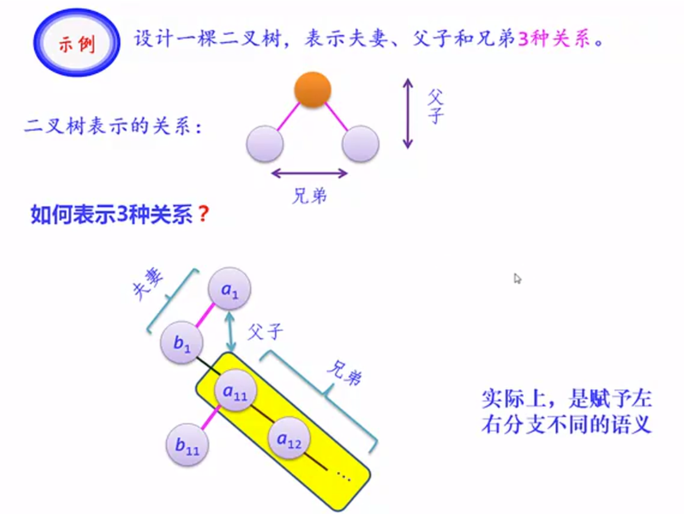
	- 赋予左右分支更多的语义，就可以表示更多的关系。包括层次。因为这种灵活，二叉树可以表示树和森林。很多树的运算都可以转换为二叉树来操作，之后再输出结果。

## 7.3 二叉树的存储结构
- 与线性表一样，二叉树也有顺序存储结构和链式存储结构

### 7.3.1 顺序存储结构
- 根据二叉树的性质4，根据完全二叉树进行层序编号，然后按顺序存放在数组中。没有数据的结点设置为空(`#`)存到数组中。

- 顺序结构的类型声明：
```C++
typedef ElemType SqBinTree[MaxSize];

SqBinTree bt = "#ABD#C#E######F";
```

- 顺序存储的特点：
	- 对于完全二叉树来说，其顺序存储是十分合适的。
	- **缺点**：对于一般的二叉树，特别是对于那些单分支结点较多的二叉树来说是很不合适的，因为可能只有少数存储单元被利用，特别是对退化的二叉树(即每个分支结点都是单分支的)，空间浪费更是惊人。
	- **优点**：在顺序存储结构中，找一个结点的双亲和孩子都很容易。

### 7.3.2 链式存储结构
- 借鉴**树的孩子链存储结构**，链式的结点类型声明如下：
```C++
typedef struct node
{
	ElemType data;
	struct node* lchild;
	struct node* rchild;
}BTNode;  
```
- 二叉树的链式存储结构又称为**二叉链存储结构**。

- 二叉链存储特点：
	- 除了指针外，二叉链**比较节省存储空问**。占用的存储空问与树形没有关系只与树中结点个数有关。
	- 在二叉链中，**找一个结点的孩子很容易**，但找其双亲不方便，

- 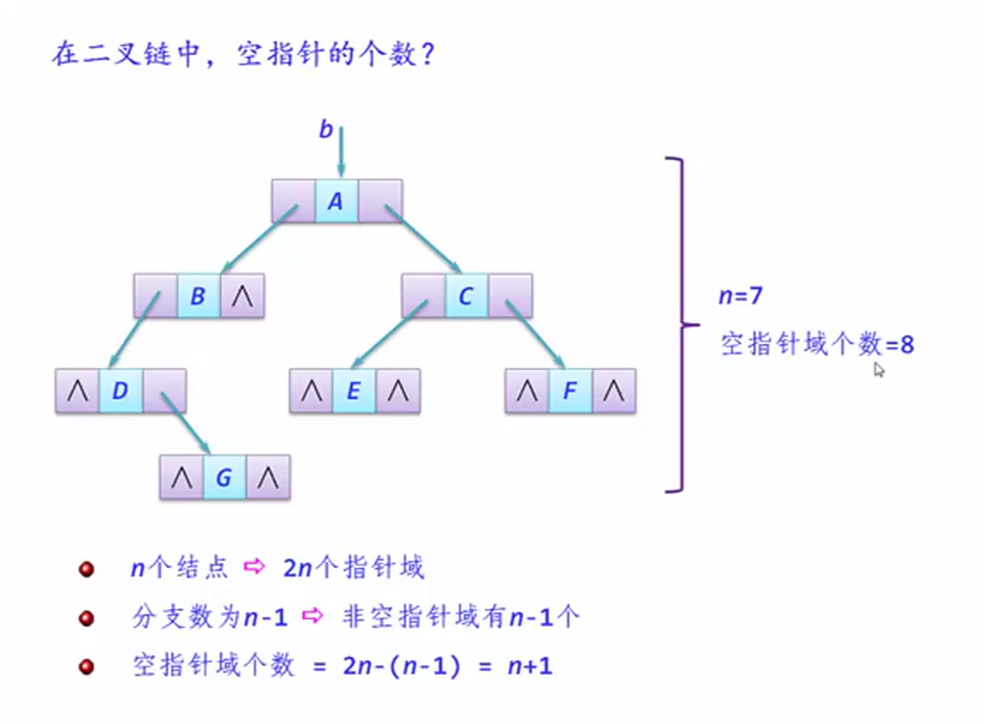

## 7.4 二叉树的基本运算及其实现

### 7.4.1 二叉树的基本运算概述
主要有以下基本运算：
- 创建二叉树
- 销毁二叉树
- 查找结点
- 找孩子结点
- 二叉树的高度
- 输出二叉树


### 7.4.2 二叉树的基本运算算法实现
#### 1.创建二叉树
- 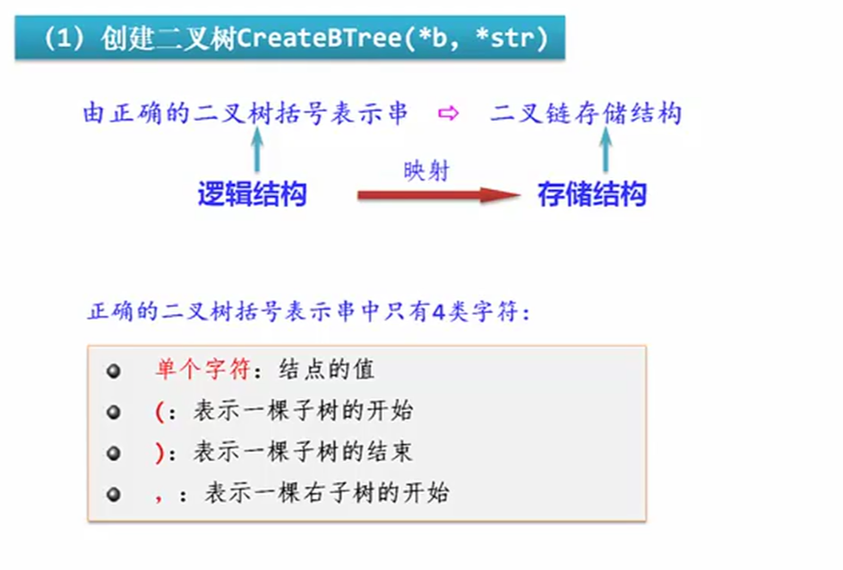
- 算法设计：
	- 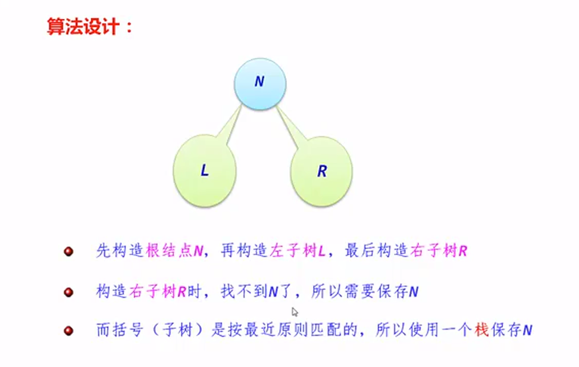
	- 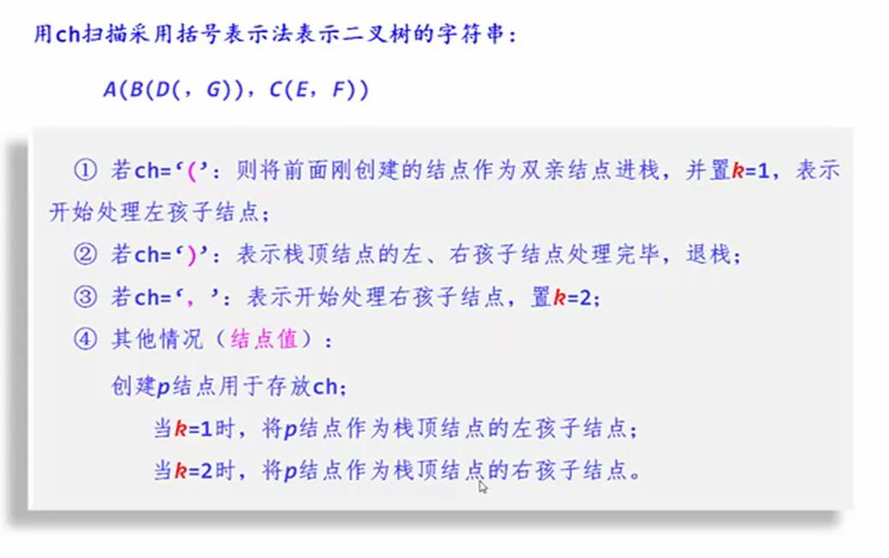
```C++
void CreateBTree(BTNode * &b,char *str)	//创建二叉树
{
	BTNode *St[MaxSize],*p=NULL;
	int top=-1,k,j=0;  
	char ch;
	b=NULL;				//建立的二叉树初始时为空
	ch=str[j];
	while (ch!='\0')  	//str未扫描完时循环
	{
   	   	switch(ch) 
		{
		case '(':top++;St[top]=p;k=1; break;		//为左孩子节点
		case ')':top--;break;
		case ',':k=2; break;                      		//为孩子节点右节点
		default:p=(BTNode *)malloc(sizeof(BTNode));
				p->data=ch;p->lchild=p->rchild=NULL;
				if (b==NULL)                    	 	//*p为二叉树的根节点
					b=p;
				else  								//已建立二叉树根节点
				{	
					switch(k) 
					{
					case 1:St[top]->lchild=p;break;
					case 2:St[top]->rchild=p;break;
					}
				}
		}
		j++;
		ch=str[j];
	}
}
```

#### 2.销毁二叉链
- 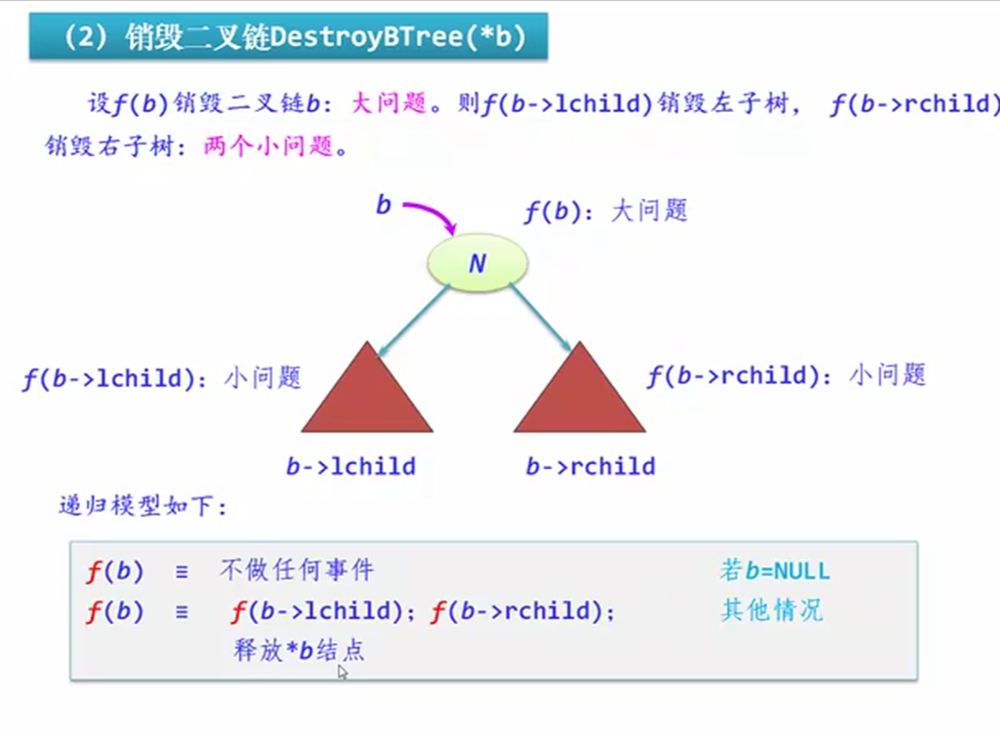
```C++
void DestroyBTree(BTNode *&b)
{	if (b!=NULL)
	{	DestroyBTree(b->lchild);
		DestroyBTree(b->rchild);
		free(b);
	}
}
```

#### 3.查找结点
- 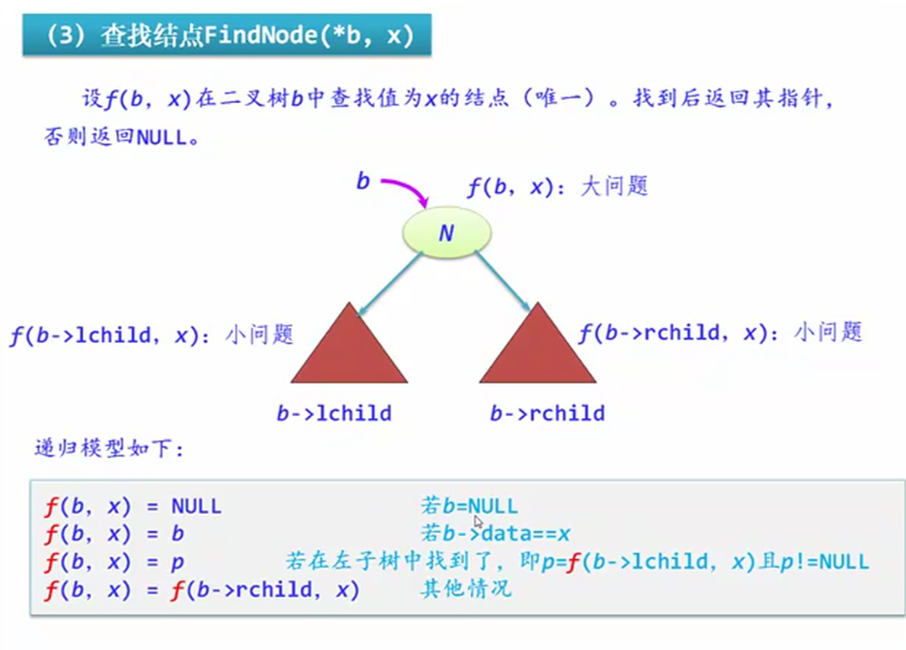
```C++
BTNode *FindNode(BTNode *b,ElemType x) 
{
	BTNode *p;
	if (b==NULL)
		return NULL;
	else if (b->data==x)
		return b;
	else  
	{
		p=FindNode(b->lchild,x);
		if (p!=NULL) 
			return p;
		else 
			return FindNode(b->rchild,x);
	}
}
```

#### 4.找孩子结点
- 直接返回p结点的左孩子结点或右孩子结点的指针。(二叉链存储的特性就是找孩子简单)
```C++
BTNode *LchildNode(BTNode *p)
{
    return p->lchild;
}

BTNode *RchildNode(BTNode *p)
{
    return p->rchild;
}
```

#### 5.二叉树的高度
```C++
int BTHeight(BTNode *b) 
{
   	int lchildh,rchildh;
   	if (b==NULL) return(0); 				//空树的高度为0
   	else  
	{
		lchildh=BTHeight(b->lchild);	//求左子树的高度为lchildh
		rchildh=BTHeight(b->rchild);	//求右子树的高度为rchildh
		return (lchildh>rchildh) ? (lchildh+1):(rchildh+1);
   	}
}
```

#### 6.输出二叉树
```C++
void DispBTree(BTNode *b) 
{
	if (b!=NULL)
	{	printf("%c",b->data);
		if (b->lchild!=NULL || b->rchild!=NULL)
		{	printf("(");						//有孩子节点时才输出(
			DispBTree(b->lchild);				//递归处理左子树
			if (b->rchild!=NULL) printf(",");	//有右孩子节点时才输出,
			DispBTree(b->rchild);				//递归处理右子树
			printf(")");						//有孩子节点时才输出)
		}
	}
}
```

```C++
// 以下主函数用做调试
void main()
{
	BTNode *b;
	CreateBTree(b,"A(B(D,E),C(,F))");
	DispBTree(b);
	printf("\n");
}
```
- 思考题：如果采用顺序存储结构，算法如何实现？
	- （问了GTP，有几个算法感觉很不直观。还是用二叉链比较好理解）

## 7.5 二叉树的遍历
### 7.5.1 二叉树遍历的概念
- 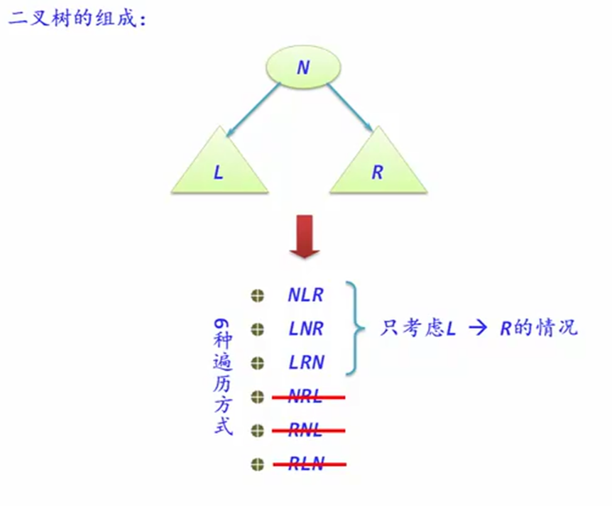
- 先序：先序序列的第一个结点是根结点
- 中序：中序序列的根结点左边是左子树的结点，右边是右子树的结点。
- 后序：后序序列的最后一个结点是根结点
- 层次：层次序列的第一个结点是根结点

### 7.5.2 三种遍历的递归算法
#### 三种遍历算法的实现
```C++
void PreOrder(BTNode *b)  		//先序遍历的递归算法
{
	if (b!=NULL)  
	{
		printf("%c ",b->data);	//访问根结点
		PreOrder(b->lchild);	//先序遍历左子树
		PreOrder(b->rchild);	//先序遍历右子树
	}
}

void InOrder(BTNode *b)   		//中序遍历的递归算法
{
	if (b!=NULL)  
	{	
		InOrder(b->lchild);		//中序遍历左子树
		printf("%c ",b->data);	//访问根结点
		InOrder(b->rchild);		//中序遍历右子树
	}
}

void PostOrder(BTNode *b) 		//后序遍历的递归算法
{
	if (b!=NULL)  
	{
		PostOrder(b->lchild);	//后序遍历左子树
		PostOrder(b->rchild);	//后序遍历右子树
		printf("%c ",b->data);	//访问根结点
	}
}
```
- 注意：
	- 递归算法的实现比较简单，但效率低且执行过程复杂；
	- 非递归算法的实现比较复杂，但效率高。

#### 三种遍历算法的应用
`【例 7.11】计算一棵给定二叉树的所有节点个数（见 Alogorithm.md）`  

`【例 7.12】输出一棵给定二叉树的所有叶子节点（见 Alogorithm.md）`  

`【例 7.13】求二叉树中指定节点的层次（见 Alogorithm.md）`  

`【例 7.14】求二叉树中指定层次的节点个数（见 Alogorithm.md）`  

`【例 7.15】判断两棵二叉树是否相似（见 Alogorithm.md）`  

`【例 7.16】输出二叉树中值为x的节点的所有祖先。（见 Alogorithm.md）`  


### 7.5.3 三种遍历的非递归算法

#### 1.先序的非递归算法
- 非递归算法1：常规算法
- 非递归算法2：其思路适合非递归中序遍历和后序遍历。

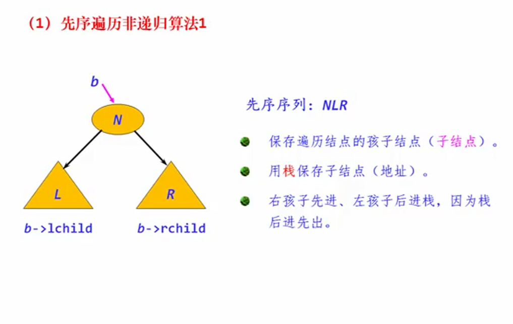
```C++
void PreOrder1(BTNode *b)			//先序非递归遍历算法1
{
	BTNode *p;
	SqStack *st;					//定义一个顺序栈指针st
	InitStack(st);					//初始化栈st
	if (b!=NULL)
	{
		Push(st,b);					//根节点进栈
		while (!StackEmpty(st))		//栈不为空时循环
		{
			Pop(st,p);				//退栈节点p并访问它
			printf("%c ",p->data);	//访问节点p

			if (p->rchild!=NULL)	//有右孩子时将其进栈
				Push(st,p->rchild);
			if (p->lchild!=NULL)	//有左孩子时将其进栈
				Push(st,p->lchild);
		}
		printf("\n");
	}
	DestroyStack(st);				//销毁栈
}
```
- 妙啊！

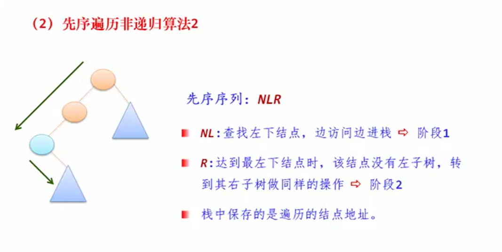
```C++
void PreOrder2(BTNode *b)			//先序非递归遍历算法2
{
	BTNode *p;
	SqStack *st;					//定义一个顺序栈指针st
	InitStack(st);					//初始化栈st
	p=b;
	while (!StackEmpty(st) || p!=NULL)
	{
		while (p!=NULL)				//访问节点p及其所有左下节点并进栈
		{
			printf("%c ",p->data);	//访问节点p
			Push(st,p);				//节点p进栈
			p=p->lchild;			//移动到左孩子
		}
		if (!StackEmpty(st))		//若栈不空
		{
			Pop(st,p);				//出栈节点p
			p=p->rchild;			//转向处理其右子树
		}
	}
	printf("\n");
	DestroyStack(st);				//销毁栈
}
```

#### 2.中序的非递归算法
```C++
void InOrder1(BTNode *b)				//中序非递归遍历算法
{
	BTNode *p;
	SqStack *st;						//定义一个顺序栈指针st
	InitStack(st);						//初始化栈st
	if (b!=NULL)
	{
		p=b;
		while (!StackEmpty(st) || p!=NULL)
		{
			while (p!=NULL)				//扫描节点p的所有左下节点并进栈
			{
				Push(st,p);				//节点p进栈
				p=p->lchild;			//移动到左孩子
			}
			if (!StackEmpty(st))		//若栈不空
			{
				Pop(st,p);				//出栈节点p
				printf("%c ",p->data);	//访问节点p
				p=p->rchild;			//转向处理其右子树
			}
		}
		printf("\n");
	}
	DestroyStack(st);				//销毁栈
}
```

#### 3.后序的非递归算法
```C++
void PostOrder1(BTNode *b)				//后序非递归遍历算法
{
	BTNode *p,*r;
	bool flag;
	SqStack *st;						//定义一个顺序栈指针st
	InitStack(st);						//初始化栈st
	p=b;
	do
	{
		while (p!=NULL)					//扫描节点p的所有左下节点并进栈
		{
			Push(st,p);					//节点p进栈
			p=p->lchild;				//移动到左孩子
		}
		r=NULL;							//r指向刚刚访问的节点，初始时为空
		flag=true;						//flag为真表示正在处理栈顶节点
		while (!StackEmpty(st) && flag)
		{
			GetTop(st,p);				//取出当前的栈顶节点p
			if (p->rchild==r)			//若节点p的右孩子为空或者为刚刚访问过的节点	
			{
				printf("%c ",p->data);	//访问节点p
				Pop(st,p);
				r=p;					//r指向刚访问过的节点
			}
			else
			{	
				p=p->rchild;			//转向处理其右子树
				flag=false;				//表示当前不是处理栈顶节点
			}
		}
	} while (!StackEmpty(st));			//栈不空循环
	printf("\n");
	DestroyStack(st);				//销毁栈
}

```

`【例 7.17】，见 Alogorithm.md`  


### 7.5.4 层次遍历算法
```C++
// 循环队列算法：略

// 层次遍历算法
void LevelOrder(BTNode *b)
{
	BTNode *p;
	SqQueue *qu;
	InitQueue(qu);					//初始化队列
	enQueue(qu,b);					//根结点指针进入队列
	while (!QueueEmpty(qu))			//队不为空循环
	{
		deQueue(qu,p);				//出队节点p
		printf("%c ",p->data);		//访问节点p
		if (p->lchild!=NULL)		//有左孩子时将其进队
			enQueue(qu,p->lchild);
		if (p->rchild!=NULL)		//有右孩子时将其进队
			enQueue(qu,p->rchild);
	} 
}
```

`【例 7.18】，见 Alogorithm.md`  


## 7.6 二叉树的构造

```C++
// 构造二叉树的算法
#include "btree.cpp"
BTNode *CreateBT1(char *pre,char *in,int n)
/*pre存放先序序列,in存放中序序列,n为二叉树节点个数,
本算法执行后返回构造的二叉链的根节点指针*/
{
	BTNode *s;
	char *p;
	int k;
	if (n<=0) return NULL;
	s=(BTNode *)malloc(sizeof(BTNode));		//创建二叉树节点s
	s->data=*pre;
	for (p=in;p<in+n;p++)					//在中序序列中找等于*ppos的位置k
		if (*p==*pre)						//pre指向根节点
			break;							//在in中找到后退出循环
	k=p-in;									//确定根节点在in中的位置
	s->lchild=CreateBT1(pre+1,in,k);		//递归构造左子树
	s->rchild=CreateBT1(pre+k+1,p+1,n-k-1); //递归构造右子树
	return s;
}
BTNode *CreateBT2(char *post,char *in,int n)
/*post存放后序序列,in存放中序序列,n为二叉树节点个数,
本算法执行后返回构造的二叉链的根节点指针*/
{
	BTNode *s;
	char r,*p;
	int k;
	if (n<=0) return NULL;
	r=*(post+n-1);							//根节点值
	s=(BTNode *)malloc(sizeof(BTNode));		//创建二叉树节点s
	s->data=r;
	for (p=in;p<in+n;p++)					//在in中查找根节点
		if (*p==r)
			break;
	k=p-in;									//k为根节点在in中的下标
	s->lchild=CreateBT2(post,in,k);			//递归构造左子树
	s->rchild=CreateBT2(post+k,p+1,n-k-1);	//递归构造右子树
	return s;
}
int main()
{
	ElemType pre[]="ABDGCEF",in[]="DGBAECF",post[]="GDBEFCA";
	BTNode *b1,*b2;
	b1=CreateBT1(pre,in,7);
	printf("b1:");DispBTree(b1);printf("\n");
	b2=CreateBT2(post,in,7);
	printf("b2:");DispBTree(b2);printf("\n");
	DestroyBTree(b1);
	DestroyBTree(b2);
	return 1;
}

```

## 7.7 线索二叉树
```C++
//中序线索二叉树的算法
#include <stdio.h>
#include <malloc.h>
#define MaxSize 100
typedef char ElemType;
typedef struct node 
{
	ElemType data;
	int ltag,rtag;      //增加的线索标记
	struct node *lchild;
	struct node *rchild;
} TBTNode;
void CreateTBTree(TBTNode * &b,char *str)
{
	TBTNode *St[MaxSize],*p=NULL;
	int top=-1,k,j=0;  
	char ch;
	b=NULL;				//建立的二叉树初始时为空
	ch=str[j];
	while (ch!='\0')	//str未扫描完时循环
	{
   	   	switch(ch) 
		{
		case '(':top++;St[top]=p;k=1; break;		//为左节点
		case ')':top--;break;
		case ',':k=2; break;                      	//为右节点
		default:p=(TBTNode *)malloc(sizeof(TBTNode));
				p->data=ch;p->lchild=p->rchild=NULL;
		        if (b==NULL)					//*p为二叉树的根节点
					b=p;
				else  							//已建立二叉树根节点
				{	
					switch(k) 
					{
					case 1:St[top]->lchild=p;break;
					case 2:St[top]->rchild=p;break;
					}
				}
		}
		j++;
		ch=str[j];
	}
}
void DispTBTree(TBTNode *b) 
{
	if (b!=NULL)
	{
		printf("%c",b->data);
		if (b->lchild!=NULL || b->rchild!=NULL)
		{
			printf("(");
			DispTBTree(b->lchild);
			if (b->rchild!=NULL) printf(",");
			DispTBTree(b->rchild);
			printf(")");
		}
	}
}
TBTNode *pre;						//全局变量
void Thread(TBTNode *&p)
{
	if (p!=NULL)	
	{	
		Thread(p->lchild);    		//左子树线索化
		if (p->lchild==NULL)		//前驱线索
		{
			p->lchild=pre;        	//建立当前节点的前驱线索
			p->ltag=1;
		}
		else p->ltag=0;
		if (pre->rchild==NULL)		//后继线索
		{	
			pre->rchild=p;     		//建立前驱节点的后继线索
		   	pre->rtag=1;
		}
		else pre->rtag=0;
	    pre=p;
	   	Thread(p->rchild);  		//右子树线索化
	}
}
TBTNode *CreateThread(TBTNode *b)     //中序线索化二叉树
{
	TBTNode *root;
	root=(TBTNode *)malloc(sizeof(TBTNode));  //创建根节点
	root->ltag=0;root->rtag=1;
	root->rchild=b;
	if (b==NULL)                //空二叉树
		root->lchild=root;
	else
	{  	
		root->lchild=b;
		pre=root;             	//pre是*p的前驱节点,供加线索用
		Thread(b);   			//中序遍历线索化二叉树
		pre->rchild=root;    	//最后处理,加入指向根节点的线索
		pre->rtag=1;
		root->rchild=pre;    	//根节点右线索化
	}
    return root;
}
void DestroyTBTree1(TBTNode *&b)	//销毁
{	if (b->ltag==0)					//节点b有左孩子,释放左子树
		DestroyTBTree1(b->lchild);
	if (b->rtag==0)					//节点b有右孩子,释放右子树
		DestroyTBTree1(b->rchild);
	free(b);
}
void DestroyTBTree(TBTNode *&tb)	//销毁一棵带头结点的中序线索树tb
{
	DestroyTBTree1(tb->lchild);		//释放以tb->lchild为根节点的树
	free(tb);						//释放头节点
}

void ThInOrder(TBTNode *tb)
{
	TBTNode *p=tb->lchild;		//指向根节点
	while (p!=tb)		
	{
		while (p->ltag==0) p=p->lchild;
		printf("%c ",p->data);
		while (p->rtag==1 && p->rchild!=tb)
		{
			p=p->rchild;
			printf("%c ",p->data);
		}
		p=p->rchild;
	}
}
int main()
{
	TBTNode *b,*tb;
	CreateTBTree(b,"A(B(D(,G)),C(E,F))");
	printf(" 二叉树:");DispTBTree(b);printf("\n");
	tb=CreateThread(b);
	printf(" 线索中序序列:");ThInOrder(tb);printf("\n");
	DestroyTBTree(tb);
	return 1;
}
```


## 7.8 哈夫曼树

```C++
//构造哈夫曼树和哈夫曼编码的算法
#include <stdio.h>
#include <string.h>
#define N 50		//叶子结点数
#define M 2*N-1		//树中结点总数
typedef struct
{
	char data[5];	//结点值
	double weight;	//权重
	int parent;		//双亲结点
	int lchild;		//左孩子结点
	int rchild;		//右孩子结点
} HTNode;
typedef struct
{
	char cd[N];		//存放哈夫曼码
	int start;
} HCode;
void CreateHT(HTNode ht[],int n0)	//构造哈夫曼树
{	int i,k,lnode,rnode;
	double min1,min2;
	for (i=0;i<2*n0-1;i++)			//所有节点的相关域置初值-1
		ht[i].parent=ht[i].lchild=ht[i].rchild=-1;
	for (i=n0;i<=2*n0-2;i++)		//构造哈夫曼树的n0-1个节点
	{	min1=min2=32767;			//lnode和rnode为最小权重的两个节点位置
		lnode=rnode=-1;
		for (k=0;k<=i-1;k++)		//在ht[0..i-1]中找权值最小的两个节点
			if (ht[k].parent==-1)	//只在尚未构造二叉树的节点中查找
			{	if (ht[k].weight<min1)
				{	min2=min1;rnode=lnode;
					min1=ht[k].weight;lnode=k;
				}
				else if (ht[k].weight<min2)
				{	min2=ht[k].weight;rnode=k;  }
			}
		ht[i].weight=ht[lnode].weight+ht[rnode].weight;
		ht[i].lchild=lnode;ht[i].rchild=rnode;	//ht[i]作为双亲节点
		ht[lnode].parent=i;ht[rnode].parent=i;
	}
}

void CreateHCode(HTNode ht[],HCode hcd[],int n0)	//构造哈夫曼树编码
{	int i,f,c;
	HCode hc;
	for (i=0;i<n0;i++)				//根据哈夫曼树求哈夫曼编码
	{	hc.start=n0;c=i;
		f=ht[i].parent;
		while (f!=-1)				//循环直到无双亲节点即到达树根节点
		{	if (ht[f].lchild==c)	//当前节点是双亲节点的左孩子
				hc.cd[hc.start--]='0';
			else					//当前节点是双亲节点的右孩子
				hc.cd[hc.start--]='1';
			c=f;f=ht[f].parent;	//再对双亲节点进行同样的操作
		}
		hc.start++;				//start指向哈夫曼编码最开始字符
		hcd[i]=hc;
	}
}

void DispHCode(HTNode ht[],HCode hcd[],int n0)	//输出哈夫曼树编码
{
	int i,k;
	double sum=0,m=0;
	int j;
	printf("  输出哈夫曼编码:\n"); //输出哈夫曼编码
	for (i=0;i<n0;i++)
	{
		j=0;
		printf("      %s:\t",ht[i].data);
		for (k=hcd[i].start;k<=n0;k++)
		{
			printf("%c",hcd[i].cd[k]);
			j++;
		}
		m+=ht[i].weight;
		sum+=ht[i].weight*j;
		printf("\n");
	}
	printf("\n  平均长度=%g\n",1.0*sum/m);
}
int main()
{
	int n=8,i;		//n表示初始字符串的个数
	char *str[]={"a","b","c","d","e","f","g","h"};
	double fnum[]={0.07,0.19,0.02,0.06,0.32,0.03,0.21,0.1};
	HTNode ht[M];
	HCode hcd[N];
	for (i=0;i<n;i++)
	{
		strcpy(ht[i].data,str[i]);
		ht[i].weight=fnum[i];
	}
	printf("\n");
	CreateHT(ht,n);
	CreateHCode(ht,hcd,n);
	DispHCode(ht,hcd,n);
	printf("\n");
	return 1;
}
```

## 7.9 用并查集求解等价问题

```C++
//并查集的算法
#include <stdio.h>
#define MaxSize 100
#define N 10		//问题涉及的人数,人的编号从1到N
#define M 7			//亲戚关系个数
#define Q 3			//询问个数
typedef struct node
{
	int data;		//结点对应人的编号
	int rank;		//结点对应秩
	int parent;		//结点对应双亲下标
} UFSTree;
void MAKE_SET(UFSTree t[],int n)	//初始化并查集树
{ 
	int i;
	for (i=1;i<=n;i++)
	{
		t[i].data=i;		//数据为该人的编号
		t[i].rank=0;		//秩初始化为0
		t[i].parent=i;		//双亲初始化指向自已
	}
}
int FIND_SET(UFSTree t[],int x)	//在x所在子树中查找集合编号
{
	if (x!=t[x].parent)					//双亲不是自已
		return(FIND_SET(t,t[x].parent));//递归在双亲中找x
	else
		return(x);						//双亲是自已,返回x
}
void UNION(UFSTree t[],int x,int y)	//将x和y所在的子树合并
{ 
	x=FIND_SET(t,x);
	y=FIND_SET(t,y);
	if (t[x].rank>t[y].rank)		//y结点的秩小于x结点的秩
		t[y].parent=x;				//将y连到x结点上,x作为y的孩子结点
	else							//y结点的秩大于等于x结点的秩
	{ 
		t[x].parent=y;				//将x连到y结点上,y作为x的孩子结点
		if (t[x].rank==t[y].rank)	//x和y结点的秩相同
			t[y].rank++;			//y结点的秩增1
	}
}
int main()
{
	int i,x,y;
	UFSTree t[MaxSize];
	int rel[M][2]={{2,4},{5,7},{1,3},{8,9},{1,2},{5,6},{2,3}};
	int ans[Q][2]={{3,4},{7,10},{8,9}};
	MAKE_SET(t,N);					//初始化并查集树t
	for (i=0;i<M;i++)				//根据关系进行合并操作
		UNION(t,rel[i][0],rel[i][1]);
	printf("data  rank  parent\n");	//输出并查集树t
	for (i=1;i<=N;i++)
		printf("%4d%5d%6d\n",t[i].data,t[i].rank,t[i].parent);
	printf("\n");
	printf("各询问的结果:\n");		//输出求解结果
	for (i=0;i<Q;i++)
	{
		x=FIND_SET(t,ans[i][0]);
		y=FIND_SET(t,ans[i][1]);
		if (x==y)
			printf("  (%d,%d):Yes\n",ans[i][0],ans[i][1]);
		else
			printf("  (%d,%d):No\n",ans[i][0],ans[i][1]);
	}
	return 1;
}

```


## 7.10 红黑树（补充）


## 本章小结
`【例 7.x】，见 Alogorithm.md`  