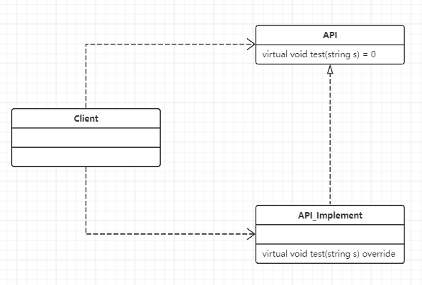
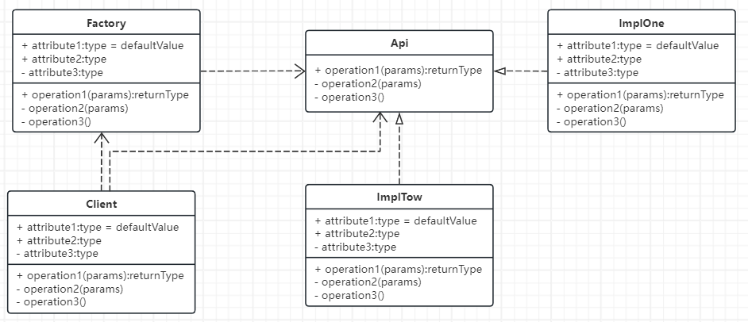

该课程学习每个模式的步骤：
- 1.介绍-定义、结构、参考实现、场景问题
- 2.模式的典型疑问与优缺点评价
- 3.单例的应用案例与思考。

## 2-1 简单工厂的使用场景
针对接口编程的设计思想剖析
- 创建型模式之简单工厂
- 封装变化
- 学设计模式就要是用面向对象的思想来做开发。

- 
```C++
// 修改前：封装性被破坏掉。客户知道了Impl类。
#include <iostream>
#include <string>
using namespace std;

class Api
{
public:
	virtual void test(string s) = 0;
protected:
	Api() {}  // 屏蔽构造函数，体现接口概念
};

class Impl : public Api
{
public:
	virtual void test(string s) override
	{
		cout << "现在是Imple类，正在执行方法: " << s << endl;
	}
};

int main()
{
	Api* pApi = new Impl();
	pApi->test("测试运行");
	return 0;
}
```

- 简单工厂的定义：提供一个创建对象实例的功能，而不需关心其具体实现。被创建的类型可以是接口、抽象类、也可以是具体的类。
- Factory实现了隔离变化
- 
```C++
// 修改后：通过简单工厂不让用户看到实现类Impl
#include <iostream>
#include <string>
using namespace std;

enum class ApiSubclass
{
	ImplOne,
	ImplTwo
};

class Api
{
public:
	virtual void test(string s) = 0;
protected:
	Api() {}  // 屏蔽构造函数，体现接口概念
};

class ImplOne : public Api
{
public:
	virtual void test(string s) override
	{
		cout << "现在是One类，正在执行方法: " << s << endl;
	}
};

class ImplTwo : public Api
{
public:
	virtual void test(string s) override
	{
		cout << "现在是Two类，正在执行方法: " << s << endl;
	}
};

class Factory
{
public:
	static Api* createApi(ApiSubclass type)
	{
		Api* pApi = nullptr;

		if (type == ApiSubclass::ImplOne)
		{
			pApi = new ImplOne();
		}
		else if (type == ApiSubclass::ImplTwo)
		{
			pApi = new ImplTwo();
		}

		return pApi;
	}
};

int main()
{
	// 实现了客户端和ImplOne和ImplTow的解耦合
	Api* pApi = Factory::createApi(ApiSubclass::ImplTwo);
	pApi->test("现在是使用简单工厂方法重构");
	return 0;
}
```


## 2-2 简单工厂的应用
- 应用：C++对象动态创建技术与配置化开发
- 在上面例子，客户端还是知道工厂的部分细节。现在想动态识别，完全实现隔离

```C++
// SimpleFactory.h
#pragma once

#include <string>
#include <map>

typedef void* (*Constructor)();  // 仿函数

class CObjectFactory
{
public:
	static void registerClass(std::string className, Constructor constructor)
	{
		constructors()[className] = constructor;
	}

	// 动态创建对象
	static void* createObject(const std::string& className)
	{
		Constructor constructor = nullptr;

		if (constructors().find(className) != constructors().end())
		{
			constructor = constructors().find(className)->second;
		}

		if (constructor == nullptr)
		{
			return nullptr;
		}

		return (*constructor)();
	}

private:
	// string->key:动态创建的类的类名，value是构建该类
	inline static std::map<std::string, Constructor>& constructors()
	{
		static std::map<std::string, Constructor> instance;
		return instance;
	}
};

#define REGISTER_CLASS(ClassName) \
class ClassName##Helper { \
public: \
	ClassName##Helper() { \
		CObjectFactory::registerClass(#ClassName, ClassName##Helper::crateObjFunc); \
	} \
	static void* crateObjFunc() { \
		return new ClassName; \
	} \
}; \
ClassName##Helper ClassName##helper;
```
- 仿函数：仿函数类重载了调用操作符operator()，这样对象就可以像函数一样被调用。
- ```void*```是一种通用的指针类型，可以指向任意类型的对象.返回一个通用的指针类型更为灵活，并且在需要的时候可以将其转换为具体的类型。

```C++
// main.cpp
#include <iostream>
#include "SimpleFactory.h"

using std::cout;
using std::endl;
using std::string;

class API
{
public:
	virtual void test(string s) = 0;
protected:
	API() {}  // 屏蔽构造函数，体现接口概念
};

class ImplOne : public API
{
public:
	virtual void test(string s) override
	{
		cout << "现在是One类，正在执行方法: " << s << endl;
	}
};

class ImplTwo : public API
{
public:
	virtual void test(string s) override
	{
		cout << "现在是Two类，正在执行方法: " << s << endl;
	}
};

REGISTER_CLASS(ImplTwo)

class AutoFactory
{
public:
	static API* CreateAPI()
	{
		// 类名的地方如果是一个配置文件，就非常灵活，可以配置化开发。非常有价值，让程序变得特别容易维护和扩展
		return static_cast<API*>(CObjectFactory::createObject("ImplTwo"));
	}
};

int main()
{
	API* pAPI = AutoFactory::CreateAPI();
	if (pAPI)
	{
		pAPI->test("哈哈，完全不知道里面的东西了^_^");
	}

	return 0;
}
```


## 2-3 单例模式的应用场景

学习单例模式：
- 一：单例模式的介绍-定义、结构、参考实现、场景问题
- 二：单例模式的典型疑问与优缺点评价：饿汉，懒汉与多线程安全
- 三：单例的应用案例与思考：缓存

### 懒汉式

```C++
#include <iostream>

using namespace std;

class Singleton
{
public:
	static Singleton* GetInstance() // 懒汉式：延迟加载（需要考虑多线程）
	{
		if (nullptr == m_Singer)
		{
			m_Singer = new Singleton;
		}
		return m_Singer;
	}

private:
	Singleton()  // 在C++中，构造函数不是线程安全的
	{
		m_Singer = nullptr;
		cout << "Construct a Singleton Object" << endl;
	}

private:
	static Singleton* m_Singer;
};

Singleton* Singleton::m_Singer = nullptr;


int main()
{
	Singleton* p1 = Singleton::GetInstance();
	Singleton* p2 = Singleton::GetInstance();

	cout << "p1 = " << p1 << endl;
	cout << "p2 = " << p2 << endl;

	return 0;
}
```
- 懒汉式的创建一定会出现时间片被打断，一定会出现线程不安全。需要使用double checking双检查锁来解决
- 懒汉模式在需要时才创建实例，而饿汉模式在类加载时就创建实例
- 懒汉模式需要考虑多线程，饿汉模式不需要考虑多线程
- 懒汉意味着“懒惰”，懒得吃饭。饿汉意味着“急切”，急着吃饭

### 饿汉式和双检查锁
```C++
#include <iostream>
#include <afxwin.h> // VS2022需要创建MFC工程

using namespace std;

CRITICAL_SECTION g_cs;

class Singleton
{
public:
	static Singleton* GetInstance()
	{
		if (nullptr == m_Singer)  // 添加双检查锁
		{
			::EnterCriticalSection(&g_cs);
			if (nullptr == m_Singer)
			{
				m_Singer = new Singleton;
			}
			::LeaveCriticalSection(&g_cs);
		}
		return m_Singer;
	}

private:
	Singleton()  // 在C++中，构造函数不是线程安全的
	{
		m_Singer = nullptr;
		cout << "Construct a Singleton Object" << endl;
	}

private:
	static Singleton* m_Singer;
};

UINT Func(LPVOID)
{
	printf("%x\n", Singleton::GetInstance());
	return 0;
}

Singleton* Singleton::m_Singer = nullptr; // new Singleton;  在这里创建就是饿汉式：类加载时即创建实例（不需要考虑多线程）


int main()
{
	::InitializeCriticalSection(&g_cs);

	for (int i = 0; i < 10; i++)
	{
		AfxBeginThread(Func, NULL);  // 不加保护会打印10个不同的指针地址
	}

	::DeleteCriticalSection(&g_cs);
	return 0;
}
```

## 2-4 单例模式的应用
- 应用：从单例到多例，应用系统缓存的实现原理
- 既然我们可以控制全局生成一个对象,那么有没有需要生成1个以上的对象呢?（好像高并发场景会用到）
- 缓存设计与Singleton的扩展

```C++
// CatchAndSingleton.cpp -- 回避多线程的安全问题，凸显单例扩展到缓存
#include <iostream>
#include <map>  // 使用全局的map来实现缓存

using namespace std;

class Singleton;
static std::map<string, Singleton*> MyMap = std::map<string, Singleton*>(); // 问了下Kimi，貌似不需要后面的赋值。

// 懒汉-延迟加载
class Singleton
{
private:
	Singleton()
	{
		m_singer = nullptr;
		cout << "单例正在构建" << endl;
	}
public:
	static Singleton* GetInstance()
	{
		// std::map<std::string, int>::iterator it = MyMap.find(DEFAULT_KEY);
		if (MyMap.find(DEFAULT_KEY) != MyMap.end())
		{
			return MyMap.find(DEFAULT_KEY)->second;
		}

		if (m_singer == nullptr)
		{
			m_singer = new Singleton;
			MyMap[DEFAULT_KEY] = m_singer;
		}

		return m_singer;
	}

private:
	static Singleton* m_singer;
	static string DEFAULT_KEY;
};

Singleton* Singleton::m_singer = nullptr;
string Singleton::DEFAULT_KEY = "One";

int main()
{
	Singleton* p1 = Singleton::GetInstance();
	Singleton* p2 = Singleton::GetInstance();
	cout << "p1 = " << p1 << endl;
	cout << "p2 = " << p2 << endl;
	return 0;
}
```
- 对KEY做一些文章，就可以把单例变成多例了。

```C++

#include <iostream>
#include <string>
#include <map>

using namespace std;

const static int NUM_MAX = 5;  // 缓存的实例个数
static std::map<int, class Singleton*> MyMap;

class Singleton
{
private:
	Singleton()
	{
		m_singer = nullptr;

		cout << "Building Single..." << endl;
	}

public:
	static Singleton* GetInstance()
	{
		m_singer = MyMap[m_InstanceCount];

		if (m_singer == nullptr)
		{
			m_singer = new Singleton;
			MyMap[m_InstanceCount] = m_singer;
		}

		m_InstanceCount++;

		if (m_InstanceCount > NUM_MAX)
		{
			m_InstanceCount = 1;
		}

		return m_singer;
	}

private:
	static Singleton* m_singer;
	static int m_InstanceCount;
};

Singleton* Singleton::m_singer = nullptr;
int Singleton::m_InstanceCount = 1;

int main()
{
	for (int i = 0; i < 10; i++)
	{
		Singleton* p1 = Singleton::GetInstance();
		cout << "p1 = " << p1 << endl;
	}

	return 0;
}
```

## 2-5 工厂模式的使用场景

- 使用场景 - 子类延迟实现父类功能的软件结构
场景:
- 考虑这样一个实际应用：实现一个导出数据的应用框架，来让客户选择数据的导出方式，并真正执行数据导出。
- 通常这种系统，在导出数据上，会有一些约定的方式，比如导出成：csv格式、数据库备份形式、Excel格式、Xml格式等等

如何设计：
- 从封装的角度来说，我们希望导出数据的业务功能对象创建ExportFileApi的具体实例，目前它只知道接口，怎么办？（提供一个接口，子类可以决定具体实例化那个类。实现类的实例化的延迟）


```C++
#include <iostream>
#include <string>

using namespace std;

class ExportFileApi
{
public:
	virtual bool exportData(string data) = 0;

protected:
	ExportFileApi() {}  // 屏蔽构造函数，体现接口概念
};

// 具体化的子类
class ExportTxtFile : public ExportFileApi
{
public:
	bool exportData(string data)
	{
		cout << "正在导出数据" << data << "到csv文件" << endl;
		return true;
	}
};

// 具体化的子类
class ExportDB : public ExportFileApi
{
public:
	bool exportData(string data)
	{
		cout << "正在导出数据" << data << "到数据库" << endl;
		return true;
	}
};

// 实现一个ExportOperate，这个叫导出数据的业务功能对象
class ExportOperate  // 它也是接口
{
public:
	bool exportData(string data)
	{
		ExportFileApi* pApi = factoryMethod();
		return pApi->exportData(data);
	}

protected:
	virtual ExportFileApi* factoryMethod() = 0;
};

// 实现的实现对象，完成导出工作
class ExportTxtFileOperate : public ExportOperate
{
protected:
	virtual ExportFileApi* factoryMethod()
	{
		return new ExportTxtFile();
	}
};

class ExportDBOperate : public ExportOperate
{
protected:
	virtual ExportFileApi* factoryMethod()
	{
		return new ExportDB();
	}
};

int main()
{
	if (ExportOperate* pOperate = new ExportTxtFileOperate())
	{
		pOperate->exportData("data");
	}
	
	return 0;
}
```
- 这一部分可以看看类图结构，会更加清晰。这里懒得画了。

工厂模式定义
- 1 工厂方法模式的功能：
	- 工厂方法的主要功能是让父类在不知道具体实现的情况下，完成自身的功能调用，而具体的实现延迟到子类来实现。

- 2 实现成抽象类
	- 工厂方法的实现中，通常父类会是一个抽象类，里面包含创建所需对象的抽象方法，这些抽象方法就是工厂方法

- 3 实现成具体的类
	- 也可以把父类实现成为一个具体的类，这种情况下，通常是在父类中提供获取所需对象的默认实现方法，这样就算没有具体的子类，也能够运行。

- 4 工厂方法的参数和返回值
	- 工厂方法的实现中，可能需要参数，以便决定到底选用哪一种具体的实现。
	- 一般工厂方法返回的是被创建对象的接口对象，当然也可以是抽象类或者一个具体的类的实例。


## 2-6 工厂模式的应用
- IOC容器与工厂模式的应用

- 老师：设计模式是经验的总结，关键要看你解决什么样软件结构


- 工厂模式的工程应用-IOC/DI：
  - 依赖注入（IOC）：应用程序依赖容器创建并注入它所需要的外部资源  
  - 控制反转（DI）：容器控制应用程序，由容器反向的向应用程序注入所需的

- ChatGTP：IOC（Inversion of Control，控制反转）和 DI（Dependency Injection，依赖注入）是软件设计中的两个重要概念，通常用于提高代码的灵活性、可维护性和可测试性。它们在设计模式和架构设计中有着广泛的应用。

- 当对象很多时，统一用IOC容器来获取（或者说注入），能够减少对象之间的依赖，方便管理。

```C++
#include <string>
#include <map>
#include <memory>
#include <functional>
#include <iostream>

using namespace std;

template <typename T>
class IOCContainer
{
public:
	IOCContainer(void) {}
	~IOCContainer()
	{

	}

	/*
	std::function 是 C++11 标准库中引入的一个通用函数封装类。
	它可以存储、复制和调用任何可调用对象（如函数指针、成员函数指针、Lambda 表达式以及其他函数对象）。
	std::function 提供了灵活的函数对象存储和调用机制，使得可以将函数作为对象传递、存储和调用。
	*/

	// 注册需要创建对象的构造函数，通过一个唯一的标识，以便于以后查找
	template <typename Drived>
	void RegisterType(string strKey)
	{
		std::function<T* ()> function = [] { return new Drived(); };  // 没有参数时可以不写()，但是[]和{}是必须的
		RegisterType_Interanal(strKey, function);
	}

	// 根据唯一的标识去查找对应的构造函数
	T* Resolve(string strKey)
	{
		if (m_createMap.find(strKey) == m_createMap.end())
		{
			return nullptr;
		}

		std::function<T* ()> function = m_createMap[strKey];
		return function();
	}

	// 创建智能指针，方便快速访问对象
	std::shared_ptr<T> ResolveShared(string strKey)
	{
		T* ptr = Resolve(strKey);
		return std::shared_ptr<T>(ptr);
	}

private:
	void RegisterType_Interanal(string strKey, std::function<T* ()> creator)
	{
		if (m_createMap.find(strKey) != m_createMap.end())
		{
			// std::invalid_argument 是 C++ 标准库中定义的一个异常类，继承自 std::logic_error。它用于表示在函数或操作中提供了无效的参数。
			throw std::invalid_argument("已经存在这个Key了，不能重复注册！");
		}

		m_createMap.emplace(strKey, creator);
	}

private:
	map<string, std::function<T* ()>> m_createMap;
};

struct ICar
{
	virtual ~ICar() {}
	virtual void test() const = 0;
};

struct Bus : ICar  // struct 默认为公有继承
{
	Bus() {}
	void test() const { std::cout << "Bus::test()" << endl; }
};

struct Track : ICar
{
	Track() {}
	void test() const { std::cout << "Track::test()" << endl; }
};

int main()
{
	IOCContainer<ICar> CarIOC;
	CarIOC.RegisterType<Bus>("bus");
	CarIOC.RegisterType<Track>("track");

	// 这时候的bus和track都是通过IOC容器注入进来的，这个时候耦合性就非常低了（好）
	if (std::shared_ptr<ICar> BusPtr = CarIOC.ResolveShared("bus"))
	{
		BusPtr->test();
	}

	// 不用再关注对象的细节，程序的灵活性大大增加
	if (std::shared_ptr<ICar> TrackPtr = CarIOC.ResolveShared("track"))
	{
		TrackPtr->test();
	}

	return 0;
}
```

**工厂模式的本质：依赖倒置原则 - 让子类选择实现**
- 依赖倒置原则告诉我们“要依赖抽象，不要依赖于具体类”：不能让高层组件依赖于底层组件，而且不管高层组件还是底层组件，都应该依赖于抽象

何时选用工厂模式：
- 1.如果一个类需要创建某个接口的对象，但是又不知道具体的实现，这种情况可以选用工厂方法模式，把创建对象的工作延迟到子类去实现
- 2.如果一个类本身就希望由它的子类来创建所需的对象的时候，应该使用工厂方法


## 2-7 抽象工厂的使用场景

场景描述: **相互关联的对象**
- 考虑这样一个实际应用：我需要完成两套GUI的表示层，一个是在PC机，另一个是在平板、手机上完成这个应用程序的界面。
- 通常一个显著的设备差别在于分辨率

如何设计：
- 从封装的角度来说，我们希望根据布局器配置我们的控件，我们开放布局器和控件接口供客户端调用。

```C++
// 不用抽象工厂来实现：封装性不好，容易造成混乱。
#include <iostream>

using namespace std;

class FrameAPI
{
public:
	virtual void Draw() const = 0;

protected:
	FrameAPI() {}
};

// PC上的Frame
class ComputerFrame : public FrameAPI
{
public:
	ComputerFrame(int InResolution) : Resolution(InResolution) { }

	virtual void Draw() const override { cout << "现在是PC机的Frame，适用的分辨率是：" << Resolution << endl; }

private:
	int Resolution;
};

// Mobile Phone上的Frame
class MobileFrame : public FrameAPI
{
public:
	MobileFrame(int InResolution) : Resolution(InResolution) { }

	virtual void Draw() const override { cout << "现在是Mobile Phone机的Frame，适用的分辨率是：" << Resolution << endl; }

private:
	int Resolution;
};

// Frame会装在到布局器上面
class LayoutAPI
{
public:
	virtual void InstallFrame() = 0;
protected:
	LayoutAPI() {}
};

// 高分辨率布局
class HighLayout : public LayoutAPI
{
public:
	HighLayout(int InFrameAdapterResolution) : FrameAdapterResolution(InFrameAdapterResolution){ }

	virtual void InstallFrame() override { cout << "现在是在PC环境下，我们使用的高分辨率布局: " << FrameAdapterResolution << endl; }
private:
	int FrameAdapterResolution; 
};

// 低分辨率布局
class LowLayout : public LayoutAPI
{
public:
	LowLayout(int InFrameAdapterResolution) : FrameAdapterResolution(InFrameAdapterResolution) { }

	virtual void InstallFrame() override { cout << "现在是在Mobile环境下，我们使用的低分辨率布局: " << FrameAdapterResolution << endl; }
private:
	int FrameAdapterResolution;
};

// 创建产品的简单工厂
class FrameFactory
{
public:
	static FrameAPI* CreateFrame(int InFrameType)
	{
		if (InFrameType == 1)
		{
			return new ComputerFrame(2160);
		}
		else if (InFrameType == 2)
		{
			return new  MobileFrame(1440);
		}
		else
		{
			return nullptr;
		}
	}
};

class LayoutFactory
{
public:
	static LayoutAPI* CreateLayout(int InLayoutType)
	{
		if (InLayoutType == 1)
		{
			return new HighLayout(2160);
		}
		else if (InLayoutType == 2)
		{
			return new  LowLayout(1440);
		}
		else
		{
			return nullptr;
		}
	}
};

class GUIEngineer
{
public:
	void PrepareDraw(int InFrameType, int InLayoutType)
	{
		if (FramePtr = FrameFactory::CreateFrame(InFrameType))
		{
			FramePtr->Draw();
		}
		
		if (LayoutPtr = LayoutFactory::CreateLayout(InLayoutType))
		{
			LayoutPtr->InstallFrame();
		}
	}

private:
	FrameAPI* FramePtr = nullptr;
	LayoutAPI* LayoutPtr = nullptr;
};

int main()
{
	if (GUIEngineer* EngPtr = new GUIEngineer)
	{
		EngPtr->PrepareDraw(1, 1);
		EngPtr->PrepareDraw(1, 2);  // 缺点：PC和Mobile混乱
	}
}
```


## 2-8 抽象工厂的应用
抽象工厂定义：
- 抽象工厂的功能是为一些列相关对象或相关依赖创建一个接口。
- 从某种意义上看，抽象工厂是一个产品系列，或者产品簇。抽象工厂定义了一产品簇，因此切换产品簇的时候提供了不同的抽象工厂就好了。


```C++
#include <iostream>

using namespace std;

class FrameAPI
{
public:
	virtual void Draw() const = 0;

protected:
	FrameAPI() {}
};

// PC上的Frame
class ComputerFrame : public FrameAPI
{
public:
	ComputerFrame(int InResolution) : Resolution(InResolution) { }

	virtual void Draw() const override { cout << "现在是PC机的Frame，适用的分辨率是：" << Resolution << endl; }

private:
	int Resolution;
};

// Mobile Phone上的Frame
class MobileFrame : public FrameAPI
{
public:
	MobileFrame(int InResolution) : Resolution(InResolution) { }

	virtual void Draw() const override { cout << "现在是Mobile Phone机的Frame，适用的分辨率是：" << Resolution << endl; }

private:
	int Resolution;
};

// Frame会装在到布局器上面
class LayoutAPI
{
public:
	virtual void InstallFrame() = 0;
protected:
	LayoutAPI() {}
};

// 高分辨率布局
class HighLayout : public LayoutAPI
{
public:
	HighLayout(int InFrameAdapterResolution) : FrameAdapterResolution(InFrameAdapterResolution) { }

	virtual void InstallFrame() override { cout << "现在是在PC环境下，我们使用的高分辨率布局: " << FrameAdapterResolution << endl; }
private:
	int FrameAdapterResolution;
};

// 低分辨率布局
class LowLayout : public LayoutAPI
{
public:
	LowLayout(int InFrameAdapterResolution) : FrameAdapterResolution(InFrameAdapterResolution) { }

	virtual void InstallFrame() override { cout << "现在是在Mobile环境下，我们使用的低分辨率布局: " << FrameAdapterResolution << endl; }
private:
	int FrameAdapterResolution;
};

// 抽象工厂用来生产产品簇
class AbstractFactory
{
public:
	virtual FrameAPI* CreateFrameAPI() = 0;
	virtual LayoutAPI* CreateLayoutAPI() = 0;
protected:
	AbstractFactory() {}
};

class Schema01 : public AbstractFactory
{
public:
	virtual FrameAPI* CreateFrameAPI() override
	{
		return new ComputerFrame(2160);
	}

	virtual LayoutAPI* CreateLayoutAPI() override
	{
		return new HighLayout(2160);
	}
};

class Schema02 : public AbstractFactory
{
public:
	virtual FrameAPI* CreateFrameAPI() override
	{
		return new MobileFrame(1440);
	}

	virtual LayoutAPI* CreateLayoutAPI() override
	{
		return new LowLayout(1440);
	}
};

class AdvancedGUIEngineer
{
public:
	void PrepareMaterials(AbstractFactory* pSchema)
	{
		if (FramePtr = pSchema->CreateFrameAPI())
		{
			FramePtr->Draw();
		}
		
		if (LayoutPtr = pSchema->CreateLayoutAPI())
		{
			LayoutPtr->InstallFrame();
		}
	}

private:
	FrameAPI* FramePtr = nullptr;
	LayoutAPI* LayoutPtr = nullptr;
};

// Schema相当于麦当劳套餐，一定是适配的
int main()
{
	if (AdvancedGUIEngineer* EngPtr = new AdvancedGUIEngineer())
	{
		EngPtr->PrepareMaterials(new Schema02);
	}
}
```

典型应用：控件式开发——业务功能封装成控件：
- 微软有一个叫做asp.net的控件组，它认为对于一个Web应用来说，虽然搜索框、广告条，导航条、页面主题的设计与实现有很大差别，但是绝大多数的Web应用的**基本布局还是大致相同**的。最后都可以组装成一个页面的过程也是大致相同的。
- 这种具有统一属组的产品簇特别适合使用抽象工厂进行装配。

抽象工厂模式的优点：
- 分离接口和实现
- 使得切换产品簇变得容易

抽象工厂模式的缺点：
- 不太容易扩展新的产品
- 容易造成类层次复杂

何时选用抽象工厂：
- 如果希望一个系统独立于它的产品的创建，组合和表示的时候，换句话说，希望一个系统只是知道产品的接口，而不关心实现的时候
- 如果一个系统要由多个产品系列中的一个来配置的时候，换句话说，就是可以动态的切换产品簇的时候
- 如果要强调一系列相关产品的接口，以便联合使用它们的时候


## 2-9 构建者模式的使用场景
场景：
- 银行对账单导出数据的应用，通常对于具体的导出内容和格
式是有要求的:
	- 1 导出的文件，不管什么格式，都分成三个部分，分别是文件头、文件体和文件尾
	- 2 在文件头部分，需要描述如下信息:分公司编号、导出数据的日期，等等
	- 3 在文件体部分，需要描述如下信息:表名称、然后分条描述数据。
	- 4 在文件尾部分，需要描述如下信息:输出人
```C++
#include <iostream>
#include <string>
#include <vector>
#include <sstream>

using namespace std;

template <typename T>
string ConvertToString(T Value)
{
	stringstream ss;
	ss << Value;
	return ss.str();
}

class ExportHeaderModel // 有点类似DataTable的TableRow
{
public:
	ExportHeaderModel(string InStrDepID, string InStrExportDate)
		: StrDepID(InStrDepID), StrExportDate(InStrExportDate) {}

	string GetDepID() const { return StrDepID; }
	string GetExportDate() const { return StrExportDate; }

private:
	string StrDepID;  // 对账单的部门ID
	string StrExportDate;  // 对账单的导出日期
};

class ExportDataModel
{
public:
	ExportDataModel(string InStrTransID, double InQUantity)
		: StrTransID(InStrTransID), Quantity(InQUantity) {}

	string GetStrTransID() const { return StrTransID; }
	double GetQuantity() const { return Quantity; }

private:
	string StrTransID; // 交易ID
	double Quantity; // 交易数量
};

class ExportFooterModel
{
public:
	ExportFooterModel(string InExportUser)
		: ExportUser(InExportUser) { }
	string GetExportUser() const { return ExportUser; }

private:
	string ExportUser;
};

class ExportToTxtHelper
{
public:
	// 用Vector来存储多笔交易记录
	void DoExport(ExportHeaderModel& EHM, vector< ExportDataModel* >& EDMList, ExportFooterModel& EFM)
	{
		string StrTemp;
		// 1.写文件头
		StrTemp = EHM.GetDepID() + ", " + EHM.GetExportDate() + "\n";

		// 2.写文件内容
		for (const ExportDataModel* EDMPtr : EDMList)
		{
			if (EDMPtr)
			{
				StrTemp += EDMPtr->GetStrTransID() + ",\t" + ConvertToString(EDMPtr->GetQuantity()) + " \n";
			}
		}

		// 3.拼接文件尾
		StrTemp += EFM.GetExportUser();

		// Test
		cout << StrTemp << endl;
	}
};


// 新的需求来了：需要转换为XML
class ExportToXMLHelper
{
public:
	void DoExport(ExportHeaderModel& EHM, vector< ExportDataModel* >& EDMList, ExportFooterModel& EFM)
	{
		string strTemp = "";
		// 第一步拼接头
		strTemp.append("<?xml verslon='1.0' encoding='utf-8'>\n");
		strTemp.append("<Receipt>\n");
		strTemp.append("	<Header>\n");
		strTemp.append("		<DepId>");
		strTemp.append(EHM.GetDepID() + "</DepId>\n");
		strTemp.append("		<ExportDate>"+ EHM.GetExportDate()+ "</ExportDate>\n");
		strTemp.append("	</Header>\n");
					
		//第二步构建数据体
		strTemp.append("	<Body>\n");
		for (const ExportDataModel* EDMPtr : EDMList)
		{
			if (EDMPtr)
			{
				strTemp.append("		<id>" + EDMPtr->GetStrTransID() + "</id>\n");
				strTemp.append("		<amount> " + ConvertToString(EDMPtr->GetQuantity()) + "</amount>\n");
			}
		}
		strTemp.append("	</Body>\n");

		//第三:拼接文件尾部
		strTemp.append("	<Footer>\n");
		strTemp.append("		<ExportUser>" + EFM.GetExportUser() + "</ExportUser>\n");
		strTemp.append("	</Footer>\n");
		strTemp.append("</Receipt>\n");

		cout << strTemp << endl;
	}
};

int main(void)
{
	ExportHeaderModel* EHMPtr = new ExportHeaderModel("南京1支行", "6月1日");

	ExportDataModel* EDMPtr01 = new ExportDataModel("1",10000.00f);
	ExportDataModel* EDMPtr02 = new ExportDataModel("2", 20000.00f);
	std::vector<ExportDataModel*> EDMList = { EDMPtr01, EDMPtr02 };
	
	ExportFooterModel* EFMPtr = new ExportFooterModel("Jack");
	
	ExportToTxtHelper ToTxtHelper;
	ToTxtHelper.DoExport(*EHMPtr, EDMList, *EFMPtr);

	ExportToXMLHelper ToXMLHelper;
	ToXMLHelper.DoExport(*EHMPtr, EDMList, *EFMPtr);
	return 0;
}
```


## 2-10 构建者模式的应用
- 如果出现重复的东西，我们就要通过重构防止出现这种**代码的坏味道**。把同样的东西归成一类，使得整个软件结构变得有规律。

```C++
#include <iostream>
#include <string>
#include <vector>
#include <sstream>
#include <memory> // 智能指针

using namespace std;

template <typename T>
string ConvertToString(T Value)
{
	stringstream ss;
	ss << Value;
	return ss.str();
}

class ExportHeaderModel // 有点类似DataTable的TableRow
{
public:
	ExportHeaderModel(string InStrDepID, string InStrExportDate)
		: StrDepID(InStrDepID), StrExportDate(InStrExportDate) {}

	string GetDepID() const { return StrDepID; }
	string GetExportDate() const { return StrExportDate; }

private:
	string StrDepID;  // 对账单的部门ID
	string StrExportDate;  // 对账单的导出日期
};


class ExportDataModel
{
public:
	ExportDataModel(string InStrTransID, double InQUantity)
		: StrTransID(InStrTransID), Quantity(InQUantity) {}

	string GetStrTransID() const { return StrTransID; }
	double GetQuantity() const { return Quantity; }

private:
	string StrTransID; // 交易ID
	double Quantity; // 交易数量
};


class ExportFooterModel
{
public:
	ExportFooterModel(string InExportUser)
		: ExportUser(InExportUser) { }
	string GetExportUser() const { return ExportUser; }

private:
	string ExportUser;
};

class Builder
{
public:
	virtual void BuilderHeader(const ExportHeaderModel& EHM) = 0;
	virtual void BuilderBody(const vector< ExportDataModel* >& EDM) = 0;
	virtual void BuilderFoot(const ExportFooterModel& EFM) = 0;

	const string& GetResult() { return StrResult; }

protected:
	Builder() {}

	string StrResult;
};

class TextBuilder : public Builder
{
public:
	virtual void BuilderHeader(const ExportHeaderModel& EHM) override
	{
		// 1.写文件头
		StrResult = EHM.GetDepID() + ", " + EHM.GetExportDate() + "\n";
	}

	virtual void BuilderBody(const vector< ExportDataModel* >& EDMList) override
	{
		// 2.写文件内容
		for (const ExportDataModel* EDMPtr : EDMList)
		{
			if (EDMPtr)
			{
				StrResult += EDMPtr->GetStrTransID() + ",\t" + ConvertToString(EDMPtr->GetQuantity()) + " \n";
			}
		}
	}

	virtual void BuilderFoot(const ExportFooterModel& EFM) override
	{
		// 3.拼接文件尾
		StrResult +=  "\t-" + EFM.GetExportUser() + "\n";
	}
};

class XMLBuilder : public Builder
{
public:
	virtual void BuilderHeader(const ExportHeaderModel& EHM) override
	{
		// 第一步拼接头
		StrResult.append("<?xml verslon='1.0' encoding='utf-8'>\n");
		StrResult.append("<Receipt>\n");
		StrResult.append("	<Header>\n");
		StrResult.append("		<DepId>");
		StrResult.append(EHM.GetDepID() + "</DepId>\n");
		StrResult.append("		<ExportDate>" + EHM.GetExportDate() + "</ExportDate>\n");
		StrResult.append("	</Header>\n");
	}

	virtual void BuilderBody(const vector< ExportDataModel* >& EDMList) override
	{
		//第二步构建数据体
		StrResult.append("	<Body>\n");
		for (const ExportDataModel* EDMPtr : EDMList)
		{
			if (EDMPtr)
			{
				StrResult.append("		<id>" + EDMPtr->GetStrTransID() + "</id>\n");
				StrResult.append("		<amount> " + ConvertToString(EDMPtr->GetQuantity()) + "</amount>\n");
			}
		}
		StrResult.append("	</Body>\n");

	}

	virtual void BuilderFoot(const ExportFooterModel& EFM) override
	{
		//第三:拼接文件尾部
		StrResult.append("	<Footer>\n");
		StrResult.append("		<ExportUser>" + EFM.GetExportUser() + "</ExportUser>\n");
		StrResult.append("	</Footer>\n");
		StrResult.append("</Receipt>\n");
	}
};

class Director
{
public:
	Director(std::shared_ptr<Builder> InBuilderPtr) : BuilderPtr(InBuilderPtr) { }

	void Construct(const ExportHeaderModel& EHM, const vector< ExportDataModel* >& EDMList, const ExportFooterModel& EFM) const
	{
		if (BuilderPtr.get())
		{
			BuilderPtr->BuilderHeader(EHM);
			BuilderPtr->BuilderBody(EDMList);
			BuilderPtr->BuilderFoot(EFM);
		}
	}

private:
	std::shared_ptr<Builder> BuilderPtr;
};

int main(void)
{
	ExportHeaderModel* EHMPtr = new ExportHeaderModel("南京1支行", "6月1日");

	ExportDataModel* EDMPtr01 = new ExportDataModel("1", 10000.00f);
	ExportDataModel* EDMPtr02 = new ExportDataModel("2", 20000.00f);

	ExportFooterModel* EFMPtr = new ExportFooterModel("Jack");

	std::vector<ExportDataModel*> EDMList = { EDMPtr01, EDMPtr02 };

	std::shared_ptr<Builder> BuilderPtr01(new TextBuilder());
	std::shared_ptr<Director> DirectorPtr01(new Director(BuilderPtr01));

	DirectorPtr01->Construct(*EHMPtr, EDMList, *EFMPtr);
	cout << BuilderPtr01->GetResult() << endl;

	std::shared_ptr<Builder> BuilderPtr02(new XMLBuilder());
	std::shared_ptr<Director> DirectorPtr(new Director(BuilderPtr02));

	DirectorPtr->Construct(*EHMPtr, EDMList, *EFMPtr);
	cout << BuilderPtr02->GetResult() << endl;

	return 0;
}
```

- 这样改了之后代码明显变得更加复杂，但是好处是制定了统一的文件处理规划。把对象的构建和对象的使用过程进行了隔离，类似模板方法。使用者只需知道`Director` 的 `Construct`方法就行了

模式的功能：
- 生成器模式的主要功能是构建复杂的产品，而且是细化的，分步骤的构建产品，也就是生成器模式重在解决一步一步构造复杂对象的问题。这个构建的过程是统一的，固定不变的，变化的部分放到生成器部分了，只要配置不同的生成器，那么同样的构建过程，就能构建出不同的产品表示来。
- 直白点说，生成器模式的重心在于分离构建算法和具体的构造实现，从而使得构建算法可以
重用，具体的构造实现可以很方便的扩展和切换，从而可以灵活的组合来构造出不同的产品
对象。

生成器模式分成两个很重要的部分:
- (1)一个部分是Builder接口这边，这边是定义了如何构建各个部件，也就是知道每个部件功能如何实现，以及如何装配这些部件到产品中去;
- (2)另外一个部分是Director这边，Director是知道如何组合来构建产品，也就是说Director负责整体的构建算法，而且通常是分步骤的来执行。
- 不管如何变化，Builder模式都存在这么两个部分，一个部分是部件构造和产品装配，另一个部分是整体构建的算法。在生成器模式中，强调的是固定整体构建的算法，而灵活扩展和切换部件的具体构造和产品装配的方式。

**设计模式的重要思路**：**不变**的的东西暴露给外部（客户端），**变化**的内容内部来处理。便于模块之间的松耦合。重构代码的“坏味道”就是这样的思想。

## 2-11 原型模式的使用场景
- 原型模式（Prototype Pattern）的使用场景：对象的快速复制

应用场景：
- 考虑这样一个实际应用:有一家制造业MRP系统里面有一个工件包的概念，制造型企业对于工件包中的每一个工件每天都有一个核查的需求，每当工件超过200项的时候，就需要将这个工件包拆成两份，如果还是超过200，继续拆分，直到单个数量不超过200。原因是后续阶段，该企业的生产部门对于工件的设计和进行人工处理，每个人每天处理工件的上限200个。起始，这个企业遇到的工件基本类型有国内企业和海外企业我们把这个工件包需求定义成两种类型:HomeOrder和AboradOrder

如何设计（不用设计模式）：
- 我们抽象出OrderApi去处理HomeOrder和ArboadOrder然后调用OrderBussiness来处理
- 已经有了某个对象实例后，如何能够快速简单地创建出更多的这种对象?
```C++
// 不使用模式
#include <iostream>
#include <string>

using namespace std;

class OrderAPI
{
protected:
	OrderAPI() {}

public:
	virtual ~OrderAPI() {}

	int GetOrderProductNum() const
	{
		return nOrderProductNum;
	}

	void SetOrderProductNum(int InNum)
	{
		nOrderProductNum = InNum;
	}

	string GetOrderContent() const
	{
		return "本次订单的客户名：" + sCustomName + "\t订单ID：" + sProductID + "\t订单数：" + std::to_string(nOrderProductNum);
	}

	void SetCustomName(string InCustomName)
	{
		sCustomName = InCustomName;
	}

	string GetCustomName() const
	{
		return sCustomName;
	}

	void SetProductID(string InProductID)
	{
		sProductID = InProductID;
	}

	string GetProductID() const
	{
		return sProductID;
	}

private:
	string sCustomName;
	string sProductID;
	int nOrderProductNum = 0;
};

// 国内订单
class HomeOrder : public OrderAPI
{
	
};

// 海外订单
class AbroadOrder : public OrderAPI
{
};

class OrderBusness
{
public:
	void SaveOder(OrderAPI* OrderPtr)
	{
		if (nullptr == OrderPtr)
		{
			return;
		}

		while (OrderPtr->GetOrderProductNum() > 200)
		{
			OrderAPI* NewOderPtr = nullptr;

			if (HomeOrder* HomeOrderPtr = dynamic_cast<HomeOrder*>(OrderPtr))
			{
				HomeOrder* HomeOrderTempPtr = new HomeOrder;
				HomeOrderTempPtr->SetOrderProductNum(200);
				HomeOrderTempPtr->SetCustomName(HomeOrderPtr->GetCustomName());
				HomeOrderTempPtr->SetProductID(HomeOrderPtr->GetProductID());

				NewOderPtr = HomeOrderTempPtr;
				
			}
			else if (dynamic_cast<AbroadOrder*>(OrderPtr))
			{
				AbroadOrder* AbroadOrderTempPtr = new AbroadOrder;
				AbroadOrderTempPtr->SetOrderProductNum(200);
				AbroadOrderTempPtr->SetCustomName("");
				AbroadOrderTempPtr->SetProductID("");

				NewOderPtr = AbroadOrderTempPtr;
			}
			else
			{
				return;
			}

			OrderPtr->SetOrderProductNum(OrderPtr->GetOrderProductNum() - 200);
			
			NewOderPtr ? cout << "New Oder Num:\n" << NewOderPtr->GetOrderContent() << endl : cout << "Error!\n";
			
		}

		cout << "Final Oder Num:\n" << OrderPtr->GetOrderContent() << endl;
	}
};

int main()
{
	HomeOrder homeOrder;
	homeOrder.SetProductID("HomeOrder001");
	homeOrder.SetCustomName("TestA");
	homeOrder.SetOrderProductNum(512);

	OrderBusness OB;
	OB.SaveOder(&homeOrder);

	return 0;
}
```

- 看到大量的`if-else`和`switch-case`就意味着要开始重构了

## 2-12 原型模式的应用
- 遵循`DRY(Don't Repeat Yourself)`原则去重构

```C++
#include <iostream>
#include <string>

using namespace std;

class OrderAPI
{
protected:
	OrderAPI() {}

public:
	virtual ~OrderAPI() {}
	virtual OrderAPI* CloneOrder() = 0;

	int GetOrderProductNum() const
	{
		return nOrderProductNum;
	}

	void SetOrderProductNum(int InNum)
	{
		nOrderProductNum = InNum;
	}

	string GetOrderContent() const
	{
		return "本次订单的客户名：" + sCustomName + "\t订单ID：" + sProductID + "\t订单数：" + std::to_string(nOrderProductNum);
	}

	void SetCustomName(string InCustomName)
	{
		sCustomName = InCustomName;
	}

	string GetCustomName() const
	{
		return sCustomName;
	}

	void SetProductID(string InProductID)
	{
		sProductID = InProductID;
	}

	string GetProductID() const
	{
		return sProductID;
	}

private:
	string sCustomName;
	string sProductID;
	int nOrderProductNum = 0;
};

// 国内订单
class HomeOrder : public OrderAPI
{
public:
	virtual OrderAPI* CloneOrder() override
	{
		HomeOrder* pNewHomeOrder = new HomeOrder();

		if (pNewHomeOrder)
		{
			pNewHomeOrder->SetCustomName(this->GetCustomName());
			pNewHomeOrder->SetProductID(this->GetProductID());
			pNewHomeOrder->SetOrderProductNum(this->GetOrderProductNum());
		}

		return pNewHomeOrder;
	}
};

// 海外订单
class AbroadOrder : public OrderAPI
{
public:
	virtual OrderAPI* CloneOrder() override
	{
		AbroadOrder* pNewAbroadOrder = new AbroadOrder();

		if (pNewAbroadOrder)
		{
			pNewAbroadOrder->SetCustomName(this->GetCustomName());
			pNewAbroadOrder->SetProductID(this->GetProductID());
			pNewAbroadOrder->SetOrderProductNum(this->GetOrderProductNum());
		}

		return pNewAbroadOrder;
	}
};

class OrderBusness
{
public:
	void SaveOder(OrderAPI* OrderPtr)
	{
		if (nullptr == OrderPtr)
		{
			return;
		}

		while (OrderPtr->GetOrderProductNum() > 200)
		{
			if (OrderAPI* NewOderPtr = OrderPtr->CloneOrder())
			{
				NewOderPtr->SetOrderProductNum(200);
				cout << "New Oder Num:\n" << NewOderPtr->GetOrderContent() << endl;
			}

			OrderPtr->SetOrderProductNum(OrderPtr->GetOrderProductNum() - 200);
		}

		cout << "Final Oder Num:\n" << OrderPtr->GetOrderContent() << endl;
	}
};

int main()
{
	HomeOrder homeOrder;
	homeOrder.SetProductID("HomeOrder001");
	homeOrder.SetCustomName("TestA");
	homeOrder.SetOrderProductNum(512);

	OrderBusness OB;
	OB.SaveOder(&homeOrder);

	return 0;
}

```
- 可以快速克隆出多个相同的对象。代码设计变得更加优雅。对于裂变式的创建功能很有用。
- 看着很像Flexi引擎的Clone控件，这玩意原来叫原型模式。
