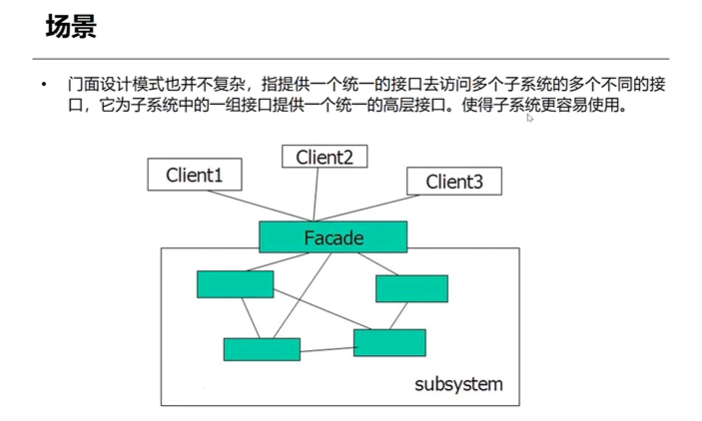
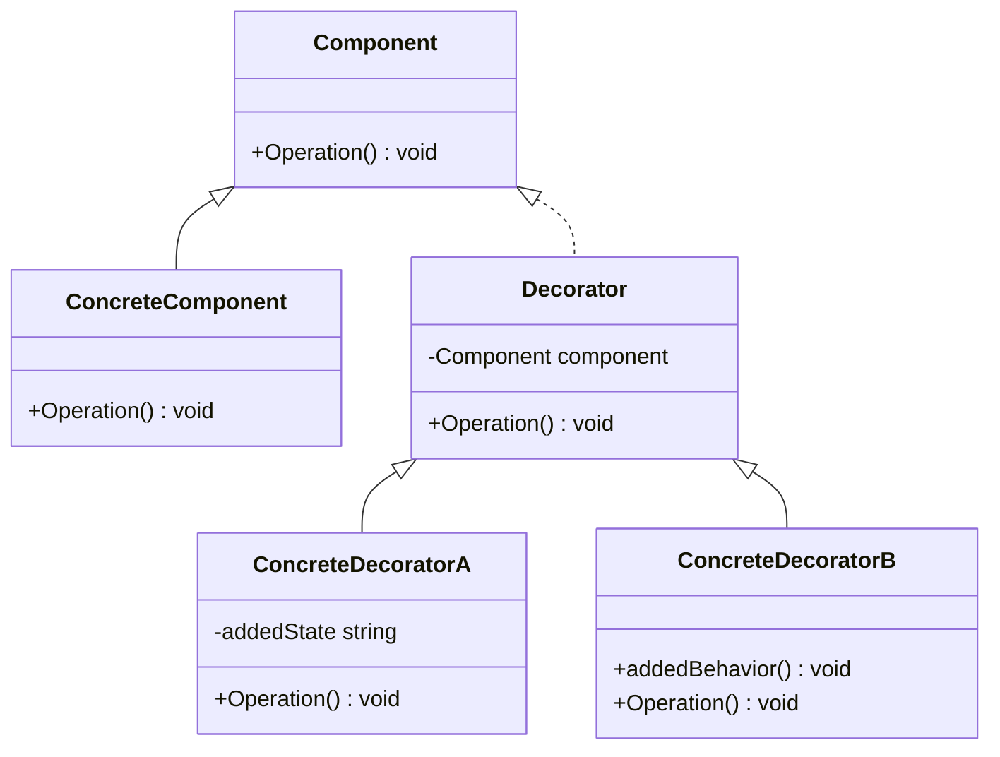

## 结构型模式
- 在解决了对象的创建问题之后，对象的组成以及对象之间的依赖关系就成了开发人员关注的焦点，因为如何设计对象的结构、继承和依赖关系会影响到后续程序的维护性
- 代码的健壮性、耦合性等。对象结构的设计很容易体现出设计人员水平的高低。适配器模式属于结构型的设计模式，它是结构型设计模式之首(用的最多的结构型设计模式)。

## 3-1 适配器模式
- 适配器模式：（Adapter Pattern）—— 对象适配与类的适配
- 适配器模式有两种:
    - 1.类的适配器 
    - 2.对象适配器，对象适配器更多一些。

场景
- 适配器设计模式也并不复杂，适配器它是主要作用是将一个类的接口转换成客户希望的另外一个接口这样使得原本由于接口不兼容而不能一起工作的那些类可以一起工作。

类适配：
```C++
#include <iostream>
#include <string>

using namespace std;

class ThreePhaseOutlet
{
public:
	void DoThreePhasePlug() 
	{
		cout << "三相插头接入" << endl;
	}
};

class TwoPhase0utlet
{
public:
	virtual void DoPlug() = 0;
};

// 类适配
class OutletConverter :public TwoPhase0utlet, public ThreePhaseOutlet 
{
public:
	virtual void DoPlug() override
	{
		DoConvertor();
		DoThreePhasePlug();
	}

	void DoConvertor() {
		cout << "我们正在将三相插头转为两相插头" << endl;
	}

};

int main()
{
	if (TwoPhase0utlet* pTwoutLet = new OutletConverter())
	{
		pTwoutLet->DoPlug();
	}

	return 0;
}

```
对象适配：
```C++
#include <iostream>
#include <string>

using namespace std;

class ThreePhaseOutlet
{
public:
	void DoThreePhasePlug() 
	{
		cout << "三相插头接入" << endl;
	}
};

class TwoPhaseOutlet
{
public:
	virtual void DoPlug() = 0;
};

// 对象适配，相比于类适配更加灵活
class OutletObjConvertor :public TwoPhaseOutlet
{
public:
	OutletObjConvertor(ThreePhaseOutlet* pOut) :m_pOut(pOut) { }

	virtual void DoPlug() override
	{
		DoConvert();
		m_pOut->DoThreePhasePlug();
	};

	void DoConvert()
	{
		cout << "我们正在对一个二相插头本身进行转化" << endl;
	}

private:
	ThreePhaseOutlet* m_pOut;
};

int main()
{
	if (TwoPhaseOutlet* pTwoOutLet = new OutletObjConvertor(new ThreePhaseOutlet))
	{
		pTwoOutLet->DoPlug();
	}

	return 0;
}

```

举例：用STL默认的适配器，完成将一个deque转换成stack
```C++
#include <iostream>
#include <deque>
#include <stack>

using namespace std;

int main() 
{
	deque<int> myDeque(3, 100);
	stack<int> myStack;
	stack<int> myStack2(myDeque);

	cout << "myStack Size: " << (int)myStack.size() << endl;
	cout << "myStack2 Size: " << (int)myStack2.size() << endl;

	myStack2.pop();
	cout << "myStack2 top: " << myStack2.top() << endl;
	cout << "myStack2 Size: " << (int)myStack2.size() << endl;
	
	return 0;
}
```

- C++ 的**类型转换函数**和**适配器**模式虽然在某种程度上都有“转换”的概念，但它们的本质不同。类型转换函数用于类型之间的转换，而适配器模式用于接口的转换和适配。

## 3-2 门面模式
- 门面模式（Facade Pattern）也叫做外观模式，是一种结构型设计模式‌



- [ ] 不知道UE的`Subsystem`用到这个了没

```C++
// 不适用模式，违背迪米特法则
#include <iostream>

using namespace std;

class Camera
{
public:
	void TurnOn()
	{
		cout << "相机启动" << endl;
	}

	void TurnOff()
	{
		cout << "相机关闭" << endl;
	}
};

class Light
{
public:
	void TurnOn()
	{
		cout << "照明灯开启" << endl;
	}

	void TurnOff()
	{
		cout << "照明灯关闭" << endl;
	}
};

class Sensor
{
public:
	void Active()
	{
		cout << "传感器启动" << endl;
	}

	void Deactive()
	{
		cout << "传感器关闭" << endl;
	}
};

class Alarm
{
public:
	void Active()
	{
		cout << "报警器启动" << endl;
	}

	void Deactive()
	{
		cout << "报警器关闭" << endl;
	}
};

int main() 
{
	// 模拟客户端
	Camera* pCamera = new Camera;
	Light* pLight = new Light;
	Sensor* pSensor = new Sensor;
	Alarm* pAlaram = new Alarm;

	cout << "启动系统" << endl;
	pCamera->TurnOn();
	pLight->TurnOn();
	pSensor->Active();
	pAlaram->Active();
		
	cout << endl << "关闭系统" << endl;
	pAlaram->Deactive();
	pSensor->Deactive();
	pLight->TurnOff();
	pCamera->TurnOff();

	return 0;
}
```

- LOD迪米特法则（Law of Demeter）：可以简单概括为：“不要和陌生人说话”，也就是说，一个对象应当尽可能少地了解其他对象的细节，并且只能与直接相关的对象通信。它的核心思想是尽量减少对象之间的依赖关系，保持各个模块的独立性。（旨在降低模块之间的耦合性）

- 迪米特法则不希望类之间建立直接的联系。如果真的有需要建立联系，也希望能通过它的友元类来转达。因此，应用迪米特法则有可能造成的一个后果就是:系统中存在大量的中介类，这些类之所以存在完全是为了传递类之间的相互调用关系--这在一定程度上增加了系统的复杂度。
```C++
#include <iostream>

using namespace std;

class Camera
{
public:
	void TurnOn()
	{
		cout << "相机启动" << endl;
	}

	void TurnOff()
	{
		cout << "相机关闭" << endl;
	}
};

class Light
{
public:
	void TurnOn()
	{
		cout << "照明灯开启" << endl;
	}

	void TurnOff()
	{
		cout << "照明灯关闭" << endl;
	}
};

class Sensor
{
public:
	void Active()
	{
		cout << "传感器启动" << endl;
	}

	void Deactive()
	{
		cout << "传感器关闭" << endl;
	}
};

class Alarm
{
public:
	void Active()
	{
		cout << "报警器启动" << endl;
	}

	void Deactive()
	{
		cout << "报警器关闭" << endl;
	}
};

class SecuritFacade
{
public:
	SecuritFacade()
	{
		m_pCamera = new Camera;
		m_pLight = new Light;
		m_pSensor = new Sensor;
		m_pAlaram = new Alarm;
	}

	virtual ~SecuritFacade()
	{
		delete m_pCamera;
		delete m_pLight;
		delete m_pSensor;
		delete m_pAlaram;
	}

	void Active()
	{
		cout << "-------启动系统-------" << endl;
		m_pCamera->TurnOn();
		m_pLight->TurnOn();
		m_pSensor->Active();
		m_pAlaram->Active();
	}

	void Deactive()
	{
		cout << "\n-------关闭系统-------" << endl;
		m_pAlaram->Deactive();
		m_pSensor->Deactive();
		m_pLight->TurnOff();
		m_pCamera->TurnOff();
	}

private:
	Camera* m_pCamera;
	Light* m_pLight;
	Sensor* m_pSensor;
	Alarm* m_pAlaram;
};

int main() 
{
	SecuritFacade Facade;
	Facade.Active();
	Facade.Deactive();

	return 0;
}
```


## 3-3 享元模式使用场景
- 享元模式（Flyweight）使用场景：运用共享技术有效地支持大量细粒度的对象

场景:
- 考虑这样一个实际应用:五子棋游戏，五子棋盘是方形的，由纵横各15条线组成15x15形成了225个交叉点。五子棋的棋子分为黑白色黑子113枚，白子112枚，黑白子加起来是225枚。
```C++
// 不使用模式
#include<iostream>
#include<string>
#include<vector>

using namespace std;

// 棋子颜色
enum class PieceColor
{
	BLACK,
	WHITE,
};

// 棋子位置
struct PiecePos
{
public:
	PiecePos(int InX, int InY) : X(InX), Y(InY) {}

	int X;
	int Y;
};

class Piece
{
public:
	Piece(PieceColor InColor, PiecePos InPos) : Color(Color), Pos(InPos) {}
	virtual ~Piece() {}

	virtual void Draw() {}

protected:
	PiecePos Pos;
	PieceColor Color;
};

class BlackPiece : public Piece
{
public:
	BlackPiece(PieceColor InColor, PiecePos InPos) : Piece(InColor, InPos) {}
	~BlackPiece() {}

	virtual void Draw() override { cout << "绘制一个黑棋" << endl; }
};

class WhitePiece :public Piece
{
public:
	WhitePiece(PieceColor InColor, PiecePos InPos) : Piece(InColor, InPos) {}
	~WhitePiece() {}

	virtual void Draw() override { cout << "绘制一个白棋" << endl; }
};

class PieceBoard
{
public:
	PieceBoard(string InBlackName, string InWhiteName) 
		: BlackName(InBlackName), WhiteName(InWhiteName) {}

	~PieceBoard()
	{
		Clear();
	}

	void SetPiece(PieceColor InColor, PiecePos InPos)
	{
		Piece* PiecePtr = nullptr;

		if (InColor == PieceColor::BLACK)
		{
			PiecePtr = new BlackPiece(InColor, InPos);
			cout << BlackName << "In " << InPos.X << ", " << InPos.Y << endl;
		}
		else
		{
			PiecePtr = new WhitePiece(InColor, InPos);
			cout << BlackName << "In " << InPos.X << ", " << InPos.Y << endl;
		}

		PieceList.push_back(PiecePtr);
	}
	void Clear()
	{
		for (Piece* PiecePtr : PieceList)
		{
			delete PiecePtr;
		}
	}

private:
	vector<Piece*> PieceList;
	string BlackName;
	string WhiteName;
};
```

- [ ] 说实话，没看懂这模式有啥用（貌似是通过共享同一个资源而节省资源，只是这个例子举的不太好）
```C++
// 使用模式
#include<iostream>
#include<string>
#include<vector>

using namespace std;

// 棋子颜色
enum class PieceColor
{
	BLACK,
	WHITE,
};

// 棋子位置
struct PiecePos
{
public:
	PiecePos(int InX, int InY) : X(InX), Y(InY) {}

	int X;
	int Y;
};

class Piece
{
public:
	Piece(PieceColor InColor) : Color(Color) {}
	virtual ~Piece() {}

	virtual void Draw() {}

protected:
	PieceColor Color;
};

class BlackPiece : public Piece
{
public:
	BlackPiece(PieceColor InColor) : Piece(InColor) {}
	~BlackPiece() {}

	virtual void Draw() override { cout << "绘制一个黑棋" << endl; }
};

class WhitePiece :public Piece
{
public:
	WhitePiece(PieceColor InColor) : Piece(InColor) {}
	~WhitePiece() {}

	virtual void Draw() override { cout << "绘制一个白棋" << endl; }
};

class PieceBoard
{
public:
	PieceBoard(string InBlackName, string InWhiteName) 
		: BlackName(InBlackName), WhiteName(InWhiteName) 
	{
		BlackPiecePtr = nullptr;
		WhitePiecePtr = nullptr;
	}

	~PieceBoard()
	{
		Clear();
	}

	void SetPiece(PieceColor InColor, PiecePos InPos)
	{
		if (InColor == PieceColor::BLACK)
		{
			if (!BlackPiecePtr)
			{
				BlackPiecePtr = new BlackPiece(InColor);
			}
			
			cout << BlackName << " In (" << InPos.X << ", " << InPos.Y << ") ";
			BlackPiecePtr->Draw();
		}
		else
		{
			if (!WhitePiecePtr)
			{
				WhitePiecePtr = new WhitePiece(InColor);
			}
			
			cout << WhiteName << " In (" << InPos.X << ", " << InPos.Y << ") ";
			WhitePiecePtr->Draw();
		}

		PieceList.push_back(InPos);
	}
	void Clear()
	{
		delete BlackPiecePtr;
		delete WhitePiecePtr;
	}

private:
	vector<PiecePos> PieceList;
	string BlackName;
	string WhiteName;

	Piece* BlackPiecePtr;
	Piece* WhitePiecePtr;
};

int main()
{
	PieceBoard Board("A", "B");
	Board.SetPiece(PieceColor::BLACK, PiecePos(44, 37));
	Board.SetPiece(PieceColor::WHITE, PiecePos(19, 70));
	Board.SetPiece(PieceColor::BLACK, PiecePos(1, 1));
	Board.SetPiece(PieceColor::WHITE, PiecePos(2, 2));

	return 0;
}
```
- [ ] 对象只new一次，让单例来保证。隔离变化


## 3-4 享元模式的应用
- 实用工程技术：文件夹图标、字符串、对象池资源池、数据库连接池与享元思想
- 1:数据库连接池:“数据库连接”是一种稀缺的资源，应该对其进行妥善管理。其实我们查询完数据库后，如果不关闭连接，而是暂时存放起来，当别人使用时，把这个连接给他们使用。就避免了一次建立数据库连接和断开的操作时间消耗。数据库连接池的基本思想:就是为数据库连接建立一个“缓冲池”。预先在缓冲池中放入一定数量的连接，当需要建立数据库连接时，只需从“缓冲池”中取出一个，使用完毕之后再放回去。我们可以通过设定连接池最大连接数来防止系统无尽的与数据库连接

- 2:资源池、对象池:着重在对象的复用，池中的每个对象都是可替换的，从同一个池中获得A对象和B对象对客户端来讲是完全相同的，主要解决复用。字符串不变性


## 3-5 代理模式的场景
- Proxy的定义场景与实现：控制对象访问与Cache代理

场景：（软件分层思想与代理
- 读取日志
```C++
// 不使用模式
#include <iostream>
#include <string>
#include <vector>
#include <fstream>
#include <map>
#include <sstream>
#include <Windows.h>

using namespace std;

vector<string> GetBugs(const string& line);
bool GetLogs();

// 故障的序号 ：[(故障名，故障时间，故障描述)]
map<int, vector<string>> Logs;

int main()
{
	SetConsoleOutputCP(CP_UTF8); // 设置控制台输出编码为UTF-8

	if (!GetLogs()) {
		return 1; // 如果无法获取日志，退出程序
	}

	for (const pair<int, vector<string>>& log : Logs)
	{
		cout << "Index: " << log.first << " Content: ";
		for (size_t i = 0; i < log.second.size(); ++i)
		{
			cout << log.second[i];
			if (i < log.second.size() - 1) {
				cout << " "; // 添加空格，除了最后一个元素
			}
		}

		cout << endl;
	}

	return 0;
}

// 切分单行输入，存到Logs对应的序号中
vector<string> GetBugs(const string& line)
{
	vector<string> bugs;
	istringstream iss(line);
	string bug;

	while (getline(iss, bug, '|'))
	{
		if (!bug.empty()) { // 仅当bug不为空时添加
			bugs.push_back(bug);
		}
	}

	return bugs;
}

bool GetLogs()
{
	ifstream file("log.txt");

	if (!file)
	{
		cerr << "无法打开日志文件" << endl;
		return false;
	}

	string line;
	int i = 0;

	while (getline(file, line))
	{
		if (!line.empty()) { // 忽略空行
			Logs[i++] = GetBugs(line);
		}
	}

	file.close();
	return true;
}

```
- 不使用模式存在的问题：数据量太大容易导致内存溢出
- 解决方法：曹冲称象，一步步装载数据，按需进行加载。
```C++
// 使用模式
#include <iostream>
#include <string>
#include <vector>
#include <fstream>
#include <map>
#include <sstream>
#include <Windows.h>

using namespace std;

vector<string> GetBugs(const string& line);
bool GetLogs();

// 故障的序号 ：[(故障名，故障时间，故障描述)]
map<int, vector<string>> Cache;

class BugManager
{
public:
	virtual void GetBugs() = 0;
	virtual ~BugManager() = default;
};

class RealBugModel : public BugManager
{
public:
	void GetBugs() override
	{
		// read log file and cache data
		ifstream file("log.txt");

		if (!file)
		{
			cerr << "Cannot open log file." << endl;
		}

		string line;
		int i = 0;

		while (getline(file, line) && !line.empty())
		{
			Cache[i++] = GetCache(line);
		}

		file.close();
	}

private:
	vector<string> GetCache(const string& line)
	{
		vector<string> bugs;
		istringstream iss(line);
		string bug;

		while (getline(iss, bug, '|') && !bug.empty()) // Only add non-empty strings to the vector
		{
			bugs.push_back(bug);
		}

		return bugs;
	}
};

class ProxyBugModel
{
public:
	ProxyBugModel() : m_reload(false) {}

	void GetBugs()
	{
		if (m_reload)
		{
			cout << "Requesting data from cache..." << endl;
		}
		else
		{
			cout << "Requesting data from real bug model..." << endl;
			shared_ptr<BugManager> realBugModel = make_shared<RealBugModel>();
			realBugModel->GetBugs();
			m_reload = true;
		}

		ShowBugs();
	}

	void ShowBugs() const
	{
		for (const pair<int, vector<string>>& data : Cache)
		{
			cout << "Index: " << data.first << " Content: ";
			for (const string& value : data.second)
			{
				cout << value << " ";
			}

			cout << endl;
		}

		cout << endl;
	}

private:
	bool m_reload; // if true, need to reload data from real bug model, otherwise from cache
};

int main()
{
	ProxyBugModel* bugModel = new ProxyBugModel();

	for (int i = 0; i < 3; i++)
	{
		cout << i + 1 << " time get bugs: " << endl;
		bugModel->GetBugs();
	}

	delete bugModel;
	SetConsoleOutputCP(CP_UTF8); // set console output code page to UTF-8 for Chinese characters display
	return 0;
}
```

## 3-6 代理模式的应用
- 实用工程技术——AOP面向切面编程、智能指针与代理思想
```C++
// 远程代理.cpp
#include <iostream>
#include <string>
using namespace std;

class AbstractServer
{
public:
	virtual void Request() = 0;

protected:
	AbstractServer() {}
};

// 真正的服务器类
class RealServer : public AbstractServer
{
public:
	virtual void Request() override
	{
		cout << "RealServer: Request received." << endl;
	}
};

class ProxyServer : public AbstractServer
{
public:
	ProxyServer(string name, string pwd) : m_name(name), m_pwd(pwd) 
	{
		m_server = new RealServer();
	}

	// 同样实现Request()方法
	virtual void Request() override
	{
		if (m_name == "admin" || m_pwd == "123456")
		{
			cout << "ProxyServer: Access successful." << endl;
			cout << "ProxyServer: Forwarding request to RealServer." << endl;
			m_server->Request();
		}
		else
		{
			cout << "ProxyServer: Access failed." << endl;
		}
	}

private:
	string m_name;
	string m_pwd;

	AbstractServer* m_server;
};

int main()
{
	AbstractServer* ProxyPtr = new ProxyServer("admin", "123456");
	if (ProxyPtr)
	{
		ProxyPtr->Request();
		delete ProxyPtr;
	}

	return 0;
}
```

### AOP
- AOP（Aspect-Oriented Programming，面向切面编程）是一种编程范式，主要用于提高代码的模块化。AOP允许开发者将与核心业务逻辑无关的通用功能（如日志记录、权限控制、事务管理等）从核心代码中分离出来，通过“切面”的方式统一处理这些横切关注点。这样既减少了重复代码，也让业务逻辑更加清晰。

- AOP的关键概念
	- 切面（Aspect）：表示横切关注点的模块化实现，如日志或事务。
	- 切入点（Pointcut）：定义在程序的哪些位置应用切面，可以在方法执行前、执行后等。
	- 通知（Advice）：定义具体要在切入点执行的动作，如“在方法开始时记录日志”。
	- 织入（Weaving）：将切面应用到目标对象的过程。织入可以在编译时、类加载时或运行时进行。
- 示例
	- 假设我们有一个银行系统中的转账方法transfer(), 在AOP中可以定义一个日志切面，在转账方法前后自动记录日志，而不需要直接修改transfer()方法本身。

- AOP让代码更关注业务逻辑，同时让横切关注点（例如日志、权限）实现模块化管理，这在大型项目中尤其有用。

```C++
#include <iostream>
#include <string>
#include <memory>

using namespace std;

class IHello
{
public:
	IHello() {}
	virtual void Output(const string& str) {}
	virtual ~IHello() {}
};

class Hello : public IHello
{
public:
	virtual void Output(const string& str) override
	{
		cout << "Hello: " << str << endl;
	}
};

class HelloProxy : public IHello
{
public:
	HelloProxy(IHello* pHello) : m_pHello(pHello) {}

	virtual void Output(const string& str) final override
	{
		cout << "在真正的对象执行之前，进行拦截" << endl;
		
		m_pHello->Output(str);

		cout << "在真正的对象执行之后，进行拦截" << endl;
	}

	~HelloProxy()
	{
		delete m_pHello;
		m_pHello = nullptr;
	}

private:
	IHello* m_pHello;
};

int main()
{
	shared_ptr<IHello> pHello = make_shared<HelloProxy>(new Hello());

	if (pHello)
	{
		pHello->Output("World");
	}

	return 0;
}
```

### 智能指针
```C++
#include <iostream>

using namespace std;

template <typename T>
class Auto_Ptr;


// 智能指针和引用计数
template <typename T>
class Ref_Ptr
{
	friend class Auto_Ptr<T>;

private:
	Ref_Ptr(T* p) : ptr(p), ref_count(1) { cout << "Ref_Ptr::Constructor" << endl; }
	virtual ~Ref_Ptr() 
	{
		if (ptr)
		{
			cout << "Ref_Ptr::Destructor" << endl;
			delete ptr; 
			ptr = nullptr;
			ref_count = 0;
		}

		ptr = nullptr;
	}
private:
	T* ptr;
	size_t ref_count;
};


// 智能指针对象
template <typename T>
class Auto_Ptr
{
public:
	Auto_Ptr() : ref_ptr(nullptr) {}
	Auto_Ptr(T* p) : ref_ptr(new Ref_Ptr<T>(p)) { cout << "Auto_Ptr(T* p) Constructor called" << endl; }

	Auto_Ptr(const Auto_Ptr<T>& other) : ref_ptr(other.ref_ptr) 
	{ 
		++(ref_ptr->ref_count);
		cout << "Auto_Ptr(const Auto_Ptr<T>& other) Copy Constructor called, ref_count = " << ref_ptr->ref_count << endl;
	}

	Auto_Ptr<T>& operator=(Auto_Ptr<T>& other)
	{
		if (this != &other)
		{
			if (ref_ptr)
			{
				// 由于左操作数指向了新对象，所以需要减少引用计数
				--(ref_ptr->ref_count);

				if (ref_ptr->ref_count == 0)
				{
					delete ref_ptr;
					ref_ptr = nullptr;
				}
			}

			ref_ptr = other.ref_ptr;
			++(ref_ptr->ref_count);

			cout << "operator= called, ref_count = " << ref_ptr->ref_count << endl;
		}
		return *this;
	}

	T& operator*() const
	{
		return *(ref_ptr->ptr);
	}

	T* operator->() const 
	{ 
		return ref_ptr->ptr; 
	}

	~Auto_Ptr()
	{
		cout << "~Auto_Ptr() called" << endl;

		if (ref_ptr)
		{
			--(ref_ptr->ref_count);
			cout << "ref_count = " << ref_ptr->ref_count << endl;

			if (ref_ptr->ref_count == 0)
			{
				delete ref_ptr;
				ref_ptr = nullptr;
			}
		}
	}


	void reset(T* p = nullptr)
	{
		if (ref_ptr)
		{
			--(ref_ptr->ref_count);
			cout << "reset called, ref_count = " << ref_ptr->ref_count << endl;

			if (ref_ptr->ref_count == 0)
			{
				delete ref_ptr;
				ref_ptr = nullptr;
			}
		}

		if (p)
		{
			ref_ptr = new Ref_Ptr<T>(p);
		}
	}

private:
	Ref_Ptr<T>* ref_ptr;
};

int main()
{
	{
		Auto_Ptr<int> ptr1 = nullptr;
		{
			Auto_Ptr<int> ptr2;
			{
				Auto_Ptr<int> ptr3(new int(4));
				cout << "ptr3 = " << *ptr3 << endl;

				ptr2 = ptr3;
				cout << "ptr2 = " << *ptr2 << endl;

				ptr1 = ptr2;
				cout << "ptr1 = " << *ptr1 << endl;

				ptr2.reset(nullptr);
				cout << "ptr2 = nullptr" << endl;
			}
		}
		// ptr1悬挂引用，导致打印错误。其实类的设计有问题，这个reset是我随手加的。当做一个警惕吧。
		cout << "ptr1 = " << *ptr1 << endl;
	}
	
	return 0;
}
```


## 3-7 装饰模式的场景
- 装饰模式(Decorator)场景与实现——组合大于继承

场景：
- 饮品计费模块

```C++
// 不使用模式
#include <iostream>

using namespace std;

class Berverage
{
public:
	virtual double Charge() = 0;
};

class RedTea : public Berverage
{
public:
	virtual double Charge() override
	{
		return 5.0;
	}
};

class GreenTea : public Berverage
{
public:
	virtual double Charge() override
	{
		return 8.0;
	};
};

class Mocha : public Berverage
{
public:
	virtual double Charge() override
	{
		return 12.0;
	};
};

// 半杯红茶半杯绿茶的情况下，就需要创建新的类。就会出现大量的子类对象。
class HalfGreenHaldRed;
class Milk;
class HalfMilkHalfGreenHaldRed;

int main()
{
	// ...
};

// 大量子对象的爆炸结构将无法完成设计。组合优于继承。
```

- 使用模式


```C++
// 使用模式
#include <iostream>

using namespace std;

class Berverage
{
public:
	virtual string GetDescription() = 0;
	virtual double Cost() = 0;
protected:
	string m_Description;
};


class CondimentDecorator : public Berverage
{
public:
	CondimentDecorator(Berverage* berverage) : m_Berverage(berverage) {}
	virtual string GetDescription() = 0;

protected:
	Berverage* m_Berverage = nullptr;
};


class Soy : public CondimentDecorator
{
public:
	Soy(Berverage* berverage) : CondimentDecorator(berverage) {}
	
	string GetDescription()
	{ 
		return m_Berverage->GetDescription() + " with Soy";
	}
	
	double Cost()
	{ 
		m_Berverage ? m_Berverage->Cost() + 0.1 : 0.1;
	}
};


class Milk : public CondimentDecorator
{
public:
	Milk(Berverage* berverage) : CondimentDecorator(berverage) {}
	
	string GetDescription() 
	{ 
		return m_Berverage->GetDescription() + " with Milk"; 
	}
	
	double Cost() 
	{ 
		return m_Berverage ? m_Berverage->Cost() + 0.3 : 0.3;
	}
};


class Latte : public Berverage
{
public:
	Latte() 
	{ 
		m_Description = "Latte";
	}
	
	string GetDescription() 
	{ 
		return m_Description; 
	}
	
	double Cost() 
	{ 
		return 13.0; 
	}
};

class Espresso : public Berverage
{
public:
	Espresso()
	{ 
		m_Description = "Espresso";
	}
	
	string GetDescription() 
	{ 
		return m_Description; 
	}
	
	double Cost() 
	{ 
		return 15.0; 
	}
};


class Mocha : public Berverage
{
public:
	Mocha()
	{ 
		m_Description = "Mocha";
	}
	
	string GetDescription() 
	{ 
		return m_Description;
	}
	
	double Cost() 
	{ 
		return 10.0;
	}
};


int main()
{
	Berverage* pEspresso = new Espresso();
	cout << pEspresso->GetDescription() << " $" << pEspresso->Cost() << endl;

	Berverage* pMocha = new Mocha();
	pMocha = new Milk(pMocha);
	pMocha = new Milk(pMocha);
	cout << pMocha->GetDescription() << " $" << pMocha->Cost() << endl;

	return 0;
};
```


## 3-8 装饰模式的应用
- 实用工程技术——MFC中CView结构设计与流式文件设计（Java IO流）思想评析
- 天生为网络编程做服务

### 模式的功能
```
透明的给一个对象增加功能，在给一个对象增加功能的同时，不能让这个对象知道，也就是
不能去改动这个对象。而实现了能够给一个对象透明的增加功能，自然就能够实现功能的动
态组合。
```

### MFC中CView结构设计

```C++
#include <iostream>

using namespace std;

class CView
{
public:
    virtual void Draw() = 0;
};


// 抽象装饰类
class CDecorator : public CView
{
protected:
    CView* m_pView;

public:
    CDecorator(CView* pView)
    {
        m_pView = pView;
    }

    virtual void Draw() override
    {
        m_pView->Draw();
    }
};

class CScrollBars : public CDecorator
{
public:
    CScrollBars(CView* pView) : CDecorator(pView) {}

    virtual void Draw() override
    {
        CDecorator::Draw();
        DrawScrollBars();
    }

protected:
    // 绘制滚动条
    void DrawScrollBars()
    {
        cout << "Drawing scrollbars" << endl;
    }
};


class CBorder : public CDecorator
{
public:
    CBorder(CView* pView) : CDecorator(pView) {}

    virtual void Draw() override
    {
        CDecorator::Draw();
        DrawBorder();
    }

protected:
    // 绘制边框
    void DrawBorder()
    {
        cout << "Drawing border" << endl;
    }
};

// 主要的被装饰对象
class CTextView : public CView
{
public:
    CTextView(const char* text)
    {
        SetWindowText(text);
    }
    
    virtual void Draw() override
    {
        CView::Draw();
        DrawTextView();
    }

    void SetWindowText(const char* text)
    {
        strncpy_s(m_Text, MAX_PATH, text, MAX_PATH - 1);
    }

protected:
    virtual void DrawTextView()
    {
        cout << "Drawing text view: " << m_Text << endl;
    }

protected:
    char m_Text[MAX_PATH];
};


class CWindows
{
public:
    CWindows()
    {
        ZeroMemory(m_WindowArray, sizeof(CView*) * 10);
    }

    void Draw()
    {
        for (int i = 0; i < 10; i++)
        {
            if (m_WindowArray[i] != nullptr)
            {
                m_WindowArray[i]->Draw();
            }
        }
    }

    void AddControl(CView* pView)
    {
        for (int i = 0; i < 10; i++)
        {
            if (m_WindowArray[i] == nullptr)
            {
                m_WindowArray[i] = pView;
                break;
            }
        }
    }

    void RemoveControl(CView* pView)
    {
        for (int i = 0; i < 10; i++)
        {
            if (m_WindowArray[i] == pView)
            {
                m_WindowArray[i] = nullptr;
                break;
            }
        }
    }
        
protected:
    CView* m_WindowArray[10];
};

int main()
{
    // 定义一个窗口对象
    CWindows windowsObj;

    // 定义一个文本框对象
    CTextView* pTextView = new CTextView("Hello, world!");

    // 定义一个带滚动条的文本框对象
    CScrollBars* pScrollBars = new CScrollBars(pTextView);

    // 定义一个带边框的带滚动条的文本框对象
    CBorder* pBorder = new CBorder(pScrollBars);

    // 添加到窗口对象中
    windowsObj.AddControl(pBorder);

    // 绘制窗口
    windowsObj.Draw();

    // 删除一个控件
    windowsObj.RemoveControl(pBorder);

    // 删除对象
    delete pBorder;
    delete pScrollBars;
    delete pTextView;

    return 0;
}
```

### 流式文件设计（Java IO流）
- 问问GTP


## 3-9 组合模式的场景
- 组合模式(Composite)场景与实现：部分整体

场景：
- 显示文件夹目录结构
```C++
// 不使用模式
#include <iostream>
#include <string>
#include <list>

using namespace std;

// 文件
class Leaf
{
public:
	Leaf(string name) : m_name(name) {}

	void ShowStructure(string prefix)
	{
		cout << prefix << "-" << m_name << endl;
	}

private:
	string m_name;
};


// 文件夹
class Composite
{
public:
	Composite(string name) : m_name(name) {}

	// 加入组合对象
	void AddComposite(Composite* composite)
	{
		m_childComposite.emplace_back(composite);
	}

	// 加入文件
	void AddLeaf(Leaf* leaf)
	{
		m_childLeaf.emplace_back(leaf);
	}

	void ShowStructure(string prefix)
	{
		cout << prefix << "+" << m_name << endl;

		for (Leaf* leaf : m_childLeaf)
		{
			leaf->ShowStructure(prefix + "  ");
		}

		for (Composite* composite : m_childComposite)
		{
			composite->ShowStructure(prefix + "  ");
		}
	}

private:
	string m_name;
	list<Leaf*> m_childLeaf;  // 问题：人为区分Leaf和Composite，并不合适。
	list<Composite*> m_childComposite;
};


int main()
{
	// 创建根目录
	Composite* root = new Composite("root");

	// 创建子目录
	Composite* child1 = new Composite("child1");
	Composite* child2 = new Composite("child2");

	// 创建文件
	Leaf* file1 = new Leaf("file1");
	Leaf* file2 = new Leaf("file2");

	// 加入到目录
	root->AddComposite(child1);
	root->AddComposite(child2);
	child1->AddLeaf(file1);
	child2->AddLeaf(file2);

	// 显示目录结构
	root->ShowStructure("");
	return 0;
}
```

```C++
// 使用模式
#include <iostream>
#include <string>
#include <list>
using namespace std;

class IFile
{
public:
	virtual void Display() = 0;

	virtual int Add(IFile* file) = 0;

	virtual int Remove(IFile* file) = 0;

	virtual list<IFile*>* GetChild() = 0;
};


// Leaf
class File : public IFile
{
public:
	File(string name) : name(name) {}

	virtual void Display() override 
	{
		cout << "-File: " << name << endl;
	}

	virtual int Add(IFile* file) override 
	{
		// 文件不能包含文件
		return -1;
	}

	virtual int Remove(IFile* file) override
	{
		return -1;
	}

	virtual list<IFile*>* GetChild() override
	{
		return nullptr;
	}

private:
	string name;
};


// Composite
class Directory : public IFile
{
public:
	Directory(string name) : name(name) 
	{
		child = new list<IFile*>();
	}

	virtual void Display() override
	{
		cout << "+Directory: " << name << endl;
	}

	virtual int Add(IFile* file) override
	{
		child->emplace_back(file);
		return 0;
	}

	virtual int Remove(IFile* file) override
	{
		child->remove(file);
		return 0;
	}

	virtual list<IFile*>* GetChild() override
	{
		return child;
	}
private:
	string name;
	list<IFile*>* child;
};

void ShowTree(IFile* root, int level)
{
	if (root == nullptr)
	{
		return;
	}

	for (int i = 0; i < level; i++)
	{
		cout << "  ";
	}
		
	root->Display();

	if (list<IFile*>* child = root->GetChild())
	{
		for (IFile* file : *child)
		{
			ShowTree(file, level + 1);
		}
	}
}

int main() 
{
	IFile* root = new Directory("root");
	IFile* dir1 = new Directory("dir1");
	IFile* file1 = new File("file1");
	IFile* file2 = new File("file2");
	IFile* file3 = new File("file3");

	root->Add(dir1);
	root->Add(file1);
	dir1->Add(file2);
	dir1->Add(file3);
	ShowTree(root, 0);

	cout << "\n-----------\n";

	dir1->Remove(file2);
	ShowTree(root, 0);

	return 0;
}
```


## 3-10 组合模式的应用
- 实用工程技术——树形(递归)结构的面向对象实现

### 模式的功能
- 构建树形结构。一个重要的应用就是：二叉树形式的计算表达式构建。
```C++

```


## 3-11 桥接模式的场景
- 定义、场景与实现：一维扩展用继承，多维扩展用桥接
```C++

```


## 3-12 桥接模式的应用
- 实用工程技术：桥接模式应用评析、MFC中的CArchive
```C++

```
