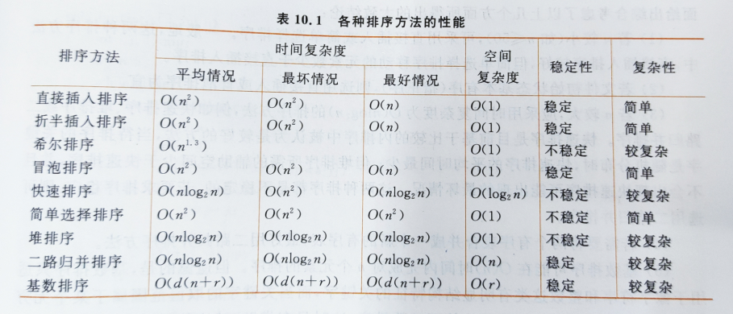

# 待办
- [ ] https://www.nowcoder.com/test/question/done?tid=53222626&qid=98665
- [ ] https://www.bilibili.com/video/BV1Pt4y197VZ/?spm_id_from=333.788.recommend_more_video.0
- [X] 观看堆排序视频


# 排序

## 一、排序的分类

### 1.内排序
- 排序过程仅在内存中进行

#### （1）基于比较的排序算法
- 插入排序
  - 直接插入
  - 折半插入
  - 希尔排序
   
- 交换排序
  - 冒泡排序
  - 快速排序
  
- 选择排序
  - 简单选择排序
  - 堆排序
  
- 归并排序
  - 二路归并
  
- 全局有序：该区域的元素的相对位置不在改变
#### （2）不基于比较的排序算法
- 基数排序


### 2.外排序
- 排序过程中涉及内外存交换

## 二、插入排序
- 插入排序：每次将一个待排序的元素按其关键字大小插入到前面已经排好序的子表中的适当位置，直到全部元素插入完成为止
- 插入排序都是局部有序区，而非全局有序区

### 1.直接插入排序
```C
// 直接插入排序(升序）- O(n^2)
void InsertSort(RecType R[], int n)
{   int i, j; RecType tmp;
    
    for(i = 1; i < n; i++)
    {   if(R[i].key < R[i-1].key)
        {   tmp = R[i];
            j = i - 1;
            do
            {   R[j+1] = R[j];
                j--;
            }   while(j >=0 && R[j].key > tmp.key);
            R[j+1] = tmp;
        }
    }
}
```

### 2.折半插入排序
- **折半插入排序**(binary insert sort)：也称二分插入排序。由于有序区的元素是有序的，可以采用折半查找方法先在R[0..i-1]中找到插入位置，再通过移动元素进行插入。第 i 躺在R[low..high](初始时 low = 0, high = i - 1)中采用折半查找方法插入R[i]的位置为R[high+1], 再将R[high+1 .. i-1] 元素后移一个位置，并置R[high+1] = R[i]。high = i - 1 --> i = high + 1
```C

void BinInsertSort(RecType R[], int n)
{
    int i, j, low, high, mid;
    RecType tmp;
    for(i = 1; i < n; i++)
    {
        if(R[i].key < R[i-1].key)   // 反序时
        {
            tmp = R[i];
            low = 0; high = i - 1;
            while(low <= high)  // 在R[low ... high]中查找插入的位置
            {
                mid = (low + high)/2;
                if(tmp.key < R[mid].key)
                    high = mid - 1;
                else
                    low = mid + 1;
            }
            
            for(j = i - 1; j >= high+1; j--)  // high+1是插入位置
                R[J+1] = R[j];  // ???
            R[high+1] = tmp;  // 插入tmp
            
        }
    }
}
            
```

### 3.希尔排序
- **希尔排序**(shell sort)：也是一种插入排序算法，实际上是一种分组插入方法。基本思想是：先选取一个小于n的整数d<sub>1</sub>作为第一个增量，把表的全部元素分成d<sub>1</sub>组，将所有距离为d<sub>1</sub>的倍数的元素放在同一个组中，在各组内进行直接插入排序；然后取第二个增量d<sub>2</sub>( < d<sub>1</sub>)，重复上述的分组和排序，直到所取的增量d<sub>t</sub>=1 (d<sub>t</sub> < d<sub>t-1</sub> < ... < d<sub>2</sub> < d<sub>1</sub>)，即所有元素放在同一组进行直接插入为止。所以shell排序称为减少增量的排序方法。shell排序的最后一趟就是调用**直接插入排序**
- 以上概述：
    - ① d = n / 2
    - ② 将排序序列分成d个组，在各组内进行**直接插入排序**
    - ③ 递减 d = d / 2（向下取整），重复②，直到d = 1

```C
// 希尔排序算法 O(n^1.3)，不稳定
void ShellSort(RecType R[], int n)
{
    int i, j, d;
    RecType tmp;
    d = n / 2;  // 增量置初值
    
    while(d > 0)  // 相比于直接插入，对d进行循环，每个记录都参加了排序
    {
        for(i = d; i < n; i++)
        {
            tmp = R[i];  // 对相隔d位置的元素组进行直接插入排序
            j = i - d;
            while(j >= 0 && tmp.key < R[j].key)
            {
                R[j+d] = R[j];
                j = j - d;
            }
            R[j+d] = tmp;
        }
        d = d / 2;
    }
} 
    
// 部分直接插入排序，为了与希尔排序比较
for( i = 1; i < n; i++)
{
    tmp = R[i];
    j = i - 1;
    while( j >= 0 && tmp.key < R[j].key)
    {
        R[j+1] = R[j];
        j = j - 1;
    }
    R[j+1] = tmp;
}

```
- 为什么希尔排序比直接插入排序好？

## 三、交换排序
- **交换排序**：基本思想是

### 1.冒泡排序
- **冒泡排序**(bubble sort)：通过无序区中相邻元素关键字间的比较和位置交换是关键字最小的元素如气泡一般逐渐往上“漂浮”直至“水面”

```C
// 冒泡排序算法
void BubbleSort(RecType R[], int n)
{   int i, j;
 
    for(i=0; i<n-1; i++)
        for(j=n-1; j>i; j++)
            if(R[j].key < R[j-1].key)
                swap(R[j], R[j-1]);
}
// 缺陷：排好序之后仍进行后几趟的比较
```

```C
// 改进后的冒泡排序算法
void BubbleSort1(RecType R[], int n)
{   int i, j;
    bool exchange;
    
    for(i=0; i<n-1; i++)
    {   exchange = false;
        for(j=n-1; j>i; j++)
            if(R[j].key < R[j-1].key)
            {   swap(R[j], R[j-1]);
                exchange = true;
            }
        if(!exchange)
            return;
    }
}   
```

### 2.快速排序
- **快速排序**(quick sort)：是由冒泡排序改进而得，基本思想是在待排序的n个元素中任取一个元素（通常取第一个元素）作为基准，把该元素放入适当位置后，数据序列被此元素划分为两部分。所有关键字比该元素小的元素放置在前一部分，所有比它大的元素放置在后一部分，并把该元素排在这两部分的中间（称为该元素归位），这个过程称为一趟快速排序，即一趟划分。快速排序每趟仅由一个元素归位。
- 特点：第 i 趟，至少有i个元素归位

```C
int partition(RecType R[], int s, int t)
{   int i=s, j=t;    
    RecType tmp = R[i];
  
    while(i < j)
    {   while(j>i && R[j].key >= tmp.key)
            j--;
        
        R[i] = R[j];
        
        while(i<j && R[j] <= tmp.key)
            i++;
        
        R[j] = R[i];
    }
    R[i] = tmp;
    return i;
}

 // s是第一个元素，t是最后一个元素
void QuickSort(RecType R[], int s, int t)  
{   int i;
    if(s < t)
    {   i = partition(R, s, t);
        QuickSort(R, s, i-1);
        QuickSort(R, i+1, t);
    }
}

// 快排可以以任意一个元素为基准，以下是以当前区间中间位置的元素为基准
void QuickSort1(RecType R[], int s, int t)
{   int i, pivot;
    pivot = (s + t) / 2;
    if(s<t)             // 区间内至少存在两个元素
    {   if(pivot != s)  // 若基准不是区间内的第一个元素，将其与第一个元素交换
            swap(R[pivot], R[s]);
        i = partition(R, s, t);
        QuickSort(R, s, i-1);
        QuickSort(R, i+1; t);
    }
}
```

## 四、选择排序
- **选择排序**(selection sort)：每一趟从待排序的元素中选出关键字最小（或最大）的元素，顺序放在排好序的子表最前（或最后），直到全部元素排序完毕。


### 1.简单选择排序
- **简单选择排序**(simple selection sort)

```C
// 简单选择排序- O(n^2)
void SelectSort(RecType R[], int n)
{   int i, j, k;
    for(i = 0; i < n -1 ; i++)
    {   k = i;
        for(j = i + 1; j < n; j++)
            if(R[j].key < R[k].key)
                k = j;
                
        if(k != i)
            swap(R[i], R[k]);
    }
}
```

### 2.堆排序
- **堆排序**(heap sort)：是一种树形选择排序方法，它的特点是将R[1..n]完全看成是一棵完全二叉树的顺序存储结构。利用完全二叉树中双亲结点和孩子节点之间的位置关系在无序区中选择关键字最大（或最小）的元素。堆排序是由简单选择排序发展而来的，利用了连续多次查找最大记录的特性。

- 堆的特点：
    - 是一颗完全二叉树
    - 所有父节点的值都要大于（或小于）子节点的值
    
- 大根堆（大顶堆）：所有节点的值都大于或等于其子节点的值，在堆排序算法中用于升序排列
- 小根堆（小顶堆）：所有节点的值都小于或等于其子节点的值，在堆排序算法中用于降序排列

- 如何判断大根堆？
    - 最后一个根节点的编号是 n/2 （向上取整）
    - 从后往前，依次对分支节点判断是否满足大根堆条件

- 筛选算法建堆（不是堆 -> 堆）：
    - 就是进行节点调整
    - 对一颗左/右子树均为堆的完全二叉树，“调整”根节点使整个二叉树也成为一个堆
    - 仅仅处理从根节点 -> 某个叶子结点路径上的结点
    - n个结点的完全二叉树高度为 log2^(n+1) （向上取整）
    - 所有筛选的时间复杂度为 O(log2^n)

```C
// 筛选算法时间复杂度： O(log2^n)
void sift(RecType R[], int low, int high)
{   int i=low, j = 2 * i;   // R[j] 是 R[i] 的左孩子
    RecType tmp = R[i];
    
    while(j <= high)
    {   
        if(j < high && R[j].key < R[j+1].key)   // 若右孩子较大，把j指向右孩子；否则还是左孩子
            j++;
            
        if(tmp.key < R[j].key)  // 最大孩子是否比双亲大
        {
            R[i] = R[j];    // 将R[j] 调整到双亲位置
            i = j;  // 修改i, j的值，以便继续向下筛选
            j = 2 * i;
        }
        else
            break;  // 双亲大，不再调整；也就说明已经调整完了，满足了大根堆定义
    }
    R[i] = tmp;
}                       
            
void HeapSort(RecType R[], int n)
{   int i;
    for(i = n/2; i >= 1; i--)       // 循环建立初始堆，调用sift算法 n/2 （向下取整）次
        sift(R, i, n);
        
    for(i = n; i >= 2; i--)
    {
        Swap(R[1], R[i]);
        sift(R, 1, i-1);    // 重新进行筛选，得到 i-1 个节点的堆
    }
}
```


## 五、归并排序
- **归并排序**(merge sort)：多次将两个或两个以上的有序表合并成一个新的有序表。
- **二路归并排序**(2-way merge sort)：多次将相邻两个的有序表合并成一个新有序表的排序方法，是最简单的归并排序

```C
// 二路归并算法
void Merge(RecType R[], int low, int mid, int high)  // Merge()：一次二路归并，将两个相邻的有序子序列归并成为一个有序序列
{
    RecType *R1;
    int i = low, j = mid + 1; k = 0;  // k是R1的下标，i 和 j分别是第1,2段的下标
    
    R1 = (RecType *)malloc((high -low + 1) * sizeof(RecType));
    
    while(i <= mid && j <= high)
        if(R[i].key <= R[j].key)  // 将第1段中的元素放入R1
        {
            R1[k] = R[i];
            i++; k++;
        }
        else  // 将第1段中的元素放入R1
        {
            R1[k] = R[j];
            j++; k++;
        }
        
    while(i <= mid)  // 将第1段余下的部分复制到R1
    {
        R1[k] = R[i];
        i++; k++;
    }
    
    while(j <= high)  // 将第2段余下的部分复制到R1
    {
        R1[k] = R[j];
        j++; k++;
    }
    
    for(k = 0, i = low; i <= high; k++, i++)  // R1复制到R[low ... high]中
        R[i] = R[k];
        
    free(R1);
}

void MergePass(RecType R[], int length, int n)  // 对整个排序序列进行一趟归并排序
{
    int i;
    for(i = 0; i + 2 * length - 1 < n; i = i + 2 *length)
```


## 六、基数排序

## 七、各种排序算法的比较和选择



