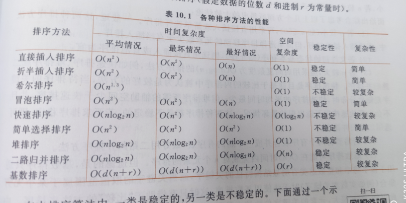

# 排序

## 一、排序的分类

### 1.内排序
- 排序过程仅在内存中进行

#### （1）基于比较的排序算法
- 插入排序
  - 直接插入
  - 折半插入
  - 希尔排序
   
- 交换排序
  - 冒泡排序
  - 快速排序
  
- 选择排序
  - 简单选择排序
  - 堆排序
  
- 归并排序
  - 二路归并

#### （2）不基于比较的排序算法
- 基数排序


### 2.外排序
- 排序过程中涉及内外存交换

## 二、插入排序
- 插入排序：每次将一个待排序的元素按其关键字大小插入到前面已经排好序的子表中的适当位置，直到全部元素插入完成为止

```C
// 直接插入排序(升序）- O(n^2)
void InsertSort(RecType R[], int n)
{   int i, j; RecType tmp;
    
    for(i = 1; i < n; i++)
    {   if(R[i].key < R[i-1].key)
        {   tmp = R[i];
            j = i - 1;
            do
            {   R[j+1] = R[j];
                j--;
            }   while(j >=0 && R[j].key > tmp.key);
            R[j+1] = tmp;
        }
    }
}
```


## 三、交换排序
- **交换排序**：基本思想是

### 1.冒泡排序
- **冒泡排序**(bubble sort)：通过无序区中相邻元素关键字间的比较和位置交换是关键字最小的元素如气泡一般逐渐往上“漂浮”直至“水面”

```C
// 冒泡排序算法
void BubbleSort(RecType R[], int n)
{   int i, j;
 
    for(i=0; i<n-1; i++)
        for(j=n-1; j>i; j++)
            if(R[j].key < R[j-1].key)
                swap(R[j], R[j-1]);
}
// 缺陷：排好序之后仍进行后几趟的比较
```

```C
// 改进后的冒泡排序算法
void BubbleSort1(RecType R[], int n)
{   int i, j;
    bool exchange;
    
    for(i=0; i<n-1; i++)
    {   exchange = false;
        for(j=n-1; j>i; j++)
            if(R[j].key < R[j-1].key)
            {   swap(R[j], R[j-1]);
                exchange = true;
            }
        if(!exchange)
            return;
    }
}   
```

### 2.快速排序
- **快速排序**(quick sort)：是有冒泡排序改进而得，基本思想是在待排序的n个元素中任取一个元素（通常取第一个元素）作为基准，把该元素放入适当位置后，数据序列被此元素划分为两部分。所有关键字比该元素小的元素放置在前一部分，所有比它大的元素放置在后一部分，并把该元素排在这两部分的中间（称为该元素归位），这个过程称为一趟快速排序，即一趟划分。快速排序每趟仅由一个元素归位。


## 四、选择排序
- **选择排序**(selection sort)：每一趟从待排序的元素中选出关键字最小（或最大）的元素，顺序放在排好序的子表最后，直到全部元素排序完毕。

### 1.简单选择排序
- **简单选择排序**(simple selection sort)：
```C
// 简单选择排序- O(n^2)
void SelectSort(RecType R[], int n)
{   int i, j, k;
    for(i = 0; i < n -1 ; i++)
    {   k = i;
        for(j = i + 1; j < n; j++)
            if(R[j].key < R[k].key)
                k = j;
                
        if(k != i)
            swap(R[i], R[k]);
    }
}
```

### 2.堆排序
            
## 五、归并排序

## 六、基数排序

## 七、各种排序算法的比较和选择



任务：
1.默写排序算法
