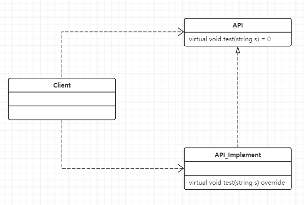
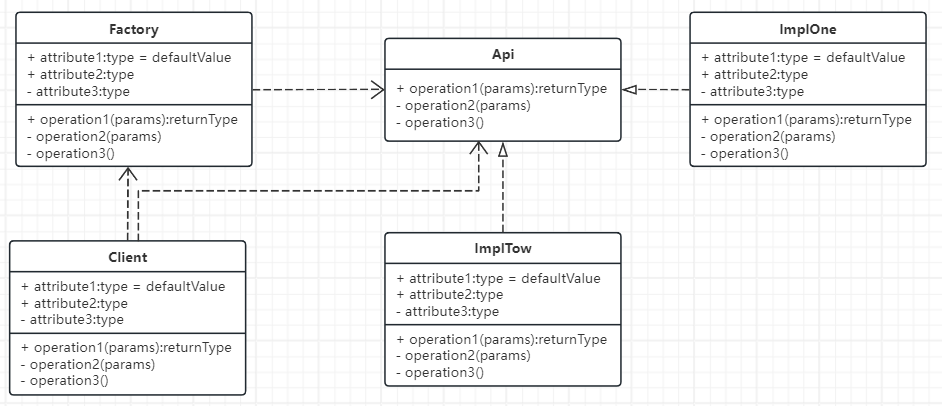

## 2-1 简单工厂方法的定义场景与实现-针对接口编程的设计思想剖析
- 创建型模式之简单工厂
- 封装变化
- 学设计模式就要是用面向对象的思想来做开发。

- 
```C++
// 修改前：封装性被破坏掉。客户知道了Impl类。
#include <iostream>
#include <string>
using namespace std;

class Api
{
public:
	virtual void test(string s) = 0;
protected:
	Api() {}  // 屏蔽构造函数，体现接口概念
};

class Impl : public Api
{
public:
	virtual void test(string s) override
	{
		cout << "现在是Imple类，正在执行方法: " << s << endl;
	}
};

int main()
{
	Api* pApi = new Impl();
	pApi->test("测试运行");
	return 0;
}
```

- 简单工厂的定义：提供一个创建对象实例的功能，而不需关心其具体实现。被创建的类型可以是接口、抽象类、也可以是具体的类。
- Factory实现了隔离变化
- 
```C++
// 修改后：通过简单工厂不让用户看到实现类Impl
#include <iostream>
#include <string>
using namespace std;

enum class ApiSubclass
{
	ImplOne,
	ImplTwo
};

class Api
{
public:
	virtual void test(string s) = 0;
protected:
	Api() {}  // 屏蔽构造函数，体现接口概念
};

class ImplOne : public Api
{
public:
	virtual void test(string s) override
	{
		cout << "现在是One类，正在执行方法: " << s << endl;
	}
};

class ImplTwo : public Api
{
public:
	virtual void test(string s) override
	{
		cout << "现在是Two类，正在执行方法: " << s << endl;
	}
};

class Factory
{
public:
	static Api* createApi(ApiSubclass type)
	{
		Api* pApi = nullptr;

		if (type == ApiSubclass::ImplOne)
		{
			pApi = new ImplOne();
		}
		else if (type == ApiSubclass::ImplTwo)
		{
			pApi = new ImplTwo();
		}

		return pApi;
	}
};

int main()
{
	// 实现了客户端和ImplOne和ImplTow的解耦合
	Api* pApi = Factory::createApi(ApiSubclass::ImplTwo);
	pApi->test("现在是使用简单工厂方法重构");
	return 0;
}
```


## 2-2 简单工厂实用工程技术：C++对象动态创建技术与配置化开发
- 在上面例子，客户端还是知道工厂的部分细节。现在想动态识别，完全实现隔离

```C++
// Factory.h
#pragma once

#include <string>
#include <map>

typedef void* (*Constructor)();  // 仿函数

class CObjectFactory
{
public:
	static void registerClass(std::string className, Constructor constructor)
	{
		constructors()[className] = constructor;
	}

	// 动态创建对象
	static void* createObject(const std::string& className)
	{
		Constructor constructor = nullptr;

		if (constructors().find(className) != constructors().end())
		{
			constructor = constructors().find(className)->second;
		}

		if (constructor == nullptr)
		{
			return nullptr;
		}

		return (*constructor)();
	}

private:
	// string->key:动态创建的类的类名，value是构建该类
	inline static std::map<std::string, Constructor>& constructors()
	{
		static std::map < std::string, Constructor> instance;
		return instance;
	}
};

#define REGISTER_CLASS(ClassName) \
class ClassName##Helper { \
public: \
	ClassName##Helper() { \
		CObjectFactory::registerClass(#ClassName, ClassName##Helper::crateObjFunc); \
	} \
	static void* crateObjFunc() { \
		return new ClassName; \
	} \
}; \
ClassName##Helper ClassName##helper;
```
- 仿函数：仿函数类重载了调用操作符operator()，这样对象就可以像函数一样被调用。
- ```void*```是一种通用的指针类型，可以指向任意类型的对象.返回一个通用的指针类型更为灵活，并且在需要的时候可以将其转换为具体的类型。

```C++
// main.cpp
#include <iostream>
#include "Factory.h"

using std::cout;
using std::endl;
using std::string;

class API
{
public:
	virtual void test(string s) = 0;
protected:
	API() {}  // 屏蔽构造函数，体现接口概念
};

class ImplOne : public API
{
public:
	virtual void test(string s) override
	{
		cout << "现在是One类，正在执行方法: " << s << endl;
	}
};

class ImplTwo : public API
{
public:
	virtual void test(string s) override
	{
		cout << "现在是Two类，正在执行方法: " << s << endl;
	}
};

REGISTER_CLASS(ImplTwo)

class AutoFactory
{
public:
	static API* CreateAPI()
	{
		// 类名的地方如果是一个配置文件，就非常灵活，可以配置化开发。非常有价值，让程序变得特别容易维护和扩展
		return static_cast<API*>(CObjectFactory::createObject("ImplTwo"));
	}
};

int main()
{
	API* pAPI = AutoFactory::CreateAPI();
	if (pAPI)
	{
		pAPI->test("哈哈，完全不知道里面的东西了^_^");
	}

	return 0;
}
```


## 2-3 单例模式的定义场景与实现：懒汉、饿汉与多线程安全double checking
学习单例模式：
- 一：单例模式的介绍-定义、结构、参考实现、场景问题
- 二：单例模式的典型疑问与优缺点评价：饿汉，懒汉与多线程安全
- 三：单例的应用案例与思考：缓存

```C++
#include <iostream>

using namespace std;

class Singleton
{
public:
	static Singleton* GetInstance() // 懒汉式：延迟加载（需要考虑多线程）
	{
		if (nullptr == m_Singer)
		{
			m_Singer = new Singleton;
		}
		return m_Singer;
	}

private:
	Singleton()  // 在C++中，构造函数不是线程安全的
	{
		m_Singer = nullptr;
		cout << "Construct a Singleton Object" << endl;
	}

private:
	static Singleton* m_Singer;
};

Singleton* Singleton::m_Singer = nullptr;


int main()
{
	Singleton* p1 = Singleton::GetInstance();
	Singleton* p2 = Singleton::GetInstance();

	cout << "p1 = " << p1 << endl;
	cout << "p2 = " << p2 << endl;

	return 0;
}
```
- 懒汉式的创建一定会出现时间片被打断，一定会出现线程不安全。需要使用double checking双检查锁来解决
- 懒汉模式在需要时才创建实例，而饿汉模式在类加载时就创建实例
- 懒汉模式需要考虑多线程，饿汉模式不需要考虑多线程
- 懒汉意味着“懒惰”，懒得吃饭。饿汉意味着“急切”，急着吃饭

```C++
#include <iostream>
#include <afxwin.h>

using namespace std;

CRITICAL_SECTION g_cs;

class Singleton
{
public:
	static Singleton* GetInstance()
	{
		if (nullptr == m_Singer)  // 添加双检查锁
		{
			::EnterCriticalSection(&g_cs);
			if (nullptr == m_Singer)
			{
				m_Singer = new Singleton;
			}
			::LeaveCriticalSection(&g_cs);
		}
		return m_Singer;
	}

private:
	Singleton()  // 在C++中，构造函数不是线程安全的
	{
		m_Singer = nullptr;
		cout << "Construct a Singleton Object" << endl;
	}

private:
	static Singleton* m_Singer;
};

UINT Func(LPVOID)
{
	printf("%x\n", Singleton::GetInstance());
	return 0;
}

Singleton* Singleton::m_Singer = nullptr; // new Singleton;  在这里创建就是饿汉式：类加载时即创建实例（不需要考虑多线程）


int main()
{
	::InitializeCriticalSection(&g_cs);

	for (int i = 0; i < 10; i++)
	{
		AfxBeginThread(Func, NULL);  // 不加保护会打印10个不同的指针地址
	}

	::DeleteCriticalSection(&g_cs);
	return 0;
}
```

## 2-4 单例模式的实用工程技术——从单例到多例，应用系统缓存的实现原理
- 既然我们可以控制全局生成一个对象,那么有没有需要生成1个以上的对象呢?
- 缓存设计与Singleton的扩展
```C++
// CatchAndSingleton.cpp -- 回避多线程的安全问题
#include <iostream>
#include <map>

using namespace std;

class Singleton;
static std::map<string, Singleton*> MyMap = std::map<string, Singleton*>();

// 懒汉-延迟加载
class Singleton
{
private:
	Singleton()
	{
		m_singer = nullptr;
		cout << "单例正在构建" << endl;
	}
public:
	static Singleton* GetInstance()
	{
		// std::map<std::string, int>::iterator it = MyMap.find(DEFAULT_KEY);
		if (MyMap.find(DEFAULT_KEY) != MyMap.end())
		{
			return MyMap.find(DEFAULT_KEY)->second;
		}

		if (m_singer == nullptr)
		{
			m_singer = new Singleton;
			MyMap[DEFAULT_KEY] = m_singer;
		}

		return m_singer;
	}

private:
	static Singleton* m_singer;
	static string DEFAULT_KEY;
};

Singleton* Singleton::m_singer = nullptr;
string Singleton::DEFAULT_KEY = "One";

int main()
{
	Singleton* p1 = Singleton::GetInstance();
	Singleton* p2 = Singleton::GetInstance();
	cout << "p1 = " << p1 << endl;
	cout << "p2 = " << p2 << endl;
	return 0;
}
```

```C++
#include <iostream>
#include <string>
#include <map>

using namespace std;

const static int NUM_MAX = 5;  // 缓存的实例个数
class Singleton;
static std::map<string, Singleton*> MyMap = std::map<string, Singleton*>();

class Singleton
{
private:
	Singleton()
	{
		m_singer = nullptr;

		cout << "Building Single..." << endl;
	}

public:
	static Singleton* GetInstance()
	{
		m_singer = MyMap[DEFAULT_KEY];


		return m_singer;
	}
private:
	static Singleton* m_singer;
};
```


## 2-5 工厂模式的定义场景与实现——子类延迟实现父类功能的软件结构

```C++

```

```C++

```


## 2-6 工厂模式的实用工程技术——IOC容器与工厂模式的应用

```C++

```

```C++

```


## 2-7 抽象工厂的定义、场景与实现——相互关联关系的对象

```C++

```

```C++

```


## 2-8 抽象工厂的实用工程技术——抽象工厂的使用场景

```C++

```

```C++

```


## 2-9 构建者模式Builder的定义、场景与实现

```C++

```

```C++

```

## 2-10 构建者模式的实用工程技术——代码的坏味道：算法与对象构建的隔离

```C++

```

```C++

```

## 2-11 原型模式的定义场景与实现——对象的快速复制

```C++

```

```C++

```

## 2-12 原型模式的实用工程技术——DRY原则与使用模式进行重构

```C++

```

```C++

```

